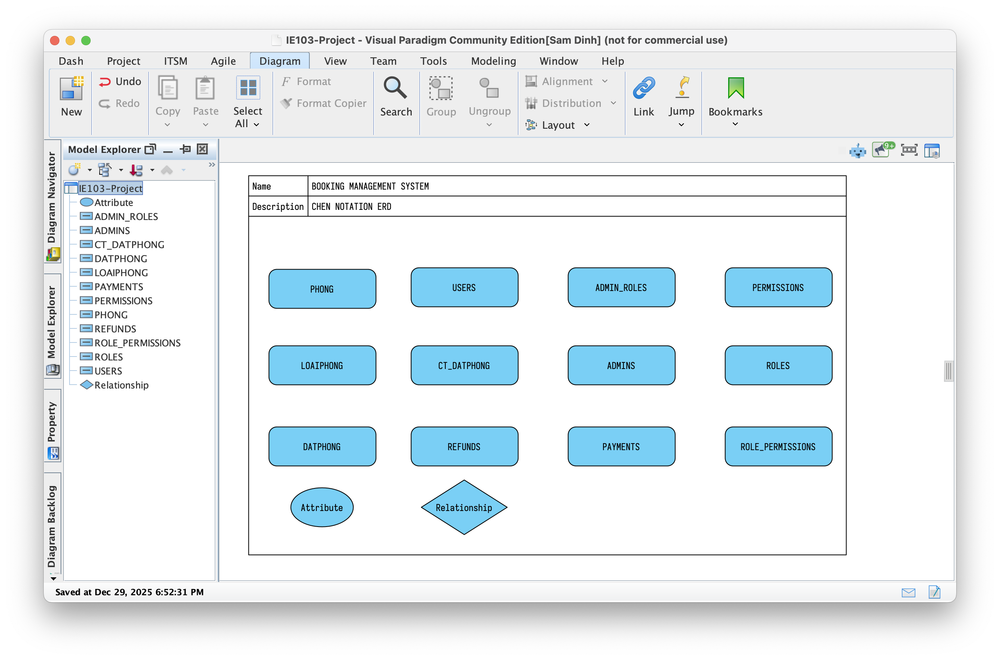

# ie103-project-report

- IE103 Project Report.
- Deadline: 28/01/2026.
- Files:
  - 1 File báo cáo văn bản, PDF.
  - 1 File Slides, PDF.
  - 1 File Video Demo: 15-20 phút.
  - Source Code
    - SQL
    - Demo
    - Report (PDF)
    - vv…
- KHÔNG CÒN BÁO CÁO TRỰC TIẾP TẠI LỚP. TẤT CẢ NỘP LẠI FILES.
- Cách nộp bài: Sẽ có hướng dẫn nộp sau.
  - Files báo cáo/mã nguồn: Elearning.
  - File video demo: gdrive/onedrive.

## Quy Cách Tổ Chức

- `noi-dung`: các tài liệu của các phần báo cáo được lưu trữ ở đây, tương đương với thư mục [`noi-dung`](https://drive.google.com/drive/folders/1e9e2FMezlBpznZvsrrtDtkm6hDfzODi0?usp=drive_link) trên GDrive.
- `report`: thư mục chứa mã nguồn soạn thảo báo cáo.

## Nội Dung

- Bám sát hướng dẫn về Yêu Cầu [ĐỒ ÁN MÔN HỌC QUẢN LÝ THÔNG TIN](noi-dung/FinalProject_GUIDE-Yeu_Cau.md).
- Bổ sung nội dung vào thư mục [noi-dung](noi-dung) tương ứng từng mục dưới đây.

### 1. Mô tả bài toán

* **Phát biểu bài toán**, mục tiêu, **đối tượng** sử dụng.
* **Mô tả quy trình trong thực tế** liên quan đến bài toán (mô tả theo từng bước, và vẽ sơ đồ nếu có. Có thể tham khảo các quy trình có sẵn trong thực tế để xây dựng).

### 2. Phân tích và thiết kế (Mô hình dữ liệu)

* Liệt kê và mô tả **các chức năng của hệ thống**.
* **Các đối tượng** nào cần **quản lý**, **mối quan hệ** giữa các đối tượng (Tức chi tiết các thực thể cần quản lý, các thuộc tính cần có và mối quan hệ giữa chúng).
* Trình bày **các ràng buộc** trên các đối tượng (nếu có).
* Vẽ **mô hình mức quan niệm** cho mối quan hệ giữa các thực thể tương ứng với loại mô hình dữ liệu lựa chọn (VD: Sơ đồ ERD cho Mô hình quan hệ, Đồ thị quan hệ cho mô hình Đồ thị-Graph, ...).
* **Thiết kế CSDL** cho bài toán tương ứng với loại mô hình dữ liệu lựa chọn (Tức chuyển sang **mô hình mức logic**). Lưu ý kèm theo các giải thích cho các bảng trong CSDL (Tân từ).

### 3. Cài đặt

* **Cài đặt mô hình dữ liệu** trên một hệ quản trị CSDL (Trong loại mô hình dữ liệu đã lựa chọn) gồm: tạo bảng, tạo khoá chính, khoá ngoại, các ràng buộc (nếu có).
* **Tạo dữ liệu mẫu** hoặc thu thập dữ liệu trong thực tế (10 - 20 dòng cho một quan hệ; **đảm bảo dữ liệu bao quát nhiều trường hợp**) .

### 4. Quản lý thông tin

* **Xử lý thông tin**
  * Stored Procedure: 5
  * Trigger: 5
  * Function: 3
  * Cursor: 2.

* **An toàn thông tin**
  * Xác thực
  * Phân quyền
  * Import
  * Export
  * Backup
  * Restore.

* **Trình bày thông tin** (đủ độ khó, đủ số lượng)
  * Menu
  * Form
  * Report
  * Help.

* **Các chức năng** của hệ thống (Từ phần phân tích)
  * Mô tả dạng văn bản. Không cần đemo.

* Lưu ý: **Demo** cho các chức năng (Trên nền tảng Web, Desktop, Mobile, ...)
  * Demo các mục được trình bày ở phần Xử lý thông tin, An toàn thông tin, vv..

## Phạm vi chức năng

-  Chi tiết tại [prd_he_thong_quan_ly_dat_phong.md](noi-dung/02-mo-hinh-du-lieu/PRD_ERD/prd_he_thong_quan_ly_dat_phong.md)

### In Scope

1. Quản lý phòng và loại phòng (BMS)
2. Quản lý khách hàng (BMS)
3. Quản lý đặt phòng (BMS)
4. Kiểm tra phòng trống (BMS & User Application)
5. Đặt phòng và hủy đặt phòng (User Application)
6. Thanh toán trực tuyến (mô phỏng)
7. Hoàn tiền và hủy giao dịch theo chính sách
8. Quản lý và phân quyền người dùng (Admin / Staff / End User)
9. Hiển thị trạng thái đặt phòng và thanh toán (User Application)
10. Ứng dụng web hoặc mobile hoàn chỉnh phục vụ thao tác đặt phòng

### Out of Scope

1. Tích hợp cổng thanh toán thực tế (VNPay, Stripe, PayPal)
2. Hệ thống kế toán hoặc xuất hóa đơn điện tử
3. Tối ưu hiệu năng cho quy mô lớn (high traffic)
4. Tích hợp bên thứ ba (OTA như Booking, Agoda)

## Demo

- Web App.
  - BE: https://github.com/lt20252cnttalpha/ie103-project-be
  - FE: https://github.com/lt20252cnttalpha/ie103-project-fe

## Công Cụ

- Vẽ ERD:
  - Chen Notation:
    - PlantUML: text-based; commit vào git được.
      - Guide: https://plantuml.com/er-diagram
      - Editor: https://www.planttext.com/
    - Visual Diagram (như ví dụ): quản lý theo project, tập trung nhiều loại diagram; binary, không commit vào git được.

