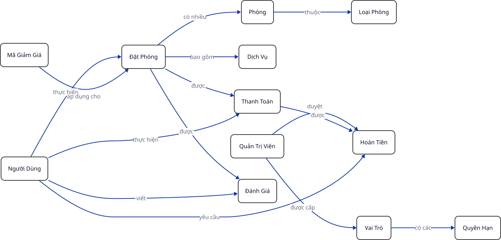

## Quy Tắc Nghiệp Vụ & Xác Định Thực Thể

### Các Quy Tắc Nghiệp Vụ

<!-- | STT | **Quy Tắc Nghiệp Vụ** |
|---:|------------|
| 1 | Một phòng không được đặt trùng thời gian. |
| 2 | Ngày trả phòng phải lớn hơn ngày nhận phòng. |
| 3 | Giờ trả phòng trễ nhất là **12:00 trưa** mỗi ngày. |
| 4 | Giờ nhận phòng sớm nhất là **14:00 (2 giờ chiều)** mỗi ngày. |
| 5 | Một lần đặt phòng phải có ít nhất một phòng. |
| 6 | Mỗi đặt phòng chỉ có tối đa một thanh toán. |
| 7 | Số tiền thanh toán phải lớn hơn 0. |
| 8 | Không được xóa đặt phòng nếu đã thanh toán. |
| 9 | Có thể hoàn tiền nếu người dùng yêu cầu trước 24 tiếng (2 ngày) kể từ ngày nhận phòng. |
| 10 | Chỉ có **Admin** mới có quyền duyệt hoàn trả. |
| 11 | Mỗi đặt phòng có thể áp dụng tối đa một mã giảm giá (voucher). |
| 12 | Mã giảm giá phải còn hạn sử dụng và chưa hết số lượng. |
| 13 | Khách hàng có thể gọi dịch vụ đi kèm bất cứ lúc nào trong thời gian lưu trú. |
| 14 | Chỉ những khách hàng đã thanh toán (PAID) và đã trả phòng mới được đánh giá. |
| 15 | Mỗi đặt phòng chỉ được đánh giá một lần. |
| 16 | Số sao đánh giá phải từ 1 đến 5. | -->

```{=typst}
#figure(
table(
  columns: (10%, 90%),
  align: (right, left),
  [STT], [#strong[Quy Tắc Nghiệp Vụ]],
  [1], [Một phòng không được đặt trùng thời gian.],
  [2], [Ngày trả phòng phải lớn hơn ngày nhận phòng.],
  [3], [Giờ trả phòng trễ nhất là #strong[12:00 trưa] mỗi ngày.],
  [4], [Giờ nhận phòng sớm nhất là #strong[14:00 (2 giờ chiều)] mỗi ngày.],
  [5], [Một lần đặt phòng phải có ít nhất một phòng.],
  [6], [Mỗi đặt phòng chỉ có tối đa một thanh toán.],
  [7], [Số tiền thanh toán phải lớn hơn 0.],
  [8], [Không được xóa đặt phòng nếu đã thanh toán.],
  [9], [Có thể hoàn tiền nếu người dùng yêu cầu trước 24 tiếng (2 ngày) kể từ ngày nhận phòng.],
  [10], [Chỉ có #strong[Admin] mới có quyền duyệt hoàn trả.],
  [11], [Mỗi đặt phòng có thể áp dụng tối đa một mã giảm giá (voucher).],
  [12], [Mã giảm giá phải còn hạn sử dụng và chưa hết số lượng.],
  [13], [Khách hàng có thể gọi dịch vụ đi kèm bất cứ lúc nào trong thời gian lưu trú.],
  [14], [Chỉ những khách hàng đã thanh toán (PAID) và đã trả phòng mới được đánh giá.],
  [15], [Mỗi đặt phòng chỉ được đánh giá một lần.],
  [16], [Số sao đánh giá phải từ 1 đến 5.]
),
caption: [Các Quy Tắc Nghiệp Vụ]
)
```

### Miêu Tả Các Nghiệp Vụ (User Stories)

<!-- | **Người Dùng** | **Miêu Tả** |
|------------:|----------------|
| US-01 | Quản lý phòng. - Là **Admin**, tôi muốn thêm, sửa, xóa phòng để cập nhật thông tin phòng. |
| US-02 | Quản lý khách hàng. - Là **Staff**, tôi muốn lưu trữ thông tin khách hàng để theo dõi lịch sử đặt phòng. |
| US-03 | Đặt phòng (End User) / Khách hàng. - Là **End User**, tôi muốn tìm kiếm phòng trống và đặt phòng theo thời gian mong muốn. |
| US-04 | Hủy đặt phòng (End User) / Khách hàng. - Là **End User**, tôi muốn hủy đặt phòng trước thời điểm nhận phòng và biết liệu mình có được hoàn tiền hay không. |
| US-05 | Kiểm tra phòng trống. - Là **Staff** hoặc **End User**, tôi muốn xem danh sách phòng trống theo ngày check-in và check-out. |
| US-05 | Kiểm tra phòng trống. - Là **Staff** hoặc **End User**, tôi muốn xem danh sách phòng trống theo ngày check-in và check-out. |
| US-06 | Thanh toán. - Là **Staff**, tôi muốn ghi nhận thanh toán và hoàn tiền cho một đặt phòng để theo dõi trạng thái thanh toán và doanh thu. |
| US-07 | Áp dụng mã giảm giá. - Là **End User**, tôi muốn áp dụng mã giảm giá (voucher) khi đặt phòng để được giảm giá theo chương trình khuyến mãi. |
| US-08 | Sử dụng dịch vụ đi kèm. - Là **End User**, tôi muốn đặt thêm các dịch vụ đi kèm (ăn sáng, giặt ủi, đưa đón sân bay) trong thời gian lưu trú để tiện lợi hơn. |
| US-09 | Đánh giá phòng. - Là **End User**, tôi muốn đánh giá và để lại phản hồi về phòng sau khi hoàn tất thanh toán và trả phòng để chia sẻ trải nghiệm của mình. |
| US-10 | Xem đánh giá phòng. - Là **End User**, tôi muốn xem điểm trung bình và các đánh giá của từng loại phòng để đưa ra quyết định đặt phòng phù hợp. | -->

```{=typst}
#figure(
table(
  columns: (10%, 90%),
  align: (right, left),
  [#strong[US]], [#strong[Miêu Tả]],
  [US-01], [
    - Quản lý phòng.
    - Là #strong[Admin], tôi muốn thêm, sửa, xóa phòng để cập nhật thông tin phòng.],
  [US-02], [
    - Quản lý khách hàng.
    - Là #strong[Staff], tôi muốn lưu trữ thông tin khách hàng để theo dõi lịch sử đặt phòng.],
  [US-03], [
    - Đặt phòng (End User) / Khách hàng.
    - Là #strong[End User], tôi muốn tìm kiếm phòng trống và đặt phòng theo thời gian mong muốn.],
  [US-04], [
    - Hủy đặt phòng (End User) / Khách hàng.
    - Là #strong[End User], tôi muốn hủy đặt phòng trước thời điểm nhận phòng và biết liệu mình có được hoàn tiền hay không.],
  [US-05], [
    - Kiểm tra phòng trống.
    - Là #strong[Staff] hoặc #strong[End User], tôi muốn xem danh sách phòng trống theo ngày check-in và check-out.],
  [US-05], [
    - Kiểm tra phòng trống.
    - Là #strong[Staff] hoặc #strong[End User], tôi muốn xem danh sách phòng trống theo ngày check-in và check-out.],
  [US-06], [
    - Thanh toán.
    - Là #strong[Staff], tôi muốn ghi nhận thanh toán và hoàn tiền cho một đặt phòng để theo dõi trạng thái thanh toán và doanh thu.],
  [US-07], [
    - Áp dụng mã giảm giá.
    - Là #strong[End User], tôi muốn áp dụng mã giảm giá (voucher) khi đặt phòng để được giảm giá theo chương trình khuyến mãi.],
  [US-08], [
    - Sử dụng dịch vụ đi kèm.
    - Là #strong[End User], tôi muốn đặt thêm các dịch vụ đi kèm (ăn sáng, giặt ủi, đưa đón sân bay) trong thời gian lưu trú để tiện lợi hơn.],
  [US-09], [
    - Đánh giá phòng.
    - Là #strong[End User], tôi muốn đánh giá và để lại phản hồi về phòng sau khi hoàn tất thanh toán và trả phòng để chia sẻ trải nghiệm của mình.],
  [US-10], [
    - Xem đánh giá phòng.
    - Là #strong[End User], tôi muốn xem điểm trung bình và các đánh giá của từng loại phòng để đưa ra quyết định đặt phòng phù hợp.]
),
caption: [Miêu Tả Các Nghiệp Vụ]
)
```

### Danh Sách Các Thực Thể

<!-- Lưu Ý về Thiết Kế Các Thực Thể -->

```{=typst}
#co-note(title: "Lưu Ý về Thiết Kế Các Thực Thể")[
Mặc dù đều là các thực thể sử dụng hệ thống *BMS*, nhưng Nhóm 02 quyết định tách biệt thực thể Người Dùng (`USERS`) và Quản Trị Viên (`ADMINS`) thành hai cấu trúc dữ liệu độc lập thay vì gộp chung. Quyết định này nhằm mục đích:

1. #strong[Phân định rõ ràng phạm vi truy cập]: Ngăn chặn tuyệt đối các rủi ro leo thang đặc quyền (Privilege Escalation), đảm bảo người dùng cuối không thể vô tình hoặc cố ý truy cập vào các chức năng quản trị.
2. #strong[Tối ưu hóa thuộc tính]: Mỗi nhóm đối tượng có các thuộc tính đặc thù riêng biệt (Ví dụ: `USERS` cần tích điểm, `ADMINS` cần có vai trò (role) cụ thể), giúp tránh dư thừa dữ liệu (`NULL` values) và đảm bảo tính chuẩn hóa.
]
```

<!-- | **Thực Thể** | **Miêu Tả** |
|--------------|--------------|
| **Admin/Staff** | - *Nhân Viên* thuộc đơn vị cung cấp dịch vụ. - Đại diện cho người dùng nội bộ của hệ thống (Admin / Staff). - Có quyền quản lý nghiệp vụ và dữ liệu hệ thống |
| **User** | - *Khách Hàng* sử dụng dịch vụ. - Đại diện cho một người dùng/khách hàng cuối của hệ thống quản lý đặt phòng. - Có thể thực hiện đặt phòng, hủy đặt phòng, thanh toán, đánh giá, và xem các thông tin của mình. |
| **Phòng** | - Đại diện cho một phòng. - Có thể được đặt hoặc không. |
| **Loại Phòng** | - Đại diện cho một loại phòng. |
| **Đặt Phòng** | - Đại diện cho một giao dịch đặt phòng. - Có thể được hủy hoặc không. |
| **Dịch Vụ** | - Đại diện cho một dịch vụ đi kèm. |
| **Thanh Toán** | - Đại diện cho một giao dịch thanh toán. |
| **Hoàn Tiền** | - Đại diện cho một giao dịch hoàn tiền. |
| **Vai Trò** | - Đại diện cho một vai trò. |
| **Quyền Hạn** | - Định nghĩa quyền thao tác cụ thể (CRUD phòng, duyệt hoàn tiền, xem báo cáo...). |
| **Đánh Giá** | - Đại diện cho một đánh giá. |
| **Mã Giảm Giá** | - Đại diện cho một mã giảm giá. - Có thể được áp dụng khi đặt phòng. | -->

```{=typst}
#figure(
table(
  columns: (20%, 80%),
  align: (right, left),
  [#strong[Thực Thể]], [#strong[Miêu Tả]],
  [#strong[Admin/Staff]],[
    - #emph[Nhân Viên] thuộc đơn vị cung cấp dịch vụ.
    - Đại diện cho người dùng nội bộ của hệ thống (Admin / Staff).
    - Có quyền quản lý nghiệp vụ và dữ liệu hệ thống.],
  [#strong[User]], [
    - #emph[Khách Hàng] sử dụng dịch vụ.
    - Đại diện cho một người dùng/khách hàng cuối của hệ thống quản lý đặt phòng.
    - Có thể thực hiện đặt phòng, hủy đặt phòng, thanh toán, đánh giá, và xem các thông tin của mình.],
  [#strong[Phòng]], [
    - Đại diện cho một phòng.
    - Có thể được đặt hoặc không.],
  [#strong[Loại Phòng]], [- Đại diện cho một loại phòng.],
  [#strong[Đặt Phòng]], [
    - Đại diện cho một giao dịch đặt phòng.
    - Có thể được hủy hoặc không.],
  [#strong[Dịch Vụ]], [- Đại diện cho một dịch vụ đi kèm.],
  [#strong[Thanh Toán]], [- Đại diện cho một giao dịch thanh toán.],
  [#strong[Hoàn Tiền]], [- Đại diện cho một giao dịch hoàn tiền.],
  [#strong[Vai Trò]], [- Đại diện cho một vai trò.],
  [#strong[Quyền Hạn]], [- Định nghĩa quyền thao tác cụ thể (CRUD phòng, duyệt hoàn tiền, xem báo cáo…).],
  [#strong[Đánh Giá]], [- Đại diện cho một đánh giá.],
  [#strong[Mã Giảm Giá]], [
    - Đại diện cho một mã giảm giá.
    - Có thể được áp dụng khi đặt phòng.]
),
caption: [Danh Sách Các Thực Thể]
)
```

### Quan Hệ Giữa Các Thực Thể

<!-- TODO: Mô tả bằng ngôn ngữ "business" thay vì kỹ thuật -->

Đây là quan hệ giữa các thực thể dưới góc độ và ngôn ngữ nghiệp vụ.

<!-- | **Thực Thể** | **Quan Hệ** | **Thực Thể** |
|---|---|---|
| **Quản Trị Viên** | được gán | **Vai Trò**|
| **Vai Trò** | có các | **Quyền Hạn**|
| **Phòng** | thuộc | **Loại Phòng**|
| **Người Dùng** | thực hiện | **Đặt Phòng**|
| **Đặt Phòng** | bao gồm | **Phòng**|
| **Đặt Phòng** | được áp dụng | **Mã Giảm Giá**|
| **Đặt Phòng** | được | **Thanh Toán**|
| **Đặt Phòng** | được | **Đánh Giá**|
| **Người Dùng** | viết | **Đánh Giá**|
| **Người Dùng** | thực hiện | **Thanh Toán**|
| **Người Dùng** | yêu cầu | **Hoàn Tiền**|
| **Thanh Toán** | được | **Hoàn Tiền**|
| **Quản Trị Viên** | duyệt | **Hoàn Tiền**|
| **Đặt Phòng** | có kèm | **Dịch Vụ**| -->

```{=typst}
#figure(
table(
  columns: (1fr,) * 3,
  align: (left, left, left),
  [#strong[Thực Thể]], [#strong[Quan Hệ]], [#strong[Thực Thể]],
  [#strong[Quản Trị Viên]], [được gán], [#strong[Vai Trò]],
  [#strong[Vai Trò]], [có các], [#strong[Quyền Hạn]],
  [#strong[Phòng]], [thuộc], [#strong[Loại Phòng]],
  [#strong[Người Dùng]], [thực hiện], [#strong[Đặt Phòng]],
  [#strong[Đặt Phòng]], [bao gồm], [#strong[Phòng]],
  [#strong[Đặt Phòng]], [được áp dụng], [#strong[Mã Giảm Giá]],
  [#strong[Đặt Phòng]], [được], [#strong[Thanh Toán]],
  [#strong[Đặt Phòng]], [được], [#strong[Đánh Giá]],
  [#strong[Người Dùng]], [viết], [#strong[Đánh Giá]],
  [#strong[Người Dùng]], [thực hiện], [#strong[Thanh Toán]],
  [#strong[Người Dùng]], [yêu cầu], [#strong[Hoàn Tiền]],
  [#strong[Thanh Toán]], [được], [#strong[Hoàn Tiền]],
  [#strong[Quản Trị Viên]], [duyệt], [#strong[Hoàn Tiền]],
  [#strong[Đặt Phòng]], [có kèm], [#strong[Dịch Vụ]]
),
caption: [Quan Hệ Giữa Các Thực Thể]
)
```

Tóm tắt các thực thể và mối quan hệ bằng mô hình trực quan:

<!-- Sử dụng layout elk cho riêng diagram này. -->


