## Mô Hình Mức Quan Niệm

<!-- - Thực thể và các thuộc tính. -->
<!-- - Mô hình ER dạng Chen. -->
<!-- Chưa có khái niệm bảng ở đây -->

<!-- 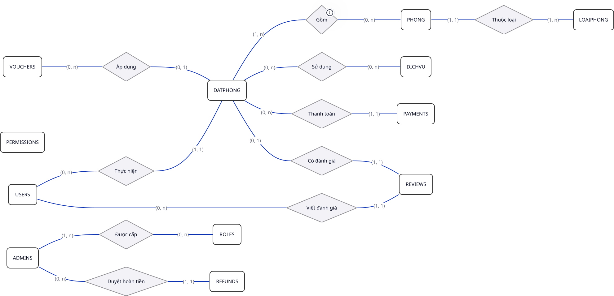 -->

Các thực thể từ các yêu cầu nghiệp vụ được mô hình hóa.

### Các Thực Thể và Thuộc Tính

- Trình bày các thực thể và thuộc tính tương ứng ở mức quan niệm phản ánh các thực thể từ mô hình nghiệp vụ.

#### ADMINS (Quản Lý/Quản Trị Viên)

- ID Admin (Thuộc tính định danh, duy nhất).
- Email
- Mật khẩu
- Tên Đầy Đủ
- Trạng Thái (Hoạt Động, Không Hoạt Động).

<!-- 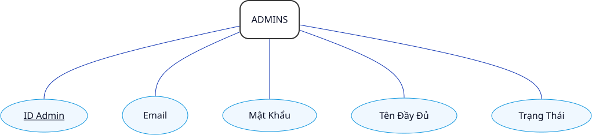 -->

#### DATPHONG (Đặt Phòng)

- ID Đặt Phòng (Thuộc tính định danh, duy nhất).
- Ngày Nhận Phòng
- Ngày Trả Phòng
- Trạng Thái (Đang Chờ, Đã Xác Nhận, Đã Hủy, Đã Hoàn Thành).

<!-- 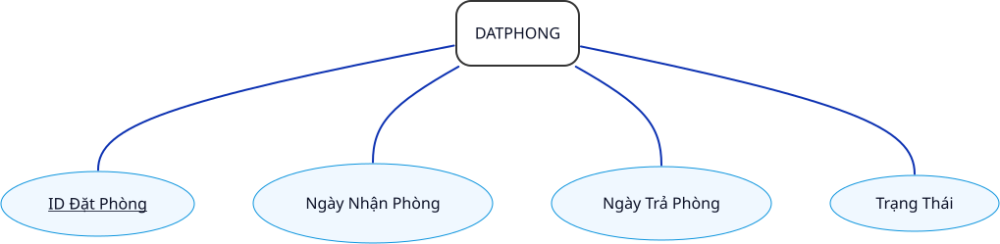 -->

#### DICHVU (Dịch Vụ)

- ID Dịch Vụ (Thuộc tính định danh, duy nhất).
- Tên Dịch Vụ
- Đơn Giá
- Đơn Vị Tính (Mặc định 'Lần', có thể là 'Kg', 'Giờ', ...)
- Trạng Thái (Hoạt Động, Không Hoạt Động).

<!-- 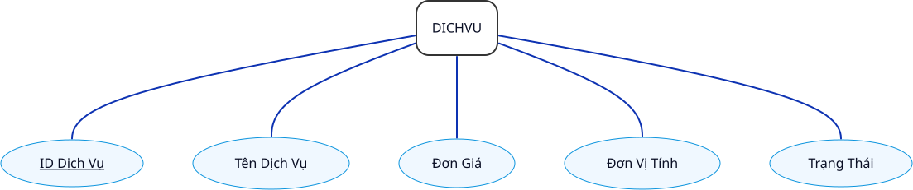 -->

#### LOAIPHONG (Loại Phòng)

- ID Loại Phòng (Thuộc tính định danh, duy nhất).
- Tên Loại Phòng
- Giá Cơ Bản ($\gt 0$)
- Mô Tả
- Sức Chứa (Mặc định là 2).

<!-- 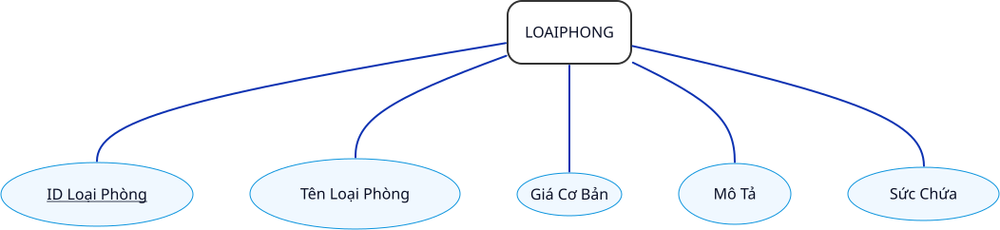 -->

#### PAYMENTS (Thanh Toán)

- ID Thanh Toán (Thuộc tính định danh, duy nhất).
- Số Tiền
- Phương Thức Thanh Toán (Tiền Mặt, Chuyển Khoản, Thẻ, Online)
- Trạng Thái (Đang Chờ, Thành Công, Gặp Lỗi, Đã Hủy, Đã Thanh Toán, Chưa Thanh Toán, Đã Hoàn Trả).

<!-- 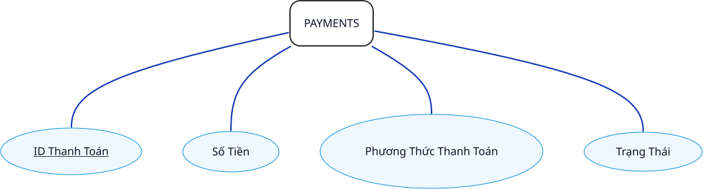 -->

#### PERMISSIONS (Quyền Hạn)

- ID Quyền Hạn (Thuộc tính định danh, duy nhất).
- Mã Quyền Hạn
- Miêu Tả

<!-- 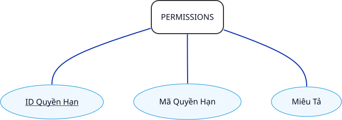 -->

#### PHONG (Phòng)

- ID Phòng (Thuộc tính định danh).
- Số Phòng (101, 102, ...).
- Trạng Thái (Trống, Đang Ở, Bảo Trì, Đã Đặt).

<!-- 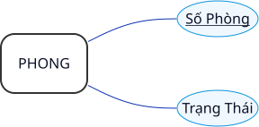 -->

#### REFUNDS (Hoàn Tiền)

- ID Hoàn Tiền (Thuộc tính định danh, duy nhất).
- Số Tiền Hoàn
- Trạng Thái (Đã Yêu Cầu, Đã Duyệt, Từ Chối, Đã Hoàn Thành).
- Lý Do

<!-- 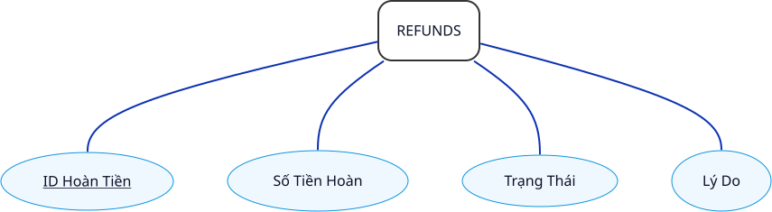 -->

#### REVIEWS (Đánh Giá)

- ID Đánh Giá (Thuộc tính định danh, duy nhất).
- Số Sao (1, 2, 3, 4, 5)
- Bình Luận
- Ngày Đánh Giá
- Trạng Thái (Đang Chờ, Đã Duyệt, Từ Chối).

<!-- 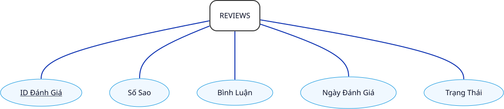 -->

#### ROLES (Vai Trò)

- ID Role (Thuộc tính định danh, duy nhất).
- Mã Vai Trò
- Tên Vai Trò
- Miêu Tả

<!-- 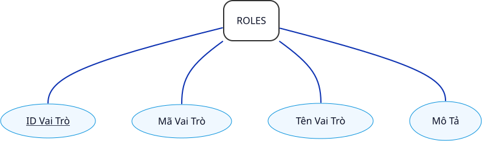 -->

#### USERS (Người Dùng)

- ID Người Dùng (Thuộc tính định danh, duy nhất).
- Email
- Mật khẩu
- Số Điện Thoại
- Tên Đầy Đủ
- Trạng Thái (Hoạt Động, Không Hoạt Động).

<!-- 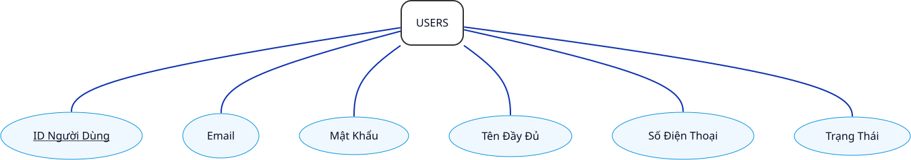 -->

#### VOUCHERS (Mã Giảm Giá)

- ID Voucher (Thuộc tính định danh, duy nhất).
- Mã Voucher
- Phần Trăm Giảm
- Ngày Hết Hạn
- Số Tiền Tối Thiểu
- Số Tiền Tối Đa
- Số Lần Đã Dùng
- Trạng Thái (Hoạt Động, Không Hoạt Động).

<!-- 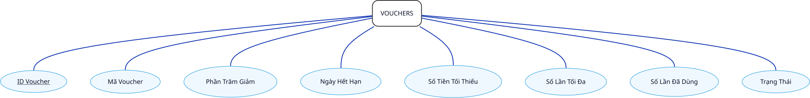 -->

### Các Mối Quan Hệ

- ADMINS - ROLES: *(n - n)*
    - Một admin có thể có tối thiểu *1* và tối đa *n* vai trò.
    - Một vai trò có thể gán tối thiểu *0* và tối đa *n* admin.
- LOAI PHONG - PHONG: *(1 - n)*
    - Một loại phòng có tối thiểu *0* và tối đa *n* phòng.
    - Một phòng thuộc và chỉ thuộc *1* loại phòng.
- USERS - DATPHONG: *(1 - n)*
    - Một người dùng có tối thiểu *0* và tối đa *n* đơn đặt phòng.
    - Một đặt phòng có và chỉ thuộc về *1* người dùng.
- DATPHONG - PHONG: *(n - n)*
    - Một đơn đặt phòng có tối thiểu *1* và tối đa *n* phòng.
    - Một phòng có tối thiểu *0* và tối đa *n* đơn đặt phòng.
- VOUCHERS - DATPHONG: *(1 - n)*
    - Một mã giảm giá có tối thiểu *0*, và tối đa *n* đơn đặt phòng.
    - Một đơn đặt phòng có tối thiểu *0*, và tối đa *1* mã giảm giá áp dụng.
- DATPHONG - REVIEWS: *một - một*
    - Một đơn đặt phòng có tối thiểu *0* và tối đa *1* đánh giá.
    - Một đánh giá thuộc và chỉ thuộc *1* đơn đặt phòng.
- USERS - REVIEWS: *(1 - n)*
    - Một user có tối thiểu *0*, và tối đa *n* đánh giá.
    - Một đánh giá có tối thiểu *1* tối đa *1* user.
- USERS - PAYMENTS: *(1 - n)*
    - Một user có tối thiểu *0*, và tối đa *n* thanh toán.
    - Một thanh toán có và chỉ có *1* user
- USERS - REFUNDS: *(1 - n)*
    - Một user có tối thiểu *0*, và tối đa *n* yêu cầu hoàn tiền.
    - Một yêu cầu hoàn tiền có và chỉ có 1 user.
- PAYMENTS - REFUNDS: *(1 - n)*
    - Một thanh toán có tối thiểu *0* và tối đa *n* hoàn tiền.
    - Một hoàn tiền được và chỉ được tạo từ *1* thanh toán.
- DATPHONG - PAYMENTS: *(1 - n)*
    - Một đơn đặt phòng có tối thiểu *0* và tối đa *n* thanh toán.
    - Một thanh toán có và chỉ có *1* đơn đặt phòng.
- ADMINS - REFUNDS: *(1 - n)*
    - Một admin có thể duyệt tối thiểu *0* và tối đa *n* lần hoàn tiền.
    - Một lần hoàn tiền chỉ được duyệt bởi *1* một admin.
- DATPHONG - DICHVU: *(n - n)*
    - Một đơn đặt phòng có thể có tối thiểu *0* và tối đa *n* dịch vụ đi kèm.
    - Một dịch vụ đi kèm có thể được sử dụng tối thiểu *0* và tối đa *n* đơn đặt phòng.
- ROLES - PERMISSIONS: *(n - n)*
    - Một vai trò có tối thiểu *0* và tối đa *n* quyền hạn.
    - Một quyền hạn có tối thiểu *0* và tối đa *n* vai trò.

### Mô Hình Thực Thể Quan Hệ (ERD) Hoàn Chỉnh

Quy cách:

- Các quan hệ *(n - n)* được tô sáng màu cam, chuẩn bị cho bước thiết kế logic.
- Đơn giản hóa đồ họa bằng cách không biểu diễn các thuộc tính.
- Mô hình đầy đủ các thuộc tính được trình bày ở phần *Phụ Lục B*, mục *Mô Hình Thực Thể Quan Hệ Đầy Đủ*.

<!-- TODO: Cân nhắc sử dụng direction TD -->

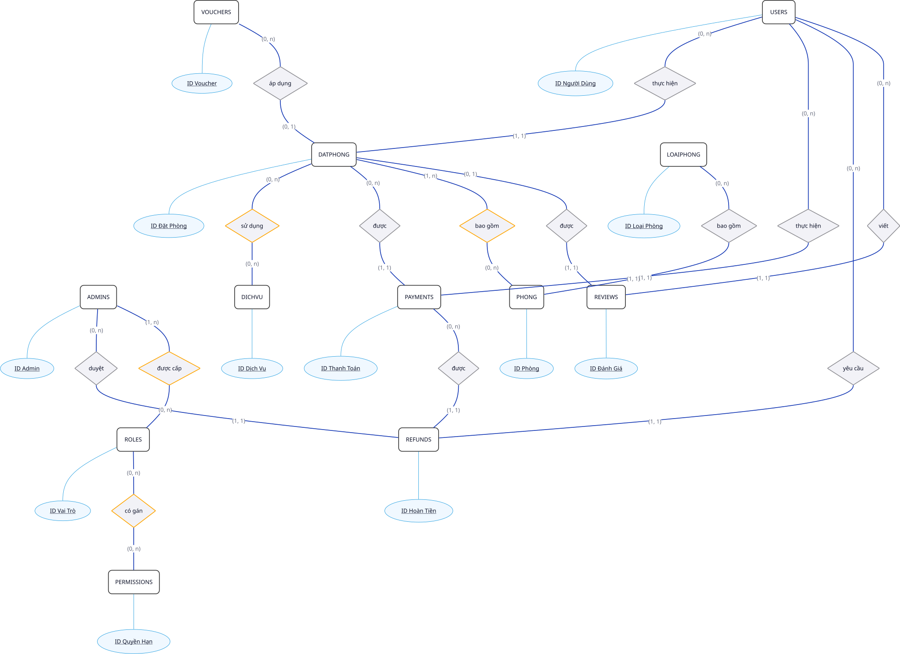
