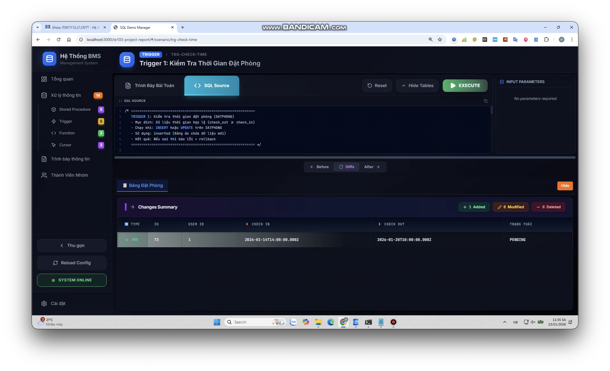
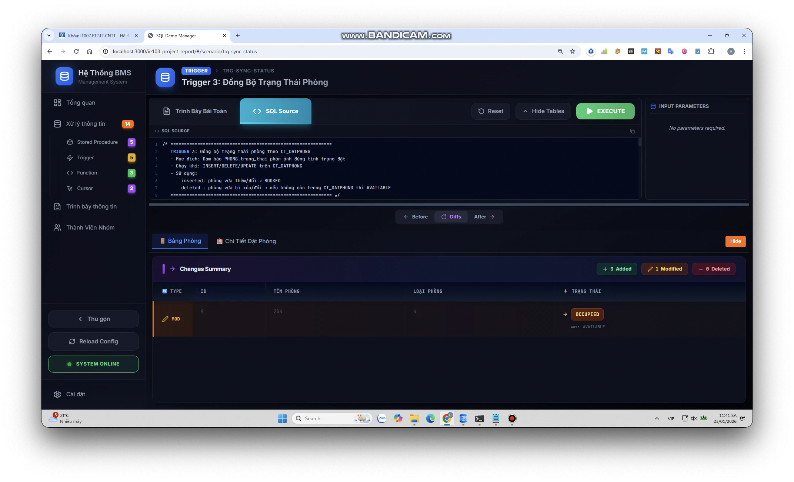
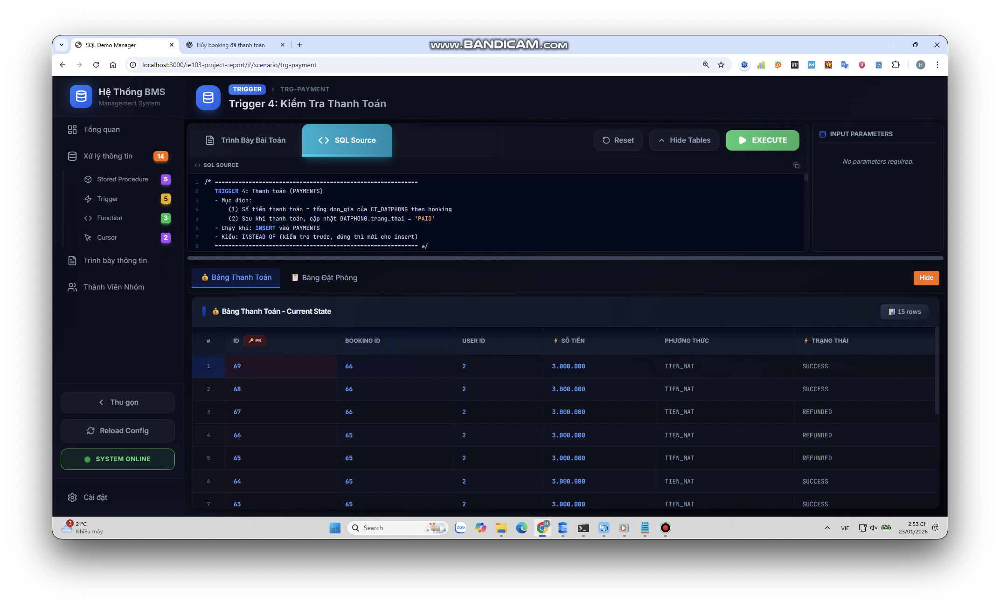
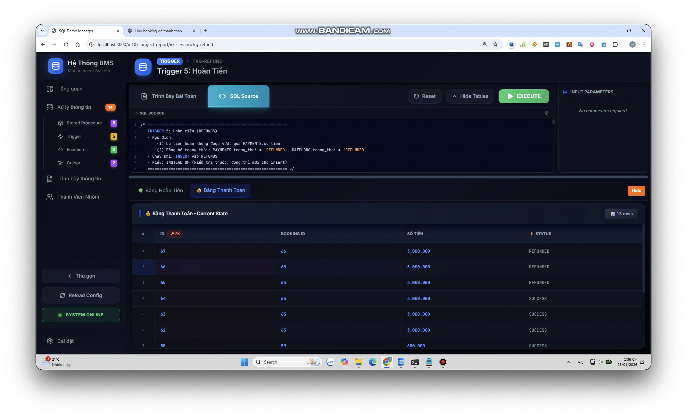
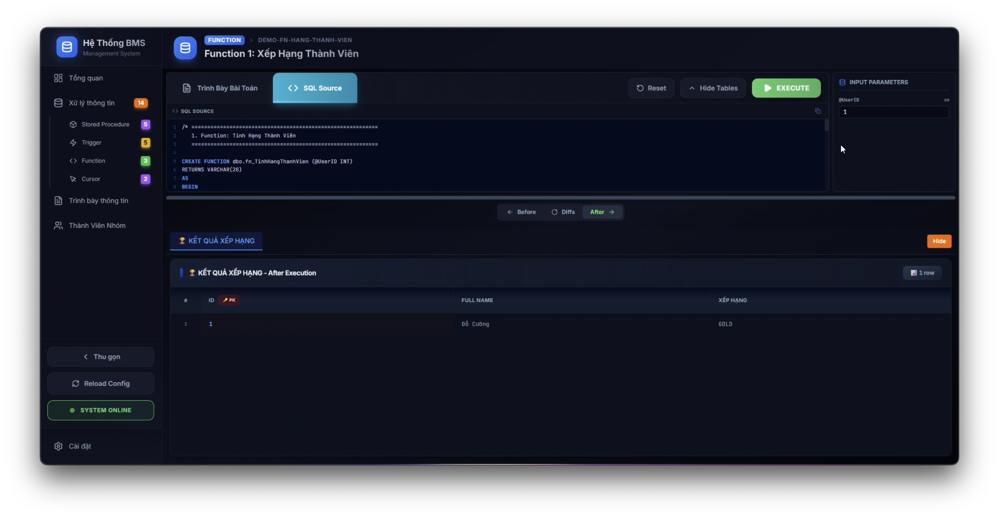
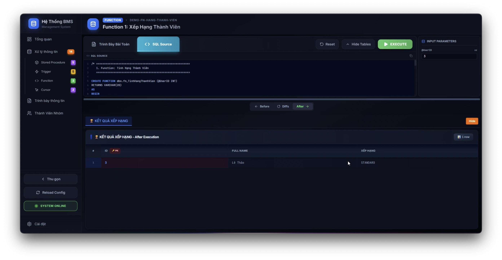
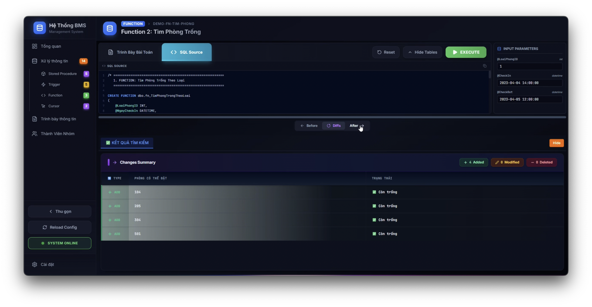
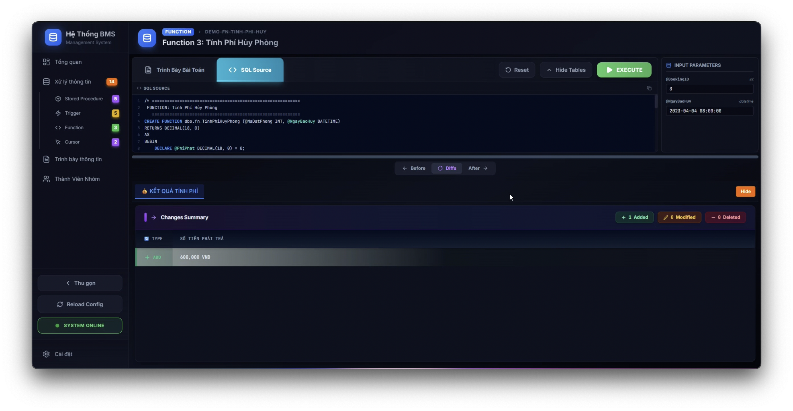

## Xử Lý Thông Tin

Hệ thống sử dụng các đối tượng lập trình cơ sở dữ liệu (Database Programmability) để đảm bảo tính nhất quán và thực thi các nghiệp vụ phức tạp.

```{=typst}
#co-warn(title: [Lưu Ý Về Cách Trình Bày])[Các mục trong phần này mục đích miêu tả các quy cách xử lý thông tin, hiện thực các yêu cầu nghiệp vụ và chức năng của hệ thống nhưng chưa bổ sung các yêu cầu được miêu tả trong mục #emph[An Toàn Thông Tin].]
```

### Stored Procedures (5)

Nhóm xây dựng các thủ tục để xử lý các giao dịch chính như đặt phòng, thanh toán và áp dụng khuyến mãi.

#### SP1 – Đặt Phòng

- Tên gọi: `SP_DATPHONG`.
- **Mục đích:** Thực hiện chức năng **đặt phòng** cho người dùng.
    - Kiểm tra phòng tồn tại và khả dụng.
    - Tạo bản ghi đặt phòng.
    - Lưu chi tiết phòng.
    - Cập nhật trạng thái phòng.
- **Tham số vào:**

<!-- | Tên tham số | Kiểu dữ liệu | Bắt buộc | Mô tả |
|------------|------------|----------|------|
| `@UserId` | `INT` | ✔ | ID người dùng |
| `@SoPhong` | `NVARCHAR(20)` | ✔ | Số phòng |
| `@CheckIn` | `DATETIME` | ✔ | Thời gian check-in |
| `@CheckOut` | `DATETIME` | ✔ | Thời gian check-out |
| `@VoucherId` | `INT` | ✖ | Voucher (nếu có) | -->

```{=typst}
#table(
  columns: (20%, 20%, 20%, 40%),
  align: (left, left, left, left),
  [Tên tham số], [Kiểu dữ liệu], [Bắt buộc], [Mô tả],
  [`@UserId`], [`INT`], [#text(fill: blue)[#sym.checkmark]], [ID người dùng],
  [`@SoPhong`], [`NVARCHAR(20)`], [#text(fill: blue)[#sym.checkmark]], [Số phòng],
  [`@CheckIn`], [`DATETIME`], [#text(fill: blue)[#sym.checkmark]], [Thời gian check-in],
  [`@CheckOut`], [`DATETIME`], [#text(fill: blue)[#sym.checkmark]], [Thời gian check-out],
  [`@VoucherId`], [`INT`], [#text(fill: red)[#sym.crossmark]], [Voucher (nếu có)]
)
```

**Ví dụ thực hiện**:

- Phòng ID = 30, Tên Phòng = 605, có Mã Vouher = 1:
    - Tạo ra đơn Đặt Phòng ID = 55, có Đơn Giá = 3,000,000.

<!--  -->

#### SP2 - Thanh Toán Đặt Phòng

- Tên gọi: `SP_THANHTOAN`.
- **Mục đích:** Thực hiện chức năng **thanh toán** cho người dùng.
    - Kiểm tra booking hợp lệ.
    - Kiểm tra số tiền thanh toán có đúng với số tiền cần trả.
    - Lưu lịch sử thanh toán.
    - Cập nhật trạng thái booking khi thanh toán hoàn tất.
- **Bảng liên quan:**

<!-- | STT | Bảng | Mô tả |
|---:|----|------|
| 1 | `DATPHONG` | Thông tin đặt phòng |
| 2 | `CT_DATPHONG` | Chi tiết phòng và đơn giá |
| 3 | `CT_SUDUNG_DV` | Dịch vụ phát sinh |
| 4 | `VOUCHERS` | Mã giảm giá |
| 5 | `PAYMENTS` | Lịch sử thanh toán | -->

```{=typst}
#table(
  columns: (8%, 32%, 60%),
  align: (right, left, left),
  [STT], [Bảng], [Mô tả], [1], [`DATPHONG`], [Thông tin đặt phòng], [2], [`CT_DATPHONG`], [Chi tiết phòng và đơn giá], [3], [`CT_SUDUNG_DV`], [Dịch vụ phát sinh], [4], [`VOUCHERS`], [Mã giảm giá], [5], [`PAYMENTS`], [Lịch sử thanh toán]
)
```

- **Tham số vào:**

<!-- | STT | Tham số | Kiểu dữ liệu | Bắt buộc | Mô tả |
|---:|------------|------------|----------|------|
| 1 | `@BookingId` | `INT` | ✔ | ID đặt phòng |
| 2 | `@UserId` | `INT` | ✔ | ID người thanh toán |
| 3 | `@SoTien` | `DECIMAL(18,2)` | ✔ | Số tiền thanh toán |
| 4 | `@PhuongThuc` | `NVARCHAR(50)` | ✔ | Phương thức thanh toán (`TIEN_MAT`, `CHUYEN_KHOAN`, `THE`, `ONLINE`) | -->

```{=typst}
#table(
  columns: (8%, 15%, 18%, 14%, 46%),
  align: (right, left, left, left, left),
  [STT], [Tham số], [Kiểu dữ liệu], [Bắt buộc], [Mô tả],
  [1], [`@BookingId`], [`INT`], [#text(fill: blue)[#sym.checkmark]], [ID đặt phòng],
  [2], [`@UserId`], [`INT`], [#text(fill: blue)[#sym.checkmark]], [ID người thanh toán],
  [3], [`@SoTien`], [`DECIMAL(18,2)`], [#text(fill: blue)[#sym.checkmark]], [Số tiền thanh toán],
  [4], [`@PhuongThuc`], [`NVARCHAR(50)`], [#text(fill: blue)[#sym.checkmark]], [Phương thức thanh toán (`TIEN_MAT`, `CHUYEN_KHOAN`, `THE`, `ONLINE`)]
)
```

**Ví dụ thực hiện**:

- Một đơn Đặt Phòng có thể được thanh toán nhiều lần.
    - Lần 1.
    - Lần 2.
    - Hoàn thành Thanh Toán: đơn Đặt Phòng chuyển trạng thái sang `COMPLETED`.

<!-- - Lần 1:


- Lần 2:


- Hoàn thành Thanh Toán: đơn Đặt Phòng chuyển trạng thái sang `COMPLETED`.

 -->

#### SP3 - Đánh Giá

- Tên gọi: `SP_DANHGIA`.
- **Mục đích:** Thực hiện chức năng **đánh giá** của người dùng sau khi *đã hoàn thành đặt phòng* (*COMPLETED*).
    - Đảm bảo chỉ đánh giá khi đã ở xong.
    - Mỗi đặt phòng chỉ được đánh giá **1 lần**.
    - Lưu đánh giá ở trạng thái chờ duyệt (`CHO_XU_LY`).
    - Hỗ trợ quản trị viên kiểm duyệt nội dung.
- **Bảng liên quan:**

<!-- | stt | Bảng | Mô tả |
|---:|----|------|
| 1 | `DATPHONG` | Thông tin đặt phòng |
| 2 | `PHONG` | Thông tin phòng |
| 3 | `REVIEWS` | Đánh giá của người dùng |
| 4 | `USERS` | Người đánh giá | -->

```{=typst}
#table(
  columns: (8%, 32%, 60%),
  align: (right, left, left),
  [stt], [Bảng], [Mô tả],
  [`1`], [`DATPHONG`], [Thông tin đặt phòng],
  [`2`], [`PHONG`], [Thông tin phòng],
  [`3`], [`REVIEWS`], [Đánh giá của người dùng],
  [`4`], [`USERS`], [Người đánh giá]
)
```

- **Tham số vào:**

<!-- | stt | Tham số | Kiểu dữ liệu | Bắt buộc | Mô tả |
|---:|------------|------------|----------|------|
| 1 | `@UserId` | INT | ✔ | ID người đánh giá |
| 2 | `@DatPhongId` | INT | ✔ | ID đặt phòng |
| 3 | `@SoPhong` | NVARCHAR(20) | ✔ | Số phòng được đánh giá |
| 4 | `@SoSao` | INT | ✔ | Số sao (1 → 5) |
| 5 | `@BinhLuan` | NVARCHAR(1000) | ✖ | Nội dung đánh giá | -->

```{=typst}
#table(
  columns: (8%, 15%, 18%, 14%, 46%),
  align: (right, left, left, left, left),
  [stt], [Tham số], [Kiểu dữ liệu], [Bắt buộc], [Mô tả],
  [`1`], [`@UserId`], [`INT`], [#text(fill: blue)[#sym.checkmark]], [ID người đánh giá],
  [`2`], [`@DatPhongId`], [`INT`], [#text(fill: blue)[#sym.checkmark]], [ID đặt phòng],
  [`3`], [`@SoPhong`], [`NVARCHAR(20)`], [#text(fill: blue)[#sym.checkmark]], [Số phòng được đánh giá],
  [`4`], [`@SoSao`], [`INT`], [#text(fill: blue)[#sym.checkmark]], [Số sao (1 → 5)],
  [`5`], [`@BinhLuan`], [`NVARCHAR(1000)`], [#text(fill: red)[#sym.crossmark]], [Nội dung đánh giá]
)
```

**Ví dụ thực hiện**:

- Sau khi hoàn thành thanh toán, và trạng thái đơn Đặt Phòng là `COMPLETED`, người dùng có thể thực hiện đánh giá.

<!--  -->

#### SP4 - Áp Dụng Voucher

- **Tên**: `SP_AP_DUNG_VOUCHER`
- **Mục đích**: Áp dụng mã giảm giá (voucher) cho một đặt phòng và tự động tính toán số tiền giảm giá.
    - Mỗi đặt phòng chỉ có thể áp dụng tối đa một mã giảm giá.
    - Mã giảm giá phải còn hạn sử dụng và chưa hết số lượng.
    - Tổng tiền đặt phòng phải đạt mức tối thiểu để áp dụng voucher.
    - Chỉ áp dụng được khi đặt phòng ở trạng thái `PENDING`.
- **Bảng liên quan**: `VOUCHERS`, `DATPHONG`, `CT_DATPHONG`.
- **Tham số đầu vào**:
    - `@DatPhongId (INT)`: ID của đặt phòng.
    - `@VoucherCode (NVARCHAR(50))`: Mã voucher cần áp dụng.
- **Tham số đầu ra**:
    - `@TongTienPhong (DECIMAL(18,2))`: Tổng tiền phòng trước khi giảm.
    - `@TienGiam (DECIMAL(18,2))`: Số tiền được giảm.
    - `@TongTienSauGiam (DECIMAL(18,2))`: Tổng tiền sau khi áp dụng giảm giá.

**Ví dụ sử dụng**:

- Đặt Phòng ID số 4 hiện chưa có voucher.
- Thực thi SP áp dụng voucher.
- Đặt Phòng ID số 4 hiện đã có voucher áp dụng.

<!-- - Đặt Phòng ID số 4 hiện chưa có voucher.


- Thực thi SP áp dụng voucher.


- Đặt Phòng ID số 4 hiện đã có voucher áp dụng.

 -->

#### SP5 - Sử Dụng Dịch Vụ

- **Tên**: `SP_SU_DUNG_DICH_VU`.
- **Mục đích**: Ghi nhận việc khách hàng sử dụng dịch vụ đi kèm (ăn sáng, giặt ủi, đưa đón sân bay, v.v.) trong thời gian lưu trú.
    - Khách hàng có thể gọi dịch vụ đi kèm bất cứ lúc nào trong thời gian lưu trú.
    - Mỗi lần gọi dịch vụ được ghi nhận riêng biệt.
    - Đơn giá được lưu lại tại thời điểm sử dụng (tránh thay đổi giá sau này ảnh hưởng đến hóa đơn).
- Tham số đầu vào:
    - `@DatPhongId (INT)`: ID của đặt phòng.
    - `@DichVuId (INT)`: ID của dịch vụ được sử dụng.
    - `@SoLuong (INT, mặc định = 1)`: Số lượng dịch vụ.
    - `@GhiChu (NVARCHAR(500), tùy chọn)`: Ghi chú về việc sử dụng dịch vụ.
    - `@ServiceUsageId (INT OUTPUT)`: ID của bản ghi sử dụng dịch vụ vừa tạo.

**Ví dụ sử dụng**:

- Đặt Phòng ID số 2 hiện chưa có dịch vụ sử dụng.
- Thực thi SP sử dụng dịch vụ: Dịch Vụ ID = 1, Coca Cola.
- Đặt Phòng ID số 2 hiện đã có dịch vụ sử dụng.

<!-- - Đặt Phòng ID số 2 hiện chưa có dịch vụ sử dụng.


- Thực thi SP sử dụng dịch vụ: Dịch Vụ ID = 1, Coca Cola.


- Đặt Phòng ID số 2 hiện đã có dịch vụ sử dụng.

 -->

### Triggers (5)

Sử dụng Trigger để đảm bảo toàn vẹn dữ liệu và tự động cập nhật trạng thái.

#### TRG-01 - Kiểm Tra Thời Gian Đặt Phòng

- Tên: `trg_DATPHONG_CheckTime`.
- Mục đích: Đảm bảo tính hợp lệ của dữ liệu thời gian khi đặt phòng trong hệ thống quản lý khách sạn.

Trong hệ thống đặt phòng khách sạn, cần đảm bảo rằng:

- Thời gian trả phòng (`check_out`) phải **lớn hơn hoặc bằng** thời gian nhận phòng (`check_in`).
- Ngăn chặn dữ liệu không hợp lệ được lưu vào cơ sở dữ liệu.
- Báo lỗi rõ ràng cho người dùng khi nhập sai.

Sử dụng `AFTER Trigger` trên bảng `DATPHONG` để:

1. Kiểm tra điều kiện thời gian sau khi `INSERT` hoặc `UPDATE`.
2. Sử dụng bảng ảo `inserted` để truy cập dữ liệu mới.
3. `ROLLBACK` transaction nếu phát hiện lỗi.
4. Hiển thị thông báo lỗi chi tiết.

**Ví dụ thực hiện**:

- Thời gian check-out lớn hơn check-in, nên thực hiện thành công.

<!--  -->

#### TRG-02 - Tự Động Tính Đơn Giá Khi Đặt Phòng

- Tên: `trg_CTDP_Insert_ValidatePrice`.
- Mục đích: Tự động hóa quy trình đặt phòng và đảm bảo tính chính xác của đơn giá.

Khi thêm chi tiết đặt phòng vào bảng `CT_DATPHONG`, cần:

1. **Kiểm tra trạng thái phòng**: Chỉ cho phép đặt phòng có trạng thái `AVAILABLE`.
2. **Tự động lấy đơn giá**: Lấy giá từ bảng `LOAIPHONG` thay vì nhập thủ công (tránh sai sót).

Sử dụng `INSTEAD OF` Trigger để:

- Chặn `INSERT` không hợp lệ (phòng không `AVAILABLE`).
- Tự động điền `don_gia` từ `LOAIPHONG.gia_co_ban`.
- Đảm bảo tính nhất quán của dữ liệu.

**Ví dụ thực hiện**:

- Tự động tính đơn giá khi thêm chi tiết đặt phòng vào bảng `CT_DATPHONG`.
    - Đặt Phòng ID = 71.
    - Phòng ID = 8.

<!--  -->

#### TRG-03 - Đồng Bộ Trạng Thái Phòng

- Tên: `trg_CTDP_SyncRoomStatus`.
- Mục đích: Tự động đồng bộ trạng thái phòng khi có thay đổi trong chi tiết đặt phòng.

Khi có thao tác `INSERT`/`UPDATE`/`DELETE` trên bảng `CT_DATPHONG`:

- Phòng được đặt $\to$ Cần chuyển trạng thái sang `OCCUPIED`.
- Phòng bị hủy đặt $\to$ Cần trả về trạng thái `AVAILABLE`.
- Đảm bảo đồng bộ thời gian thực.

Sử dụng `AFTER Trigger` với:

- Bảng ảo `inserted`: Phòng vừa được đặt.
- Bảng ảo `deleted`: Phòng vừa bị hủy.
- Cập nhật trạng thái tự động.

<!-- **Ví dụ thực hiện**:

 -->

#### TRG-04 - Kiểm Tra Thanh Toán

- Tên: `trg_PAYMENTS_Insert_CheckAndPaid`.
- Mục đích: Đảm bảo tính chính xác của số tiền thanh toán và tự động cập nhật trạng thái đơn đặt phòng.

Khi khách hàng thanh toán (`INSERT` vào bảng `PAYMENTS`):

1. **Kiểm tra số tiền**: Số tiền thanh toán phải bằng tổng đơn giá các phòng đã đặt.
2. **Cập nhật trạng thái**: Tự động chuyển trạng thái booking sang `PAID`.
3. **Ngăn gian lận**: Không cho thanh toán sai số tiền.

Sử dụng `INSTEAD OF` Trigger để:

- Tính tổng tiền từ `CT_DATPHONG`.
- So sánh với số tiền thanh toán.
- Tự động cập nhật trạng thái nếu hợp lệ.

<!-- **Ví dụ thực hiện**:

 -->

#### TRG-05 - Kiểm Tra Hoàn Tiền

- Tên: `trg_REFUNDS_Insert_CheckAndUpdate`.
- Mục đích: Quản lý quy trình hoàn tiền an toàn và chính xác.

Khi xử lý hoàn tiền (`INSERT` vào bảng `REFUNDS`):

1. **Kiểm tra số tiền hoàn**: Không được vượt quá số tiền đã thanh toán.
2. **Đồng bộ trạng thái**: Cập nhật `PAYMENTS.trang_thai = 'REFUNDED'` và `DATPHONG.trang_thai = 'REFUNDED'`.
3. **Ngăn gian lận**: Không cho hoàn tiền nhiều hơn đã trả.

Sử dụng `INSTEAD OF` Trigger để:

- Kiểm tra `REFUNDS.so_tien_hoan <= PAYMENTS.so_tien`.
- Tự động cập nhật trạng thái trong `PAYMENTS` và `DATPHONG`.
- Đảm bảo tính toàn vẹn dữ liệu.

<!-- **Ví dụ thực hiện**:

 -->

### Functions (3)

Các hàm hỗ trợ tính toán và kiểm tra nhanh.

#### FN-01 - Tính Hạng Thành Viên

- Tên: `fn_TinhHangThanhVien`.
- **Mục đích:** Tự động xếp hạng thành viên (Loyalty Tier) cho khách hàng dựa trên tổng doanh thu thực tế.
- **Logic xử lý:**
    - Kết nối bảng `PAYMENTS` để lấy lịch sử giao dịch của `UserID`.
    - Chỉ tính tổng tiền (`SUM`) của các giao dịch thành công (Status là `PAID`, `SUCCESS`, hoặc `APPROVED`).
- **Quy tắc xếp hạng:**
    - Tổng chi tiêu < 5.000.000 VNĐ: **STANDARD**.
    - Tổng chi tiêu 5.000.000 - 20.000.000 VNĐ: **GOLD**.
    - Tổng chi tiêu > 20.000.000 VNĐ: **PLATINUM**.

**Kiểm thử:**

- User 1: Đã thanh toán tổng cộng `13,400,000 VNĐ`.
    - User 1: `GOLD`.

<!--  -->

- User 3 : Đã thanh toán `4,300,000 VNĐ`.
    - User 3: `STANDARD`.

<!--  -->

#### FN-02 - Tìm Phòng Trống Theo Loại

- Tên: `fn_TimPhongTrongTheoLoai`.
- **Mục đích:** Tự động tìm kiếm các phòng trống thuộc một loại phòng cụ thể trong khoảng thời gian yêu cầu.
- **Logic xử lý:**
    - Đầu vào: `Loại Phòng ID`, `Ngày Check-in`, `Ngày Check-out`.
    - Lấy danh sách **TẤT CẢ** phòng thuộc loại phòng yêu cầu.
    - Tìm danh sách các phòng **ĐANG BẬN** (có lịch đặt trùng với thời gian đầu vào).
    - _Lưu ý:_ Bỏ qua các đơn đặt phòng đã bị Hủy (`CANCELLED`) hoặc Hoàn tiền (`REFUNDED`).
    - **Công thức:** `Kết quả = Danh sách Gốc - Danh sách Bận`.
    - Trả về dạng Bảng (Table-Valued Function).

**Kiểm thử:**

- Kịch bản: Phòng `101` (Loại 1) đang có khách ở từ `04/04` đến `05/04`. Phòng `102` (Loại 1) đang trống.
- Test Case: Tìm phòng Loại 1 trống trong ngày `02/04`.
- Kết quả mong đợi: Chỉ hiển thị phòng `104`, `205`, `304`, `501`. Phòng `101` bị ẩn đi.

<!--  -->

#### FN-03 - Tính Phí Hủy Phòng Động

- Tên: `fn_TinhPhiHuyPhong`.
- **Mục đích:** Tính toán số tiền phạt khi khách hàng yêu cầu hủy phòng, dựa trên thời gian báo trước so với ngày Check-in để đảm bảo công bằng.
- **Logic xử lý:**
    - Kết nối bảng `DATPHONG` để lấy ngày Check-in dự kiến.
    - Tính tổng tiền cọc của đơn hàng từ bảng `CT_DATPHONG`.
    - Tính khoảng cách ngày: `Số ngày` = `Ngày Check-in` - `Ngày Báo Hủy`.
- **Quy tắc tính phí:**
    - Nếu báo trước **>= 3 ngày**: Miễn phí (0%).
    - Nếu báo trước **từ 1 đến dưới 3 ngày**: Phạt **50%** tổng tiền cọc.
    - Nếu báo sát giờ (**< 1 ngày** hoặc trong ngày check-in): Phạt **100%** tổng tiền cọc.

**Kiểm thử:**

Kịch bản:

- Đơn đặt phòng `ID = 3` có ngày Check-in là `2023/04/04`.
- Tổng tiền cọc `600,000 VNĐ`.

Case 1:

- Hủy ngày `2023/04/01` (Trước 3 ngày).
- Kết quả: `0 VNĐ`.

<!--  -->

Case 2:

- Hủy ngày `2023/04/04` (Trong ngày Check-in).
- Kết quả: `600,000 VNĐ`.

<!--  -->

### Cursors (2)

Sử dụng Cursor cho các tác vụ xử lý theo lô (Batch Processing) định kỳ.

#### CS-01 - Tự Động Hoàn Tất Đơn Đặt Phòng Khi Quá Hạn

- Tên gọi: `cursor_checkout`.
- **Mục Đích:**
    - Tự động hóa việc kết thúc quy trình đặt phòng.
    - Hệ thống quét các đơn đặt phòng đã quá hạn trả phòng (`Check-out`) nhưng trạng thái vẫn là `CONFIRMED` để chuyển sang `COMPLETED` và giải phóng phòng.
- **Logic Xử Lý:**
    - Khai báo Cursor quét bảng `DATPHONG`.
    - Điều kiện lọc: `trang_thai = 'CONFIRMED'` VÀ `check_out < GETDATE()` (Thời gian hiện tại đã vượt qua giờ check-out).
    - **Xử Lý Ngoại Lệ:** Vòng lặp xử lý từng đơn:
        + Cập nhật trạng thái đơn (`DATPHONG`) thành `COMPLETED`.
        + Tìm các phòng liên quan trong bảng `CT_DATPHONG` và cập nhật trạng thái phòng (`PHONG`) về `AVAILABLE` (Sẵn sàng đón khách mới).
        + Đếm số lượng đơn đã xử lý và in log thông báo.

**Kiểm Thử: Trước khi thực hiện.**

- Các phòng có trạng thái `CONFIRMED`.

<!--  -->

**Kiểm Thử: Kết quả.**

- Các phòng có trạng thái `AVAILABLE`.

<!--  -->

#### CS-02 - Đồng Bộ Trạng Thái Phòng Thực Tế

- Tên gọi: `cur_phong_status`.
- **Mục đích:**
    - Cursor này đảm bảo trạng thái hiển thị của phòng (`AVAILABLE`, `OCCUPIED`, `MAINTENANCE`, `RESERVED`) trên giao diện luôn khớp với dữ liệu đặt phòng thực tế trong cơ sở dữ liệu.
- **Logic xử lý:**
    - Duyệt qua tất cả các phòng trong bảng `PHONG`, lấy thông tin `id`, `so_phong` và `trang_thai` hiện tại.
    - Với mỗi phòng, thực hiện truy vấn kiểm tra xem có đơn đặt phòng nào đang hoạt động (Trạng thái `CONFIRMED` và thời gian hiện tại nằm trong khoảng lưu trú).
    - Cập nhật:
        + Trường hợp 1 (Có khách đang ở):
            - Nếu trạng thái hiện tại chưa phải `OCCUPIED` $\to$ Cập nhật thành `OCCUPIED`.
        + Trường hợp 2 (Không có khách):
            - Nếu trạng thái hiện tại là `OCCUPIED` (tức là dữ liệu cũ bị sai/treo) $\to$ Trả về `AVAILABLE`.
            - Nếu trạng thái hiện tại là `MAINTENANCE` (Bảo trì) hoặc `RESERVED` (Đã đặt trước) $\to$ Giữ nguyên, không can thiệp.

**Kiểm Thử: Trước khi thực hiện.**

- Phòng 101: Đang trống thực tế và dữ liệu lỗi hiển thị là `AVAILABLE` (đúng).
- Phòng 102: Đang có khách ở thực tế nhưng hiển thị là `AVAILABLE` (sai).
- Phòng 503: Đang bảo trì (`MAINTENANCE`), không có khách (đúng).


**Kiểm Thử: Kết quả.**

- Phòng 101: Giữ nguyên trạng thái (`AVAILABLE`).
- Phòng 102: Cập nhật sang Đang có khách (`OCCUPIED`).
- Phòng 503: Giữ nguyên trạng thái (`MAINTENANCE`).


