## An Toàn Thông Tin

### Xác Thực Và Phân Quyền

```{=typst}
#todo[(Xác Thực Và Phân Quyền) THỰC HIỆN PHÂN QUYỀN.]
```

Hệ thống áp dụng mô hình bảo mật dựa trên vai trò (RBAC - Role Based Access Control).

- Xác thực:
    - Mật khẩu người dùng được mã hóa (Hashing) trước khi lưu vào cơ sở dữ liệu (giả lập logic ứng dụng).
- Bảng phân quyền:

<!-- | STT | **Vai Trò** | **Quyền Hạn** |
|----:|----|----|
| 1 | Admin | Quản lý tất cả |
| 2 | Staff | Quản lý đặt phòng |
| 3 | End User | Đặt phòng | -->

```{=typst}
#figure(
    table(
    columns: (10%, 20%, 70%),
    align: (right, left, left),
    [STT], [#strong[Vai Trò]], [#strong[Quyền Hạn]], [1], [Admin], [Quản lý tất cả], [2], [Staff], [Quản lý đặt phòng], [3], [End User], [Đặt phòng]
    ),
    caption: [An Toàn Thông Tin - Bảng Phân Quyền]
)
```

### Sao Lưu & Phục Hồi

Chiến lược sao lưu dữ liệu được đề xuất:

- Full Backup: Thực hiện định kỳ vào 00:00 Chủ Nhật hàng tuần.
- Differential Backup: Thực hiện vào 00:00 các ngày trong tuần.
- Export/Import: Sử dụng trong các tình huống cụ thể.

#### Backup – Restore Dữ Liệu

**Backup:**

1. Chuột phải vào Database, chọn *Task* > *Back Up...*.


2. Chọn *Full* trong mục *Backup type*. Chọn *Destination* là *Disk*


3. Thêm đường dẫn thư mục lưu file backup.


4. Nhấn *OK*.


5. Thông báo Hoàn Thành.


**Restore:**

1. Chuột phải vào mục Database của Server, chọn *Restore Database...*.


2. Chọn *Source* là *Device* và chọn *File name* là file backup.


3. Chọn file `.bak` để khôi phục.


4. Chọn *Destination* là *Database* và đặt tên *Database* là *BookingMS*.


5. Thông báo Hoàn Thành.


6. Kiểm tra các thành phần của Database vừa được khôi phục.


#### Export - Import Dữ Liệu

**Export:**

1. Chuột phải vào Database cần Export, chọn *Task* > *Export Data-Tier Application...*.

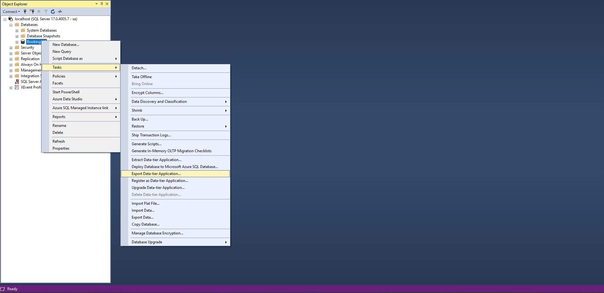

2. Chọn *Next* ở trang *Introduction*.

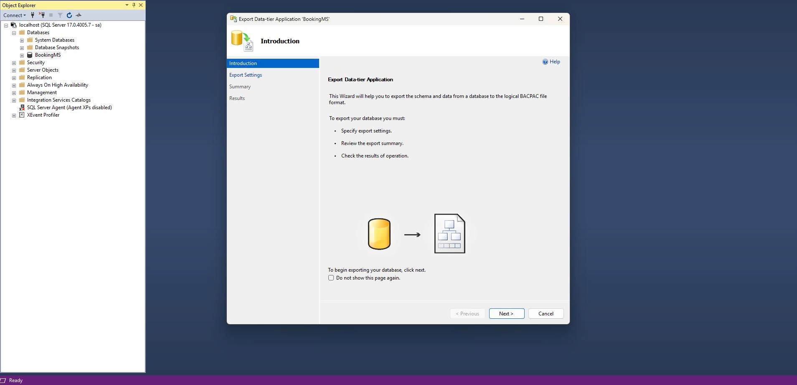

3. Ở trang *Export Settings*, mục *Save to local disk*, chỉ định đường dẫn lưu file `.bacpac`.

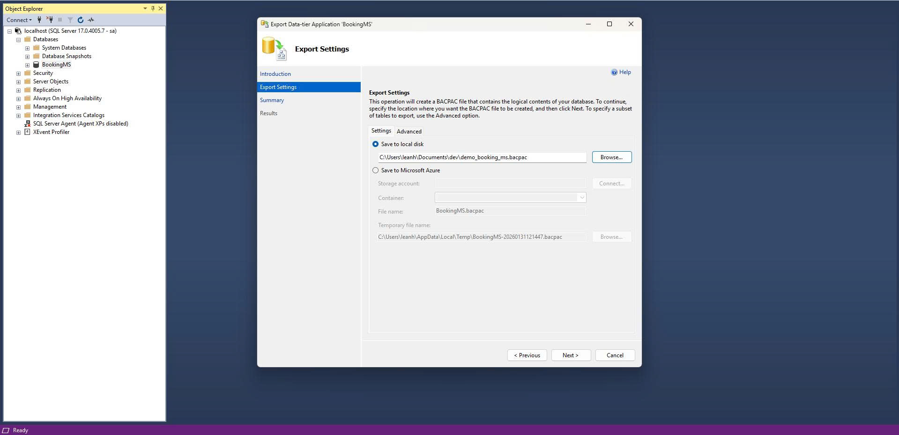

4. Ở trang *Export Settings*, *Next* và chọn các thành phần (*tables*) cần export.

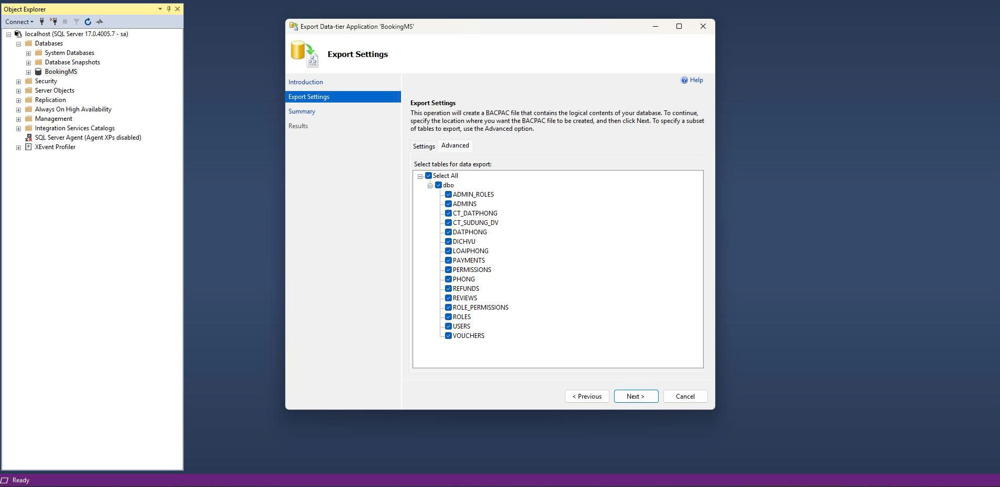

5. Ở trang *Summary*, xác nhận thông tin và nhấn *Finish*.

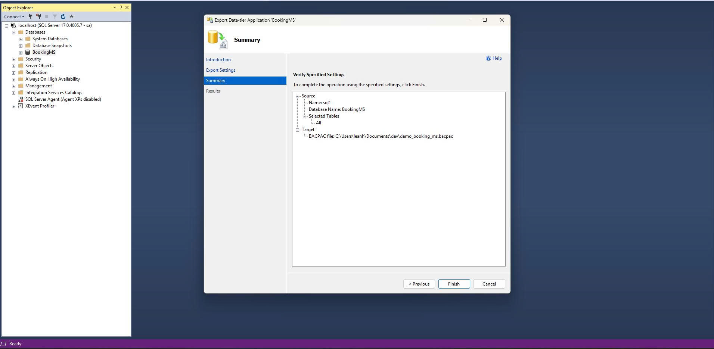

6. Kiểm tra tiến độ và kết quả ở trang *Results*.

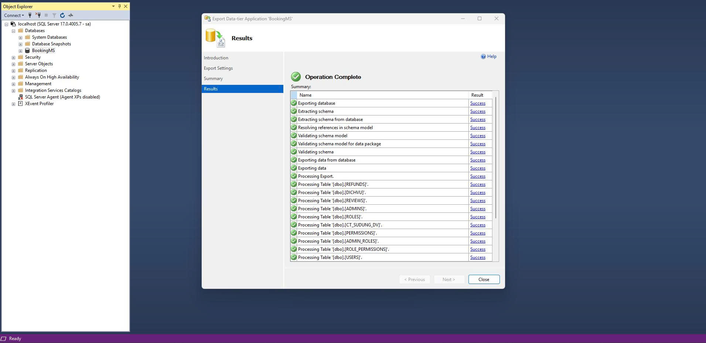

7. Kiểm tra kết quả và chắc chắn file `.bacpac` đã được tạo thành công.

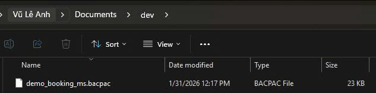

**Import:**

1. Chuột phải vào Database cần Import, chọn *Import Data-Tier Application...*.


2. Chọn *Next* ở trang *Introduction*.

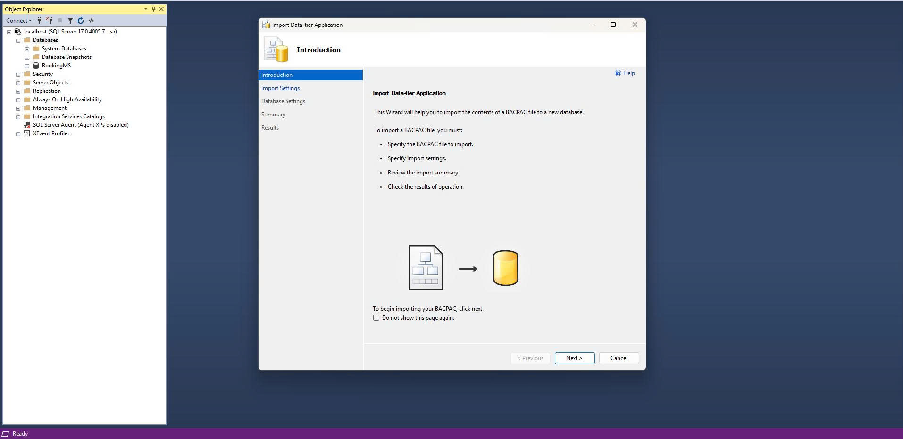

3. Chọn *Browse* để tìm file `.bacpac`.

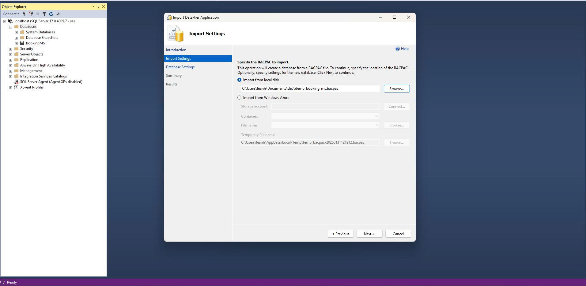

4. Ở trang *Database Settings*, đặt tên cho database tại *New database name*.

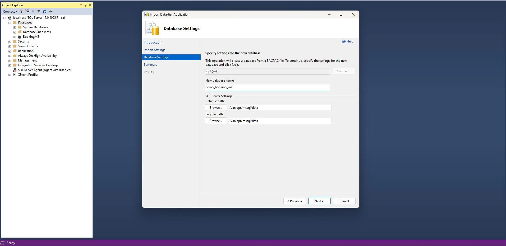

5. Ở trang *Summary*, xác nhận thông tin và nhấn *Finish*.

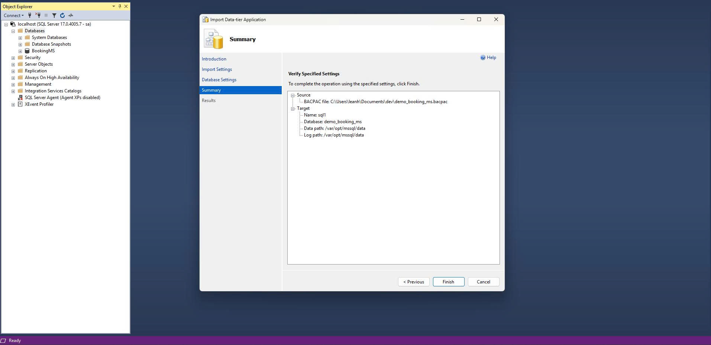

6. Kiểm tra tiến độ và kết quả ở trang *Results*.

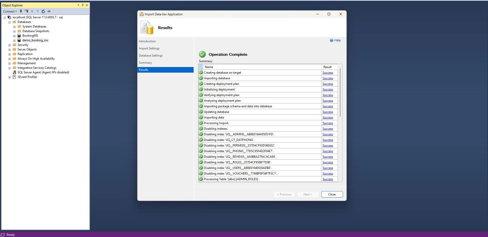

7. Kiểm tra kết quả bằng cách xem các thành phần của Database vừa được import.

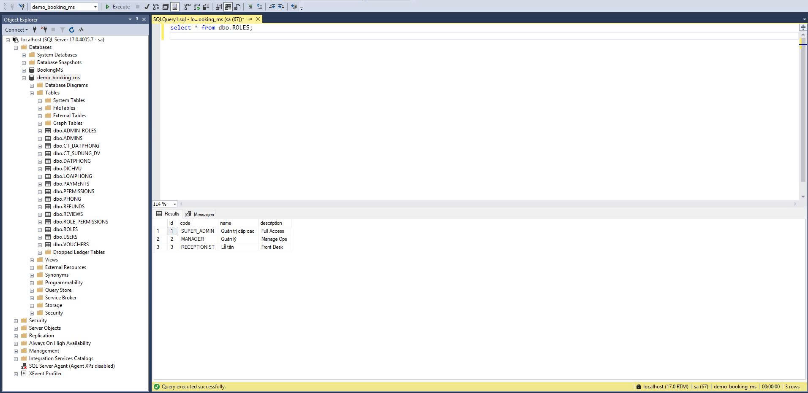
