## An Toàn Thông Tin

Mục này trình bày về cách hiện thực các biện pháp bảo mật thông tin trong hệ thống, bao gồm các biện pháp phân quyền, mã hóa mật khẩu, và các biện pháp bảo mật khác. Hệ thống áp dụng mô hình bảo mật đa lớp từ mức Vật Lý của Hệ Quản Trị CSDL, tới phân quyền dựa trên vai trò (RBAC) ở mức dữ liệu.

Đồng thời trình bày các công việc của quản trị viên trong việc sao lưu/khôi phục dữ liệu, đảm bảo an toàn thông tin và tính liên tục của vận hành (Business Continuity).

### Bảo Mật Mức Hệ Quản Trị

Bảo mật mức vật lý của hệ quản trị SQL Server là lớp đầu tiên trong *An Toàn Thông Tin* của Hệ Thống BMS.

Để tuân thủ nguyên tắc *Đặc Quyền Tối Thiểu* (Least Privilege) -- mỗi tài khoản chỉ có đủ quyền truy cập vào tài nguyên cần thiết cho các nghiệp vụ cụ thể, hệ thống KHÔNG SỬ DỤNG tài khoản `sa` (System Admin) để kết nối từ ứng dụng vào cơ sở dữ liệu. Thay vào đó, một tài khoản chuyên biệt được tạo ra để kết nối từ ứng dụng vào cơ sở dữ liệu.

- Tạo Login trên Server:

```{=typst}
#figure(
  ```sql
  CREATE LOGIN [BMS_App_User] WITH PASSWORD = 'P@ssw0rd123!';
  ```,
  caption: [Bảo Mật Mức Hệ Quản Trị - Tạo Login Server]
)
```

- Tạo Database User & Gán Quyền:

```{=typst}
#figure(
```sql
USE ROOM_BOOKING_SYSTEM;
CREATE USER [BMS_App_User] FOR LOGIN [BMS_App_User];
```,
caption: [Bảo Mật Mức Hệ Quản Trị - Tạo Database User]
)
```

- Gán Quyền: Chỉ cấp quyền thực thi (`EXECUTE`) trên các Stored Procedure, ngăn chặn truy cập trực tiếp vào bảng dữ liệu.

```{=typst}
#figure(
```sql
GRANT EXECUTE TO [BMS_App_User];
DENY SELECT, INSERT, UPDATE, DELETE ON SCHEMA::dbo TO [BMS_App_User];
GO
```,
caption: [Bảo Mật Mức Hệ Quản Trị - Gán Quyền]
)
```

### Mã Hóa Mật Khẩu

Để đảm bảo an toàn dữ liệu người dùng, hệ thống không lưu trữ mật khẩu dưới dạng văn bản thuần (plain-text). Mọi mật khẩu đều được mã hóa một chiều bằng thuật toán SHA-256 thông qua hàm HASHBYTES của SQL Server trước khi lưu vào cơ sở dữ liệu.

Tồn tại một Stored Producedure (SP) thực hiện mã hóa mật khẩu mỗi khi tạo User mới (`SP_AUTH_REGISTER`) như miêu tả sau:

```{=typst}
#figure(
    raw(read("code/ch04-sp_auth_register.sql"), lang: "sql", block: true),
    caption: [An Toàn Thông Tin -- Mã Hóa Mật Khẩu]
)
```

Tồn tại một SP Đăng nhập (Kiểm tra Hash mật khẩu khi người dùng đăng nhập) `SP_AUTH_LOGIN`:

- Mã hóa mật khẩu nhập vào và so sánh với mật khẩu đã mã hóa trong database.
- Đảm bảo luôn so sánh cặp `email` đăng nhập và `password_hash` được nhập vào.

```{=typst}
#figure(
    raw(read("code/ch04-sp_auth_login.sql"), lang: "sql", block: true),
    caption: [An Toàn Thông Tin -- Kiểm Tra Mật Khẩu Đăng Nhập]
)
```

### Xác Thực Và Phân Quyền

Hệ thống áp dụng cơ chế phân quyền dựa trên vai trò (RBAC).

#### RBAC (Role-Based Access Control) Cho Nhân Viên

```{=typst}
#co-warn[Mọi thao tác quản trị (Thêm phòng, Duyệt hoàn tiền...) đều phải đi qua hàm kiểm tra `F_CHECK_PERMISSION` để xác thực xem `AdminID` có sở hữu quyền (`PERMISSIONS.code`) tương ứng hay không.]
```

Hệ thống quản lý quyền hạn thông qua các bảng `ROLES`, `PERMISSIONS` và `ADMIN_ROLES`. Quyền truy cập không được gán cứng mà dựa trên vai trò và quyền hạn của *Admin* hoặc *Staff* (Nhân viên).

Mô hình phân quyền:

<!-- | STT | **Vai Trò** | **Quyền Hạn** |
|----:|----|----|
| 1 | `SUPER_ADMIN` | Quản trị viên cấp cao | Toàn quyền quản lý hệ thống |
| 2 | `ADMIN` | Quản trị viên | Quản lý phòng và đặt phòng |
| 3 | `STAFF` | Nhân viên | Xử lý đặt phòng và thanh toán |
| 4 | `ACCOUNTANT` | Kế toán | Quản lý thanh toán và doanh thu |
| 5 | `RECEPTIONIST` | Lễ tân | Tiếp nhận khách và check-in/out |
| 6 | `MANAGER` | Quản lý | Giám sát hoạt động |
| 7 | `MAINTENANCE` | Bảo trì | Quản lý bảo trì phòng |
| 8 | `MARKETING` | Marketing | Quản lý khuyến mãi và voucher |
| 9 | `SUPPORT` | Hỗ trợ | Hỗ trợ khách hàng |
| 10 | `ANALYST` | Phân tích | Xem báo cáo và thống kê | -->

```{=typst}
#figure(
    table(
    columns: (10%, 20%, 70%),
    align: (right + bottom, left + bottom, left + bottom),
    [STT], [#strong[Vai Trò]], [#strong[Quyền Hạn]],
    [1], [`SUPER_ADMIN`], [Quản trị viên cấp cao],
    [2], [`ADMIN`], [Quản trị viên],
    [3], [`STAFF`], [Nhân viên],
    [4], [`ACCOUNTANT`], [Kế toán],
    [5], [`RECEPTIONIST`], [Lễ tân],
    [6], [`MANAGER`], [Quản lý],
    [7], [`MAINTENANCE`], [Bảo trì],
    [8], [`MARKETING`], [Marketing],
    [9], [`SUPPORT`], [Hỗ trợ],
    [10], [`ANALYST`], [Phân tích]
    ),
    caption: [An Toàn Thông Tin - Bảng Phân Quyền]
)
```

Thủ tục kiểm tra quyền `F_CHECK_PERMISSION`:

- Kiểm tra quyền bằng cách liên kết các bảng, và chỉ cho phép truy cập vào tài nguyên hệ thống nếu staff/admin có quyền truy cập vào tài nguyên đó.
- Miêu tả nhanh như dưới đây.

```sql
BEGIN
    DECLARE @IsAllowed BIT = 0;

    IF EXISTS (
        SELECT 1 
        FROM ADMIN_ROLES ar
        JOIN ROLES r ON ar.role_id = r.id
        JOIN ROLE_PERMISSIONS rp ON r.id = rp.role_id
        JOIN PERMISSIONS p ON rp.permission_id = p.id
        WHERE ar.admin_id = @AdminId 
          AND p.code = @RequiredPermissionCode
    )
    SET @IsAllowed = 1;

    RETURN @IsAllowed;
END;
```

#### OBAC (Ownership-Based Access Control) Cho Khách Hàng

(Trình Bày Ở Đây)

### Sao Lưu & Phục Hồi

Chiến lược sao lưu dữ liệu được đề xuất:

- Full Backup: Thực hiện định kỳ vào 00:00 Chủ Nhật hàng tuần.
    - Mỗi bản Full backup được lưu giữ trong 2 tuần.
- Differential Backup: Thực hiện vào 00:00 các ngày trong tuần.
    - Mỗi bản Differential backup được lưu giữ trong 1 tuần.
- Export/Import: Sử dụng trong các tình huống cụ thể.
    - Không quy định thời gian lưu giữ, tùy tình huống hoặc yêu cầu khi thực hiện.

#### Backup – Restore Dữ Liệu

**Backup:**

1. Chuột phải vào Database, chọn *Task* > *Back Up...*.

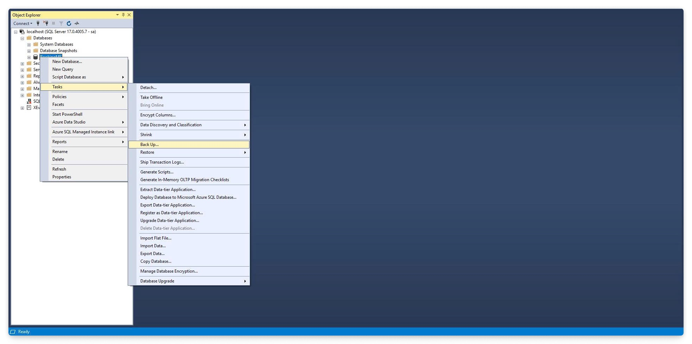

2. Chọn *Full* hoặc *Differential* trong mục *Backup type*. Chọn *Destination* là *Disk*

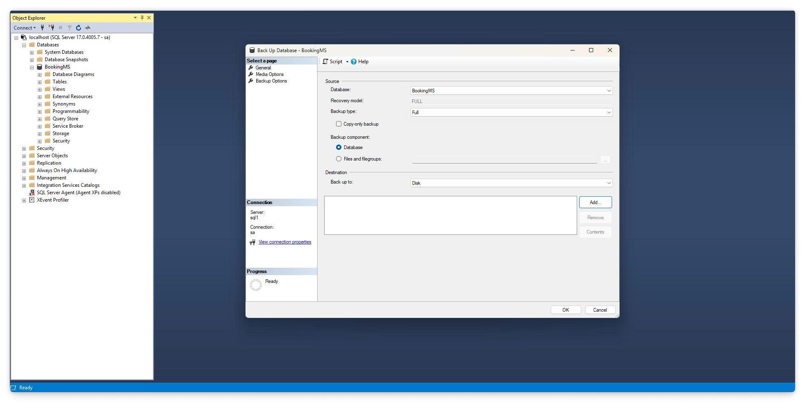

3. Thêm đường dẫn thư mục lưu file backup.


4. Nhấn *OK*.


5. Thông báo Hoàn Thành.

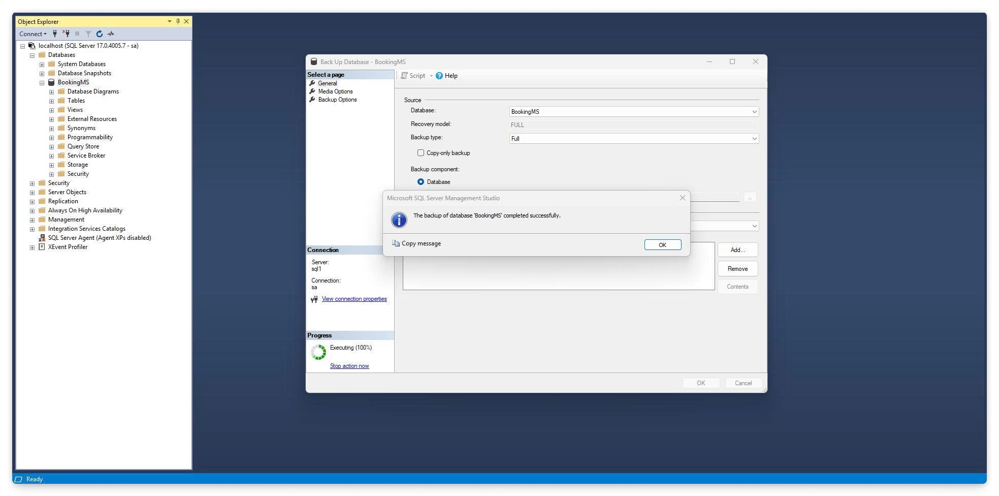

**Restore:**

1. Chuột phải vào mục Database của Server, chọn *Restore Database...*.

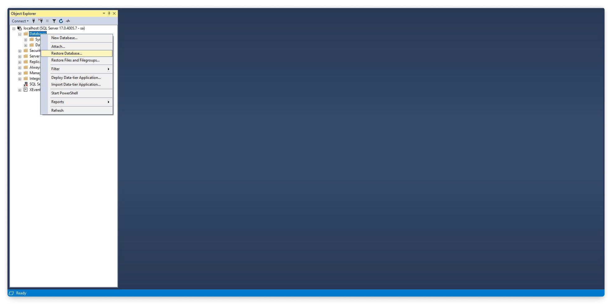

2. Chọn *Source* là *Device* và chọn *File name* là file backup.

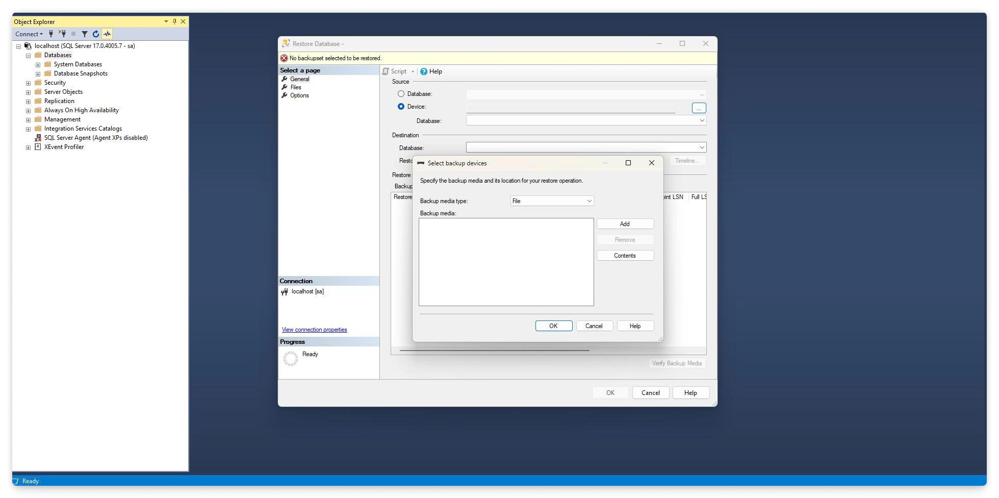

3. Chọn file `.bak` để khôi phục.

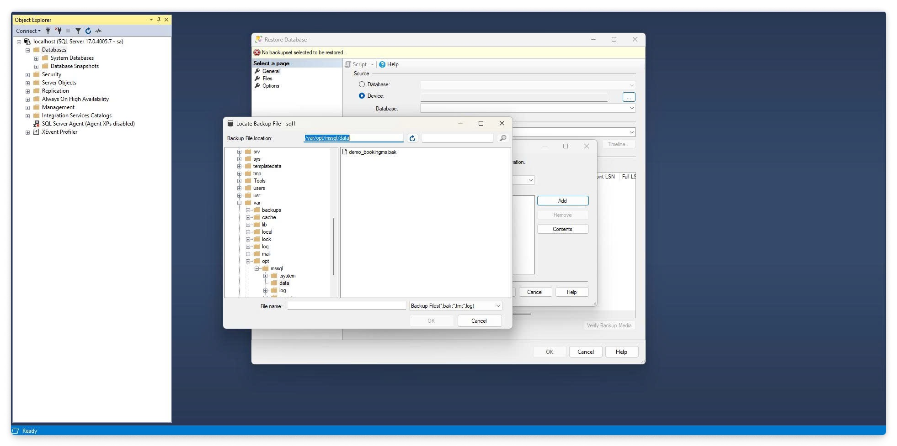

4. Chọn *Destination* là *Database* và đặt tên *Database* là *BookingMS*.

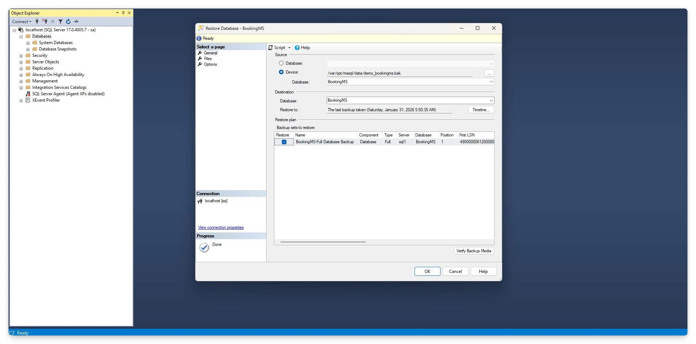

5. Thông báo Hoàn Thành.

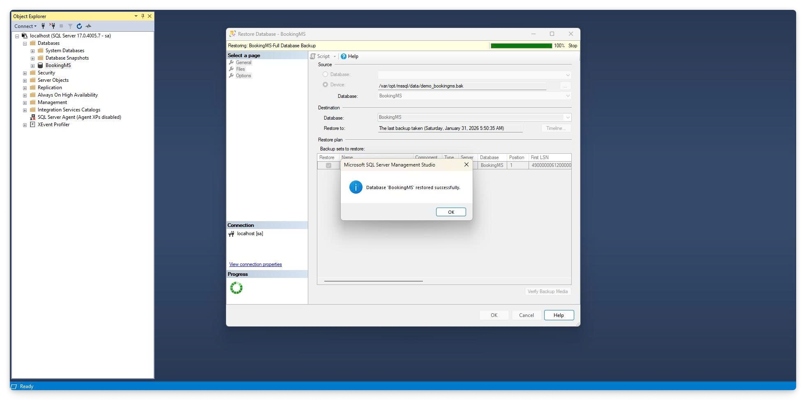

6. Kiểm tra các thành phần của Database vừa được khôi phục.

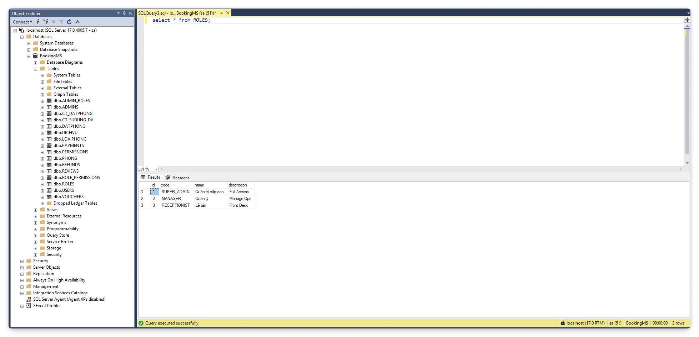

#### Export - Import Dữ Liệu

**Export:**

1. Chuột phải vào Database cần Export, chọn *Task* > *Export Data-Tier Application...*.

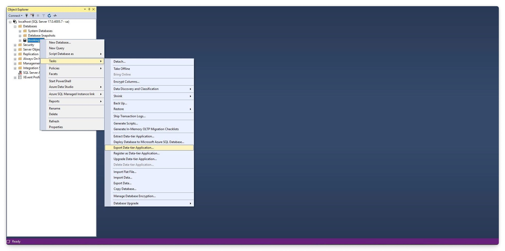

2. Chọn *Next* ở trang *Introduction*.


3. Ở trang *Export Settings*, mục *Save to local disk*, chỉ định đường dẫn lưu file `.bacpac`.

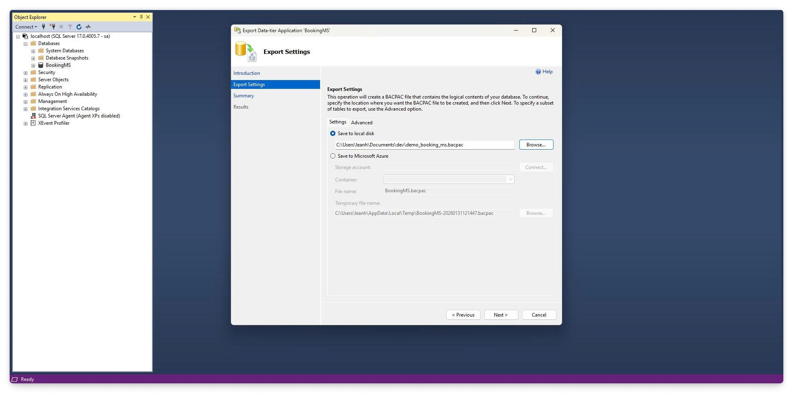

4. Ở trang *Export Settings*, *Next* và chọn các thành phần (*tables*) cần export.

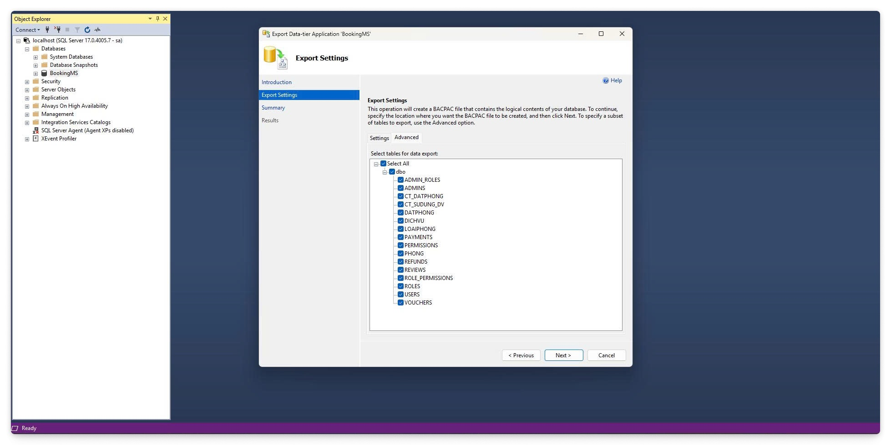

5. Ở trang *Summary*, xác nhận thông tin và nhấn *Finish*.

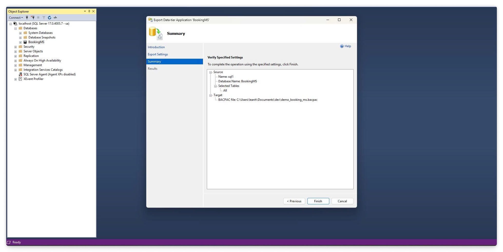

6. Kiểm tra tiến độ và kết quả ở trang *Results*.

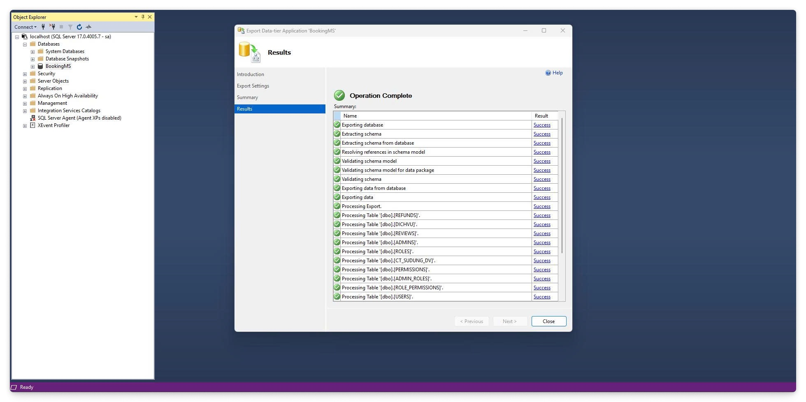

7. Kiểm tra kết quả và chắc chắn file `.bacpac` đã được tạo thành công.

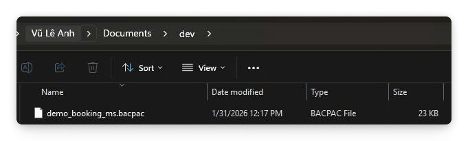

**Import:**

1. Chuột phải vào Database cần Import, chọn *Import Data-Tier Application...*.

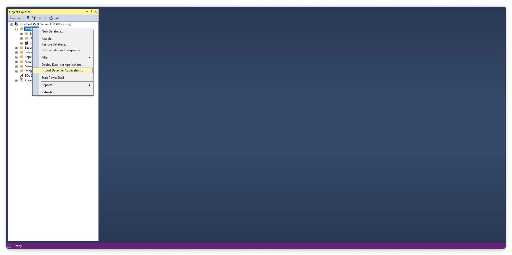

2. Chọn *Next* ở trang *Introduction*.


3. Chọn *Browse* để tìm file `.bacpac`.

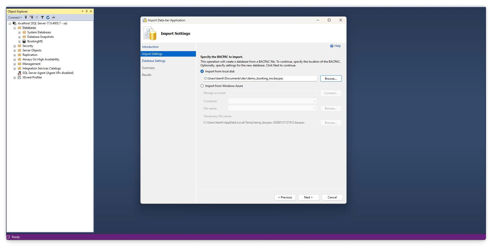

4. Ở trang *Database Settings*, đặt tên cho database tại *New database name*.

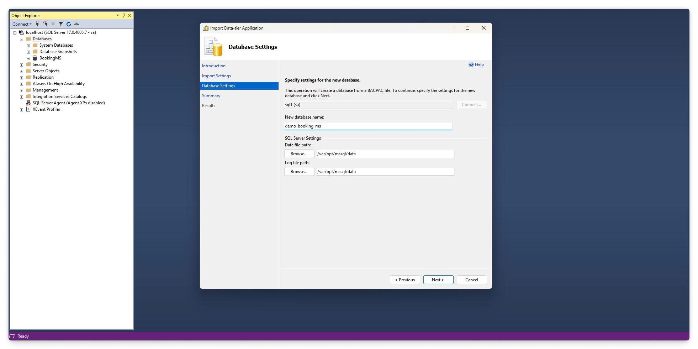

5. Ở trang *Summary*, xác nhận thông tin và nhấn *Finish*.

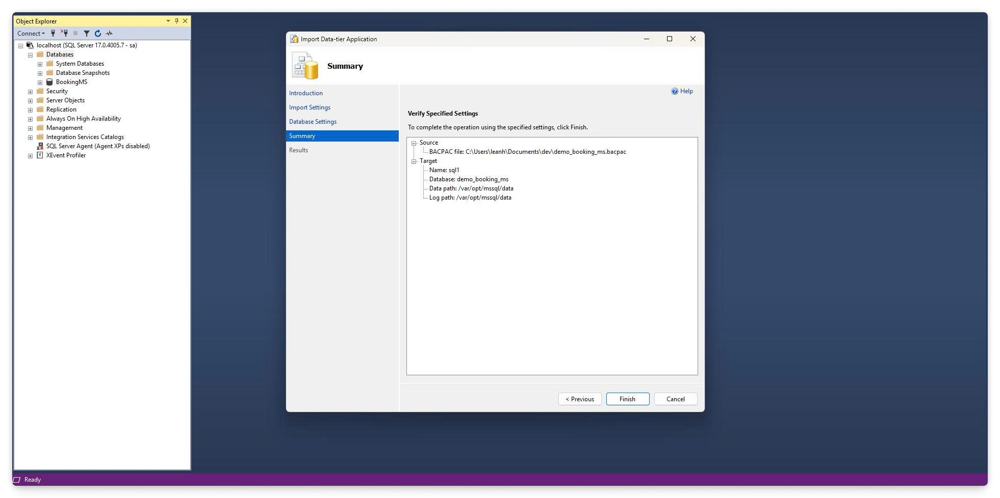

6. Kiểm tra tiến độ và kết quả ở trang *Results*.

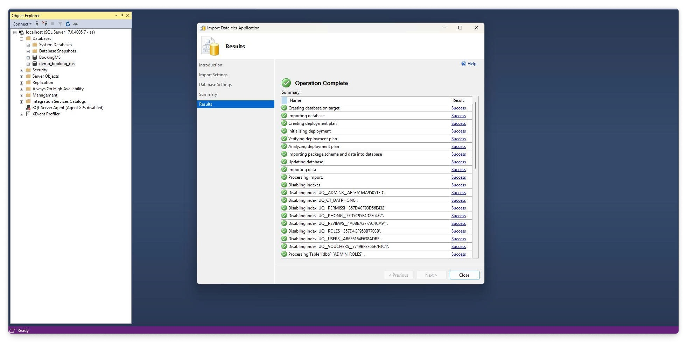

7. Kiểm tra kết quả bằng cách xem các thành phần của Database vừa được import.

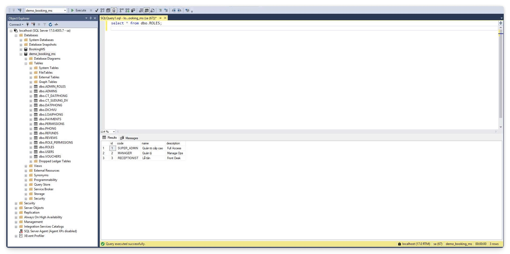
