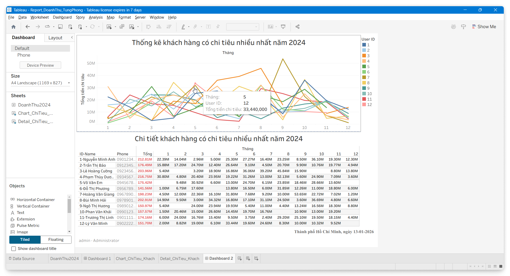
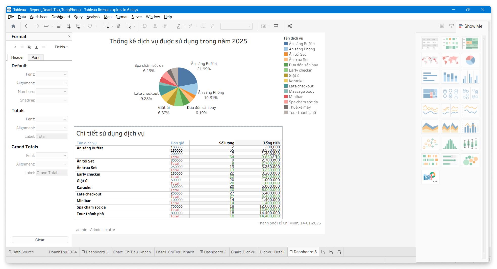
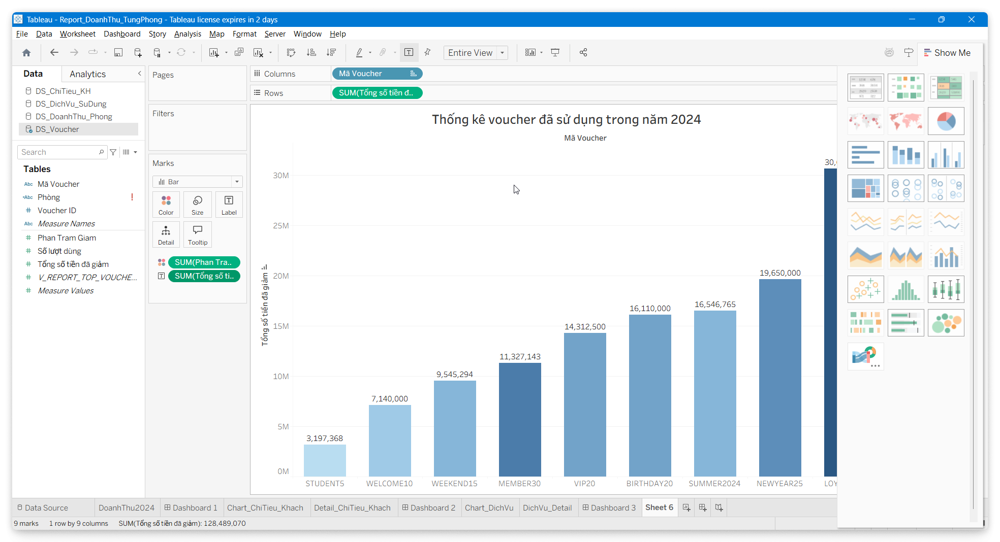
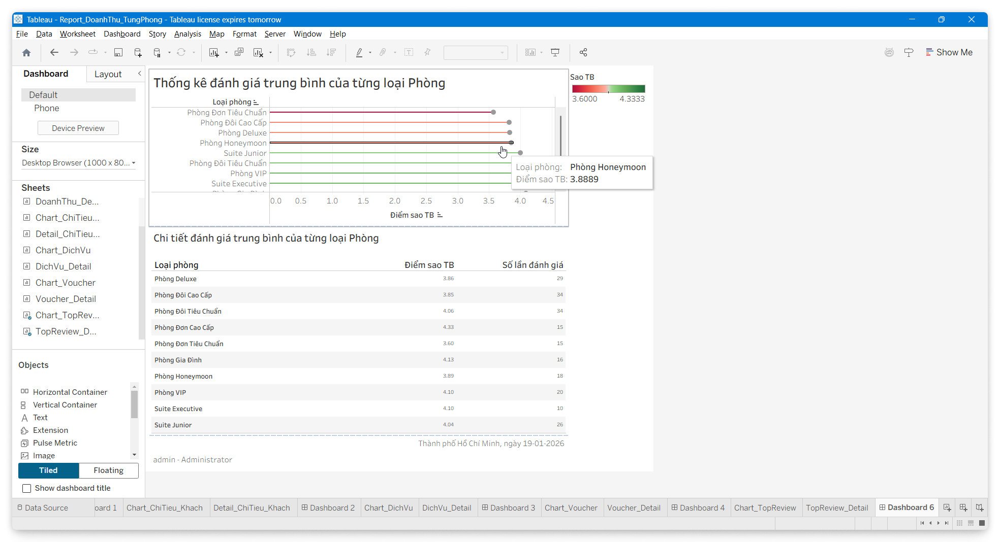

## Trình Bày Thông Tin

Phần này hiện thực yêu cầu Trình Bày Thông Tin, phục vụ cho người sử dụng trên hệ thống, bao gồm USERS (qua Menu hoặc Form), Admin/Quản Lý qua các Báo Cáo (Report), vv...

Mỗi hình thức trình bày thông tin hướng đến những yêu cầu khác nhau nhằm tối ưu hóa trải nghiệm người dùng và hỗ trợ ra quyết định hiệu quả.

### Menu

(Không trình bày).

<!--
- Module Khách Hàng (Front-Office):
    - Trang chủ / Tìm kiếm phòng.
    - Chi tiết phòng & Đặt phòng.
    - Lịch sử đặt phòng / Đánh giá.
- Module Quản Trị (Back-Office):
    - Dashboard: Thống kê doanh thu, tỷ lệ lấp đầy.
    - Quản lý phòng: Sơ đồ phòng, cập nhật trạng thái.
    - Nghiệp vụ: Check-in, Check-out, Dịch vụ đi kèm.
    - Cấu hình: Quản lý Voucher, Tài khoản nhân viên. -->

<!-- Form: Không sử dụng -->
### Form

(Không trình bày).

### Report - Các Báo Cáo

Các báo cáo đầu ra chính của hệ thống phục vụ quá trình khai thác dữ liệu và ra quyết định của quản lý:

- Báo Cáo 01 - Thống Kê Doanh Thu:
    - Thống kê doanh thu từng tháng và doanh thu của từng phòng trong tháng.
- Báo Cáo 02 - Top Khách Hàng Chi Tiêu Nhiều Nhất:
    - Thống kê và xếp hạng khách hàng chi tiêu nhiều nhất.
- Báo Cáo 03 - Thống Kê Doanh Thu Dịch Vụ:
    - Thống kê "Dịch vụ được yêu thích nhất".
- Báo Cáo 04 - Thống Kê Top Voucher Được Săn Đón Nhất:
    - Thống kê và xếp hạng voucher được sử dụng nhiều nhất.
- Báo Cáo 05 - Thống Kê Top Loại Phòng Được Yêu Thích Nhất:
    - Thống kê và xếp hạng loại phòng được yêu thích nhất.

#### Báo Cáo 01 - Thống Kê Doanh Thu

Tóm tắt:

- Thống kê doanh thu từng tháng trong năm 2024, và doanh thu của từng phòng trong tháng.

Miêu tả:

- Giúp thống kê được doanh thu của từng phòng để đánh giá xem phòng nào ít khách đặt để tìm ra lý do, hoặc thay đổi loại phòng theo xu hướng của khách.
- Chúng ta sẽ có phần chart thể hiện tổng doanh thu của từng tháng, và phần hiển thị chi tiết tổng số lượt đặt và tổng số tiền đem về của từng phòng trong năm 2024.

<!-- Các bước thực hiện:

1. Tạo View tính tổng doanh thu và số lần đặt phòng của từng phòng trong từng tháng của năm 2024: `V_RPT_DOANHTHU_THEO_PHONG_2024`.
2. Kết nối Tableau vào CSDL.
3. Kéo view `V_RPT_DOANHTHU_THEO_PHONG_2024` vào Canvas.
4. Sheet tạo chart bar, mapping dữ liệu từ View `V_RPT_DOANHTHU_THEO_PHONG_2024` để tạo report:
    - `Thang` $\to$ Columns, edit chọn *Discrete* $\Rightarrow$ để hiển thị từng tháng theo cột.
    - `Doanh Thu Phong` $\to$ Rows $\Rightarrow$ để Tableau tự tính `SUM` doanh thu theo từng tháng tương ứng.
    - Kéo thả vào mục Marks các trường trong view:
        - `Doanh Thu Phong` $\to$ Color $\Rightarrow$ để hiển thị màu phân biệt giá trị doanh thu.
        - `Doanh Thu Phong` và `So Luot Dat`  $\to$ Label $\Rightarrow$ để hiển thị doanh thu, số lần đặt trên bar.
        - Kéo `So Luot Dat` vào tooltip và edit thông tin để hiển thị khi rê chuột.
        - Tạo calculated fields để hiển thị mã phòng - tên loại phòng.
5. Màn hình design và preview chart bar.

6. Màn hình Design và Preview sheet hiển thị bảng chi tiết.

7. Tạo dashboard để hiển thị report.
    - Hiển thị 2 sheet charts ở trên.
        - Dạng cột.
        - Dạng bảng. -->

<!--  -->

#### Báo Cáo 02 - Top Khách Hàng Chi Tiêu Nhiều Nhất

Mục đích:

- Giúp đánh giá xem khách hàng thân thiết để tặng voucher hay là nâng hạng khách hàng lên Premium, VIP phục vụ cho CSKH, CRM.

<!-- Các bước thực hiện:

1. Tạo View lấy danh sách Khách Hàng VIP (`V_REPORT_USER_VIP_2024`).
2. Kết nối Tableu vào database.
3. Kéo view `V_REPORT_USER_VIP_2024` vào Canvas.
4. Mapping dữ liệu từ View `V_REPORT_USER_VIP_2024` để tạo chart line:
    - Kéo "Tổng tiền chi tiêu" $\to$ Row $\Rightarrow$ Tableau sẽ tự động tính tổng và làm trục đứng (Y).
    - Kéo "Tháng" $\to$ Columns, chọn demension để làm trục ngang (X).
    - Kéo `UserID` vào Color chỗ Mark để hiển thị màu phân biệt.
    - Filter top 10 tùy mục đích.
5. Tạo Sheet hiển thị table chi tiết.
    - Kéo "Tháng" $\to$ Columns, chọn demension và *discrete*.
    - Tạo calculated fields để hiển thị UserID - Tên.
    - Kéo calculated fields và phone vào để hiển thị.
    - Kéo "Tổng chi tiêu" và Text chỗ Marks để show tiền vào table.
    - Format màu, kiểu chữ kích thước.
    - Chọn Analysis $\to$ Total $\to$ show grands total và kéo về trái để hiển thị cột tổng.
6. Màn hình design và preview dashboard.

- Ta chọn kích cỡ A4 lanscape để in cho đẹp và đây đủ, chọn fit -> entrie view để hiển thị hết width height. -->

<!--  -->

#### Báo Cáo 03 - Thống Kê Doanh Thu Dịch Vụ

Miêu tả:

- Để xác định "Dịch vụ nào được ưa chuộng nhất" (Best Seller) sẽ giúp quản lý có kế hoạch nhập hàng và đẩy mạnh khuyến mãi.
- Vì mỗi dịch vụ thời giá sẽ khác nhau nên ở table chi tiết ta sẽ thống kê từng đơn giá của dịch vụ.

<!-- Các bước thực hiện:

1. Tạo View lấy danh sách Dịch Vụ Yêu Thích Nhất (`V_REPORT_TOP_SERVICE_2024`).
2. Kết nối Tableu vào database.
3. Kéo view `V_REPORT_TOP_SERVICE_2024` vào Canvas.
4. Mapping dữ liệu từ View `V_REPORT_TOP_SERVICE_2024` để tạo chart line.
5. Tạo Sheet hiển thị table chi tiết.

Màn hình design và preview dashboard:

 -->

#### Báo Cáo 04 - Thống Kê Top Voucher Được Săn Đón Nhất

Miêu tả:

- Để thống kê xem mình đưa ra bao nhiêu mã giảm giá, và cái nào khách xài nhiều nhất.
- Tổng số tiền của voucher nào sử dụng nhiều nhất.
- Chỉ tính dòng trong bảng `PAYMENTS` có trạng thái `SUCCESS`, hiểu là thanh toán thành công.
- Công thức tính số tiền giảm: (tiền thực / (100% - %giảm)) - tiền thực .

<!-- Các bước thực hiện:

1. Tạo View lấy danh sách Top Voucher Được Săn Đón Nhất & Số Tiền Đã Giảm Giá Năm 2024 (`V_REPORT_TOP_VOUCHER_2024`).
2. Kết nối Tableu vào database.
3. Kéo view `V_REPORT_TOP_VOUCHER_2024` vào Canvas.
4. Mapping dữ liệu từ View `V_REPORT_TOP_VOUCHER_2024` để tạo chart line.
5. Tạo Sheet hiển thị table chi tiết.

Màn hình design và preview dashboard:

 -->

#### Báo Cáo 05 - Thống Kê Top Loại Phòng Được Yêu Thích Nhất

Miêu tả:

- Dựa trên số sao được khách hàng đánh giá, ta sẽ thống kê xem xem là loại phòng nào làm khách hàng thích nhất, để điều chỉnh phòng theo xu hướng của khách hàng, giúp đánh giá tăng doanh thu, thu hút khách.
- Chúng ta chỉ lấy những reviews nào đã được admin duyệt(`trang_thai = 'APPROVED'`), vì có thể có những review spam hoặc rác.

<!-- Các bước thực hiện:

1. Tạo View lấy danh sách Top Loại Phòng Được Yêu Thích Nhất (`V_REPORT_ROOM_RATING`).
2. Kết nối Tableu vào database.
3. Kéo view `V_REPORT_ROOM_RATING` vào Canvas.
4. Mapping dữ liệu từ View `V_REPORT_ROOM_RATING` để tạo chart line.
5. Tạo Sheet hiển thị table chi tiết.

Màn hình design và preview dashboard:

 -->

