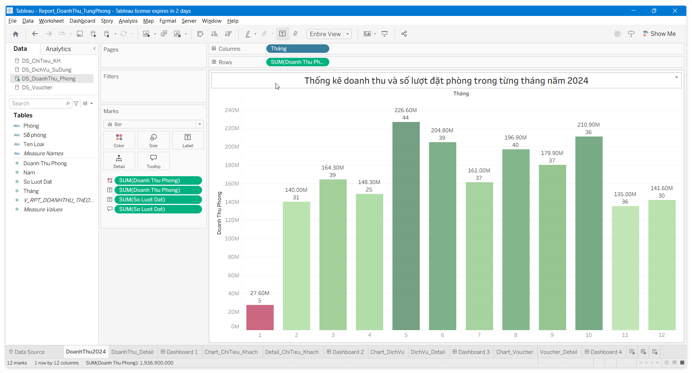
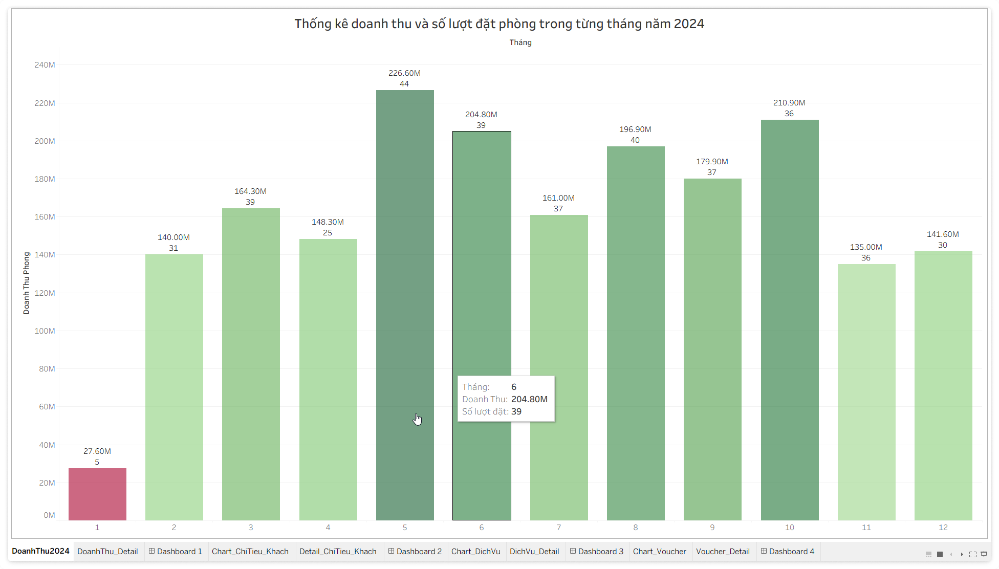
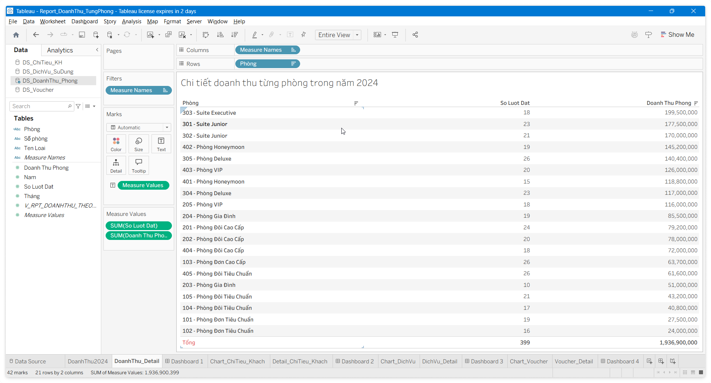
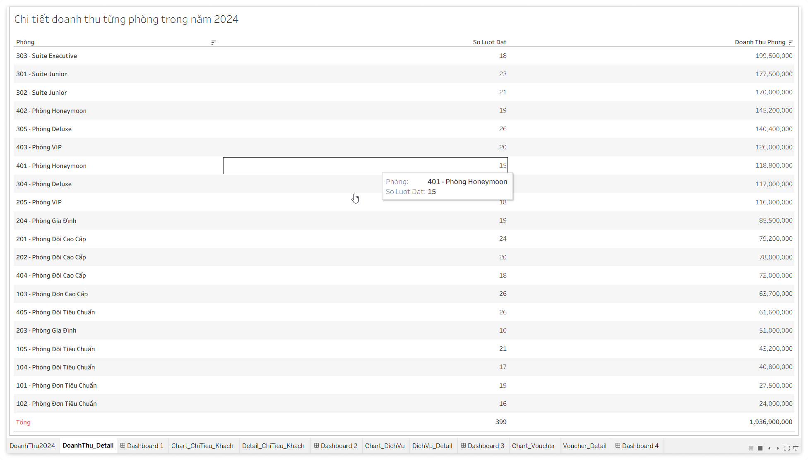
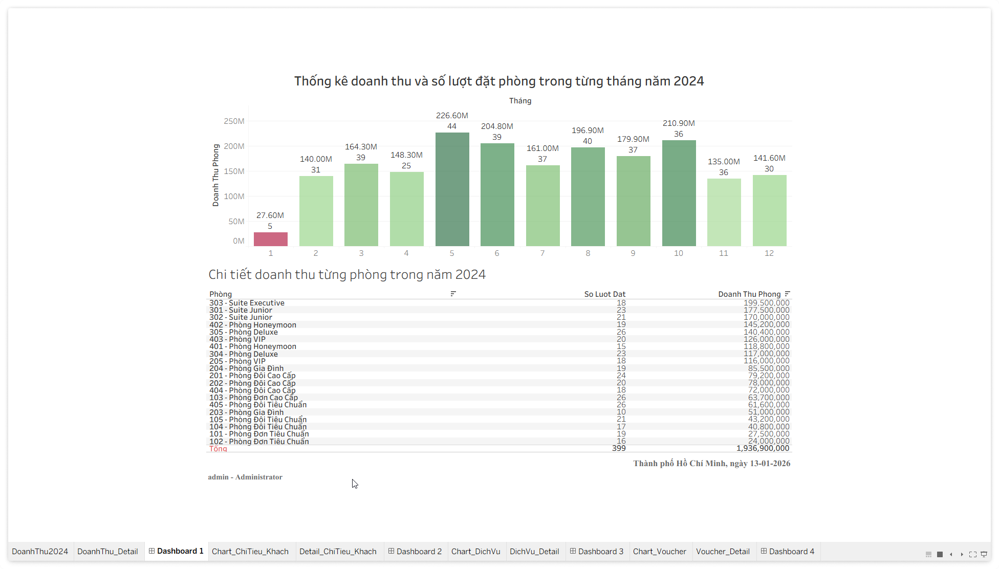

# Quản Lý Thông Tin

Trên nền tảng cơ sở dữ liệu đã thiết kế, chương này trình bày các kỹ thuật xử lý dữ liệu nâng cao (Business Logic) và các chính sách an toàn thông tin được áp dụng trong hệ thống.

## Xử Lý Thông Tin

Hệ thống sử dụng các đối tượng lập trình cơ sở dữ liệu (Database Programmability) để đảm bảo tính nhất quán và thực thi các nghiệp vụ phức tạp.

### Stored Procedures (5)

Nhóm xây dựng các thủ tục để xử lý các giao dịch chính như đặt phòng, thanh toán và áp dụng khuyến mãi.

#### SP1: ApplyVoucher

#### SP2: BookingRoom

#### SP3: Checkout

#### SP4: Payment

#### SP5: RegisterUser

#### SPx: Review Room

#### SPx: Service

### Triggers (5)

Sử dụng Trigger để đảm bảo toàn vẹn dữ liệu và tự động cập nhật trạng thái.

#### TG1: AutoPrice

#### TG2: CheckTime

#### TG3: Payment

#### TG4: Refund

#### TG5: SyncStatus

### Functions (3)

Các hàm hỗ trợ tính toán và kiểm tra nhanh.

#### F1: CheckRoomAvailable

#### F2: RevertCreateError

#### F3 (WIP)

### Cursors (2)

Sử dụng Cursor cho các tác vụ xử lý theo lô (Batch Processing) định kỳ.

- `C_UpdateOverdueBookings`: Quét toàn bộ các đơn đặt phòng trạng thái `PENDING`. Nếu quá hạn thanh toán (24h), hệ thống tự động hủy đơn và giải phóng phòng.

#### C1: SyncRoomStatus

#### C2: UpdateStatusWhenOverdue

## An Toàn Thông Tin

### Xác thực và phân quyền

Hệ thống áp dụng mô hình bảo mật dựa trên vai trò (RBAC - Role Based Access Control).

- Xác thực: Mật khẩu người dùng được mã hóa (Hashing) trước khi lưu vào cơ sở dữ liệu (giả lập logic ứng dụng).
- Phân quyền:

| Vai Trò | Quyền Hạn |
|----|----|
| Admin | Quản lý tất cả |
| Staff | Quản lý đặt phòng |
| End User | Đặt phòng |

### Sao Lưu & Phục Hồi

Chiến lược sao lưu dữ liệu được đề xuất:

- Full Backup: Thực hiện định kỳ vào 00:00 Chủ Nhật hàng tuần.
- Differential Backup: Thực hiện vào 00:00 các ngày trong tuần.
- Transaction Log Backup: Mỗi 4 giờ/lần để giảm thiểu rủi ro mất dữ liệu giao dịch.

#### Import - Export Dữ Liệu

#### Backup – Restore Dữ Liệu

## Trình Bày Thông Tin

Hệ thống được thiết kế hướng tới trải nghiệm người dùng tối ưu hóa cho từng đối tượng.

<!-- Menu: Không sử dụng -->
<!-- ### Menu

- Module Khách Hàng (Front-Office):
    - Trang chủ / Tìm kiếm phòng.
    - Chi tiết phòng & Đặt phòng.
    - Lịch sử đặt phòng / Đánh giá.
- Module Quản Trị (Back-Office):
    - Dashboard: Thống kê doanh thu, tỷ lệ lấp đầy.
    - Quản lý phòng: Sơ đồ phòng, cập nhật trạng thái.
    - Nghiệp vụ: Check-in, Check-out, Dịch vụ đi kèm.
    - Cấu hình: Quản lý Voucher, Tài khoản nhân viên. -->

<!-- Form: Không sử dụng -->
<!-- ### Form -->

### Report

Các báo cáo đầu ra chính của hệ thống:

- Báo Cáo Doanh Thu Tháng: Tổng hợp doanh thu theo loại phòng và theo dịch vụ, phục vụ bộ phận kế toán.
- Phiếu Xác Nhận Đặt Phòng (Booking Confirmation): Gửi cho khách hàng sau khi đặt thành công.
- Hóa Đơn Thanh Toán (Invoice): Chi tiết tiền phòng, dịch vụ, giảm giá voucher và số tiền thực thu.

#### Thống Kê Doanh Thu

Tóm tắt:

- Thống kê doanh thu từng tháng trong năm 2024, và doanh thu của từng phòng trong tháng.

Miêu tả:

- Giúp thống kê được doanh thu của từng phòng để đánh giá xem phòng nào ít khách đặt để tìm ra lý do, hoặc thay đổi loại phòng theo xu hướng của khách.
- Chúng ta sẽ có phần chart thể hiển tổng doanh thu của từng tháng, và phần hiển thị chi tiết tổng số lượt đặt và tổng số tiền đem về của từng phòng trong năm 2024.

Các bước thực hiện:

1. Tạo View tính tổng doanh thu và số lần đặt phòng của từng phòng trong từng tháng của năm 2024: `V_RPT_DOANHTHU_THEO_PHONG_2024`.
2. Kết nối Tableau vào CSDL.
3. Kéo view `V_RPT_DOANHTHU_THEO_PHONG_2024` vào Canvas.
4. Sheet tạo chart bar, mapping dữ liệu từ View `V_RPT_DOANHTHU_THEO_PHONG_2024` để tạo report:
    - `Thang` $\to$ Columns, edit chọn *Discrete* $\Rightarrow$ để hiển thị từng tháng theo cột.
    - `Doanh Thu Phong` $\to$ Rows $\Rightarrow$ để Tableau tự tính `SUM` doanh thu theo từng tháng tương ứng.
    - Kéo thả vào mục Marks các trường trong view:
        - `Doanh Thu Phong` $\to$ Color $\Rightarrow$ để hiển thị màu phân biệt giá trị doanh thu.
        - `Doanh Thu Phong` và `So Luot Dat`  $\to$ Label $\Rightarrow$ để hiển thị doanh thu, số lần đặt trên bar.
        - Kéo `So Luot Dat` vào tooltip và edit thông tin để hiển thị khi rê chuột.
        - Tạo calculated fields để hiển thị mã phòng - tên loại phòng.
5. Màn hình design và preview chart bar.

6. Màn hình Design và Preview sheet hiển thị bảng chi tiết.

7. Tạo dashboard để hiển thị report.
    - Hiển thị 2 sheet charts ở trên.
        - Dạng cột.
        - Dạng bảng.

## Các Chức Năng Của Hệ Thống

(Hướng dẫn: Chỉ miêu tả)

### Quản Lý Thông Tin Nền Tảng

### Quản Lý Dữ Liệu Đặt Phòng

### Thống Kê Và Báo Cáo

### Quản Trị Hệ Thống
