# Quản Lý Thông Tin

Trên nền tảng cơ sở dữ liệu đã thiết kế, chương này trình bày các kỹ thuật xử lý dữ liệu nâng cao (Business Logic) và các chính sách an toàn thông tin được áp dụng trong hệ thống.

## Xử Lý Thông Tin

Hệ thống sử dụng các đối tượng lập trình cơ sở dữ liệu (Database Programmability) để đảm bảo tính nhất quán và thực thi các nghiệp vụ phức tạp.

### Stored Procedures (5)

Nhóm xây dựng các thủ tục để xử lý các giao dịch chính như đặt phòng, thanh toán và áp dụng khuyến mãi.

#### SP1 – Đặt Phòng

- Tên gọi: `SP_DATPHONG`.
- **Mục đích:** Thực hiện chức năng **đặt phòng** cho người dùng.
    - Kiểm tra phòng tồn tại và khả dụng.
    - Tạo bản ghi đặt phòng.
    - Lưu chi tiết phòng.
    - Cập nhật trạng thái phòng.
- **Tham số vào:**

<!-- | Tên tham số | Kiểu dữ liệu | Bắt buộc | Mô tả |
|------------|------------|----------|------|
| `@UserId` | `INT` | ✔ | ID người dùng |
| `@SoPhong` | `NVARCHAR(20)` | ✔ | Số phòng |
| `@CheckIn` | `DATETIME` | ✔ | Thời gian check-in |
| `@CheckOut` | `DATETIME` | ✔ | Thời gian check-out |
| `@VoucherId` | `INT` | ✖ | Voucher (nếu có) | -->

```{=typst}
#table(
  columns: (20%, 20%, 20%, 40%),
  align: (left, left, left, left),
  [Tên tham số], [Kiểu dữ liệu], [Bắt buộc], [Mô tả],
  [`@UserId`], [`INT`], [#text(fill: blue)[#sym.checkmark]], [ID người dùng],
  [`@SoPhong`], [`NVARCHAR(20)`], [#text(fill: blue)[#sym.checkmark]], [Số phòng],
  [`@CheckIn`], [`DATETIME`], [#text(fill: blue)[#sym.checkmark]], [Thời gian check-in],
  [`@CheckOut`], [`DATETIME`], [#text(fill: blue)[#sym.checkmark]], [Thời gian check-out],
  [`@VoucherId`], [`INT`], [#text(fill: red)[#sym.crossmark]], [Voucher (nếu có)]
)
```

**Ví dụ thực hiện**:

- Phòng ID = 30, Tên Phòng = 605, có Mã Vouher = 1:
    - Tạo ra đơn Đặt Phòng ID = 55, có Đơn Giá = 3,000,000.

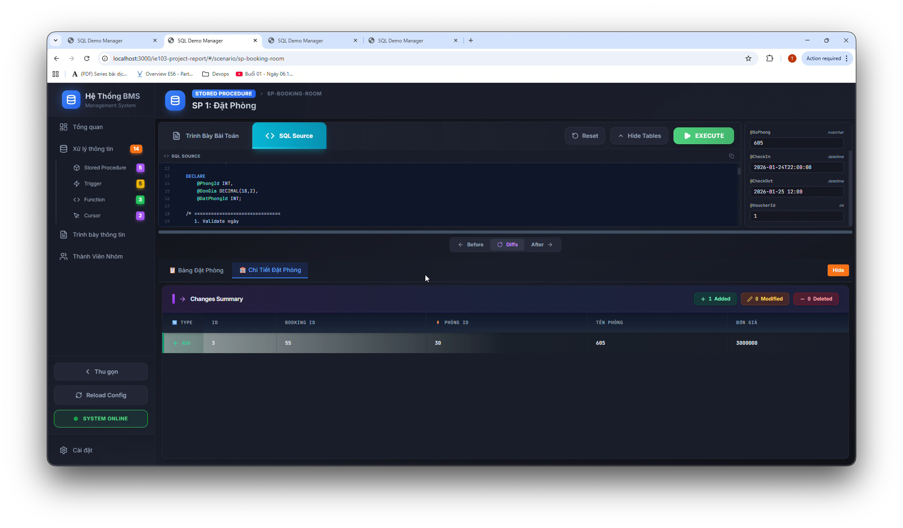

#### SP2 - Thanh Toán Đặt Phòng

- Tên gọi: `SP_THANHTOAN`.
- **Mục đích:** Thực hiện chức năng **thanh toán** cho người dùng.
    - Kiểm tra booking hợp lệ.
    - Kiểm tra số tiền thanh toán có đúng với số tiền cần trả.
    - Lưu lịch sử thanh toán.
    - Cập nhật trạng thái booking khi thanh toán hoàn tất.
- **Bảng liên quan:**

<!-- | STT | Bảng | Mô tả |
|---:|----|------|
| 1 | `DATPHONG` | Thông tin đặt phòng |
| 2 | `CT_DATPHONG` | Chi tiết phòng và đơn giá |
| 3 | `CT_SUDUNG_DV` | Dịch vụ phát sinh |
| 4 | `VOUCHERS` | Mã giảm giá |
| 5 | `PAYMENTS` | Lịch sử thanh toán | -->

```{=typst}
#table(
  columns: (8%, 32%, 60%),
  align: (right, left, left),
  [STT], [Bảng], [Mô tả], [1], [`DATPHONG`], [Thông tin đặt phòng], [2], [`CT_DATPHONG`], [Chi tiết phòng và đơn giá], [3], [`CT_SUDUNG_DV`], [Dịch vụ phát sinh], [4], [`VOUCHERS`], [Mã giảm giá], [5], [`PAYMENTS`], [Lịch sử thanh toán]
)
```

- **Tham số vào:**

<!-- | STT | Tham số | Kiểu dữ liệu | Bắt buộc | Mô tả |
|---:|------------|------------|----------|------|
| 1 | `@BookingId` | `INT` | ✔ | ID đặt phòng |
| 2 | `@UserId` | `INT` | ✔ | ID người thanh toán |
| 3 | `@SoTien` | `DECIMAL(18,2)` | ✔ | Số tiền thanh toán |
| 4 | `@PhuongThuc` | `NVARCHAR(50)` | ✔ | Phương thức thanh toán (`TIEN_MAT`, `CHUYEN_KHOAN`, `THE`, `ONLINE`) | -->

```{=typst}
#table(
  columns: (8%, 15%, 18%, 14%, 46%),
  align: (right, left, left, left, left),
  [STT], [Tham số], [Kiểu dữ liệu], [Bắt buộc], [Mô tả],
  [1], [`@BookingId`], [`INT`], [#text(fill: blue)[#sym.checkmark]], [ID đặt phòng],
  [2], [`@UserId`], [`INT`], [#text(fill: blue)[#sym.checkmark]], [ID người thanh toán],
  [3], [`@SoTien`], [`DECIMAL(18,2)`], [#text(fill: blue)[#sym.checkmark]], [Số tiền thanh toán],
  [4], [`@PhuongThuc`], [`NVARCHAR(50)`], [#text(fill: blue)[#sym.checkmark]], [Phương thức thanh toán (`TIEN_MAT`, `CHUYEN_KHOAN`, `THE`, `ONLINE`)]
)
```

**Ví dụ thực hiện**:

- Một đơn Đặt Phòng có thể được thanh toán nhiều lần. Lần 1:

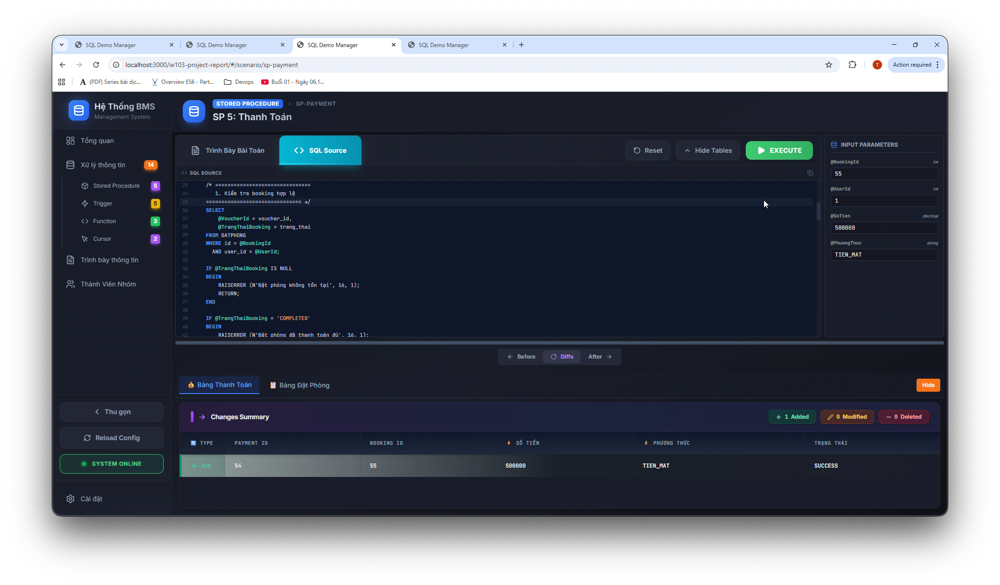

- Lần 2:


- Hoàn thành Thanh Toán: đơn Đặt Phòng chuyển trạng thái sang `COMPLETED`.

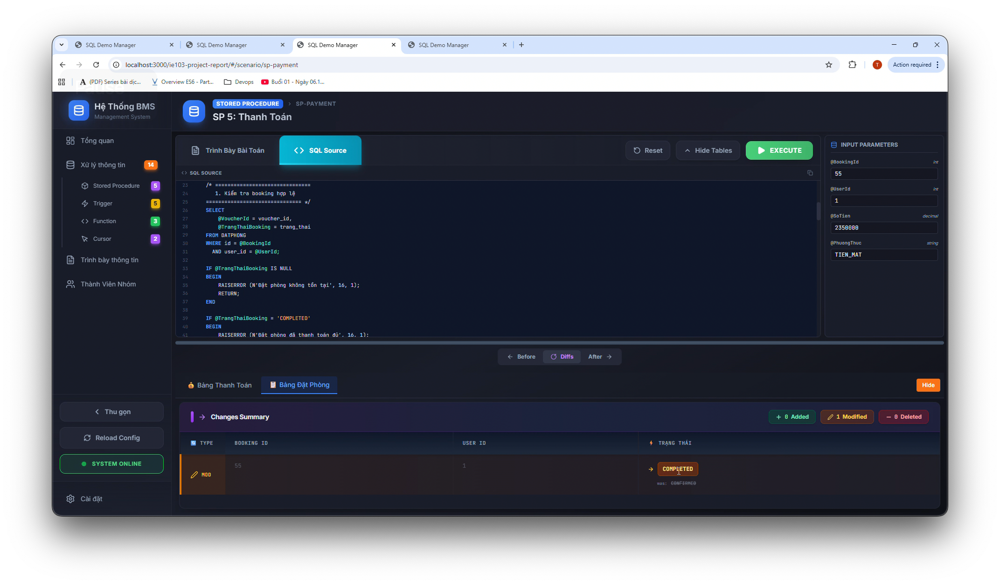

#### SP3 - Đánh Giá

- Tên gọi: `SP_DANHGIA`.
- **Mục đích:** Thực hiện chức năng **đánh giá** của người dùng sau khi *đã hoàn thành đặt phòng* (*COMPLETED*).
    - Đảm bảo chỉ đánh giá khi đã ở xong.
    - Mỗi đặt phòng chỉ được đánh giá **1 lần**.
    - Lưu đánh giá ở trạng thái chờ duyệt (`CHO_XU_LY`).
    - Hỗ trợ quản trị viên kiểm duyệt nội dung.
- **Bảng liên quan:**

<!-- | stt | Bảng | Mô tả |
|---:|----|------|
| 1 | `DATPHONG` | Thông tin đặt phòng |
| 2 | `PHONG` | Thông tin phòng |
| 3 | `REVIEWS` | Đánh giá của người dùng |
| 4 | `USERS` | Người đánh giá | -->

```{=typst}
#table(
  columns: (8%, 32%, 60%),
  align: (right, left, left),
  [stt], [Bảng], [Mô tả],
  [`1`], [`DATPHONG`], [Thông tin đặt phòng],
  [`2`], [`PHONG`], [Thông tin phòng],
  [`3`], [`REVIEWS`], [Đánh giá của người dùng],
  [`4`], [`USERS`], [Người đánh giá]
)
```

- **Tham số vào:**

<!-- | stt | Tham số | Kiểu dữ liệu | Bắt buộc | Mô tả |
|---:|------------|------------|----------|------|
| 1 | `@UserId` | INT | ✔ | ID người đánh giá |
| 2 | `@DatPhongId` | INT | ✔ | ID đặt phòng |
| 3 | `@SoPhong` | NVARCHAR(20) | ✔ | Số phòng được đánh giá |
| 4 | `@SoSao` | INT | ✔ | Số sao (1 → 5) |
| 5 | `@BinhLuan` | NVARCHAR(1000) | ✖ | Nội dung đánh giá | -->

```{=typst}
#table(
  columns: (8%, 15%, 18%, 14%, 46%),
  align: (right, left, left, left, left),
  [stt], [Tham số], [Kiểu dữ liệu], [Bắt buộc], [Mô tả],
  [`1`], [`@UserId`], [`INT`], [#text(fill: blue)[#sym.checkmark]], [ID người đánh giá],
  [`2`], [`@DatPhongId`], [`INT`], [#text(fill: blue)[#sym.checkmark]], [ID đặt phòng],
  [`3`], [`@SoPhong`], [`NVARCHAR(20)`], [#text(fill: blue)[#sym.checkmark]], [Số phòng được đánh giá],
  [`4`], [`@SoSao`], [`INT`], [#text(fill: blue)[#sym.checkmark]], [Số sao (1 → 5)],
  [`5`], [`@BinhLuan`], [`NVARCHAR(1000)`], [#text(fill: red)[#sym.crossmark]], [Nội dung đánh giá]
)
```

**Ví dụ thực hiện**:

- Sau khi hoàn thành thanh toán, và trạng thái đơn Đặt Phòng là `COMPLETED`, người dùng có thể thực hiện đánh giá.

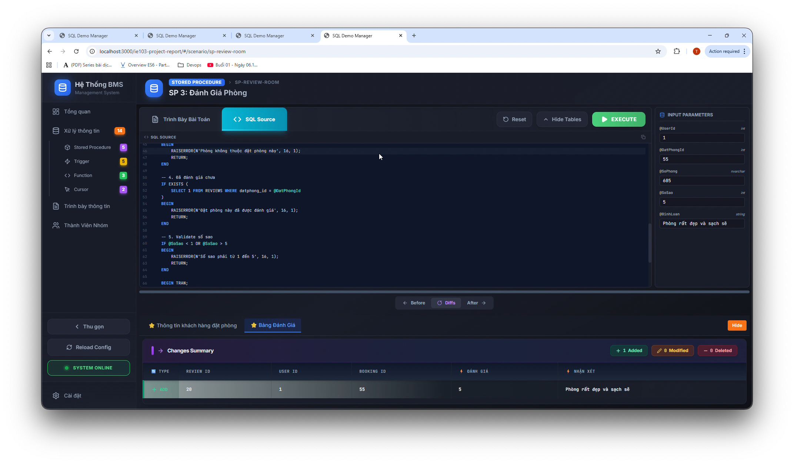

#### SP4 - Áp Dụng Voucher

- **Tên**: `SP_AP_DUNG_VOUCHER`
- **Mục đích**: Áp dụng mã giảm giá (voucher) cho một đặt phòng và tự động tính toán số tiền giảm giá.
    - Mỗi đặt phòng chỉ có thể áp dụng tối đa một mã giảm giá.
    - Mã giảm giá phải còn hạn sử dụng và chưa hết số lượng.
    - Tổng tiền đặt phòng phải đạt mức tối thiểu để áp dụng voucher.
    - Chỉ áp dụng được khi đặt phòng ở trạng thái `PENDING`.
- **Bảng liên quan**: `VOUCHERS`, `DATPHONG`, `CT_DATPHONG`.
- **Tham số đầu vào**:
    - `@DatPhongId (INT)`: ID của đặt phòng.
    - `@VoucherCode (NVARCHAR(50))`: Mã voucher cần áp dụng.
- **Tham số đầu ra**:
    - `@TongTienPhong (DECIMAL(18,2))`: Tổng tiền phòng trước khi giảm.
    - `@TienGiam (DECIMAL(18,2))`: Số tiền được giảm.
    - `@TongTienSauGiam (DECIMAL(18,2))`: Tổng tiền sau khi áp dụng giảm giá.

**Ví dụ sử dụng**:

- Đặt Phòng ID số 4 hiện chưa có voucher.

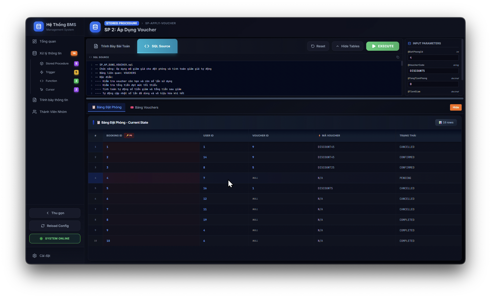

- Thực thi SP áp dụng voucher.

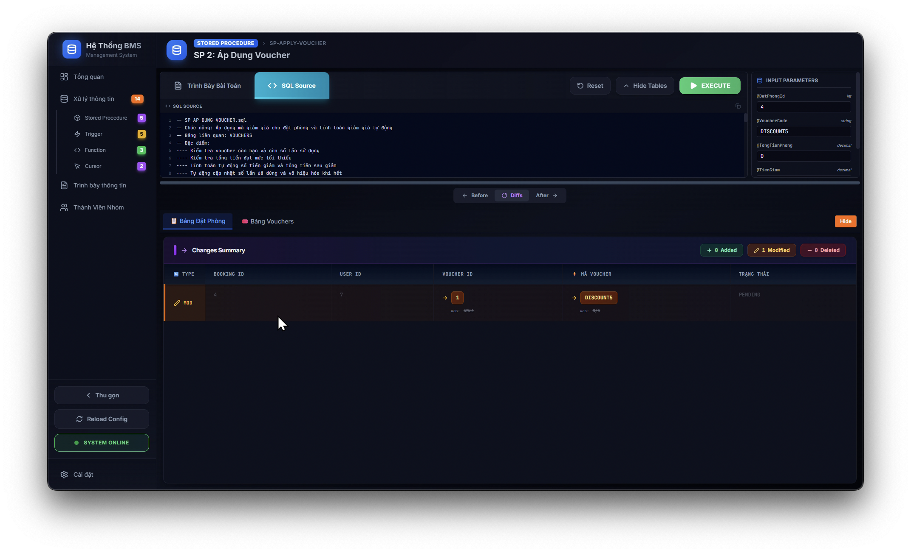

- Đặt Phòng ID số 4 hiện đã có voucher áp dụng.

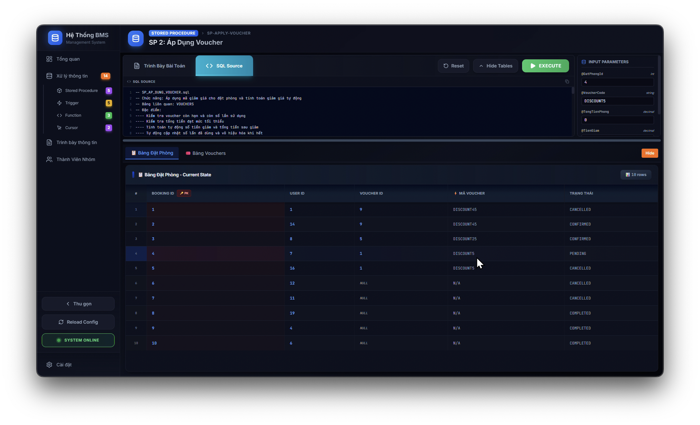

#### SP5 - Sử Dụng Dịch Vụ

- **Tên**: `SP_SU_DUNG_DICH_VU`.
- **Mục đích**: Ghi nhận việc khách hàng sử dụng dịch vụ đi kèm (ăn sáng, giặt ủi, đưa đón sân bay, v.v.) trong thời gian lưu trú.
    - Khách hàng có thể gọi dịch vụ đi kèm bất cứ lúc nào trong thời gian lưu trú.
    - Mỗi lần gọi dịch vụ được ghi nhận riêng biệt.
    - Đơn giá được lưu lại tại thời điểm sử dụng (tránh thay đổi giá sau này ảnh hưởng đến hóa đơn).
- Tham số đầu vào:
    - `@DatPhongId (INT)`: ID của đặt phòng.
    - `@DichVuId (INT)`: ID của dịch vụ được sử dụng.
    - `@SoLuong (INT, mặc định = 1)`: Số lượng dịch vụ.
    - `@GhiChu (NVARCHAR(500), tùy chọn)`: Ghi chú về việc sử dụng dịch vụ.
    - `@ServiceUsageId (INT OUTPUT)`: ID của bản ghi sử dụng dịch vụ vừa tạo.

**Ví dụ sử dụng**:

- Đặt Phòng ID số 2 hiện chưa có dịch vụ sử dụng.

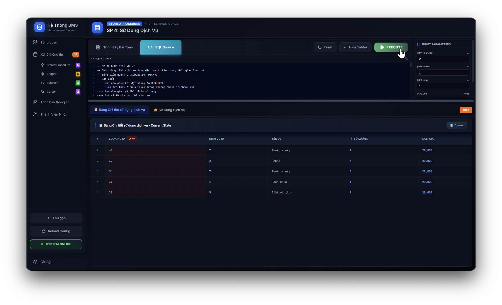

- Thực thi SP sử dụng dịch vụ: Dịch Vụ ID = 1, Coca Cola.

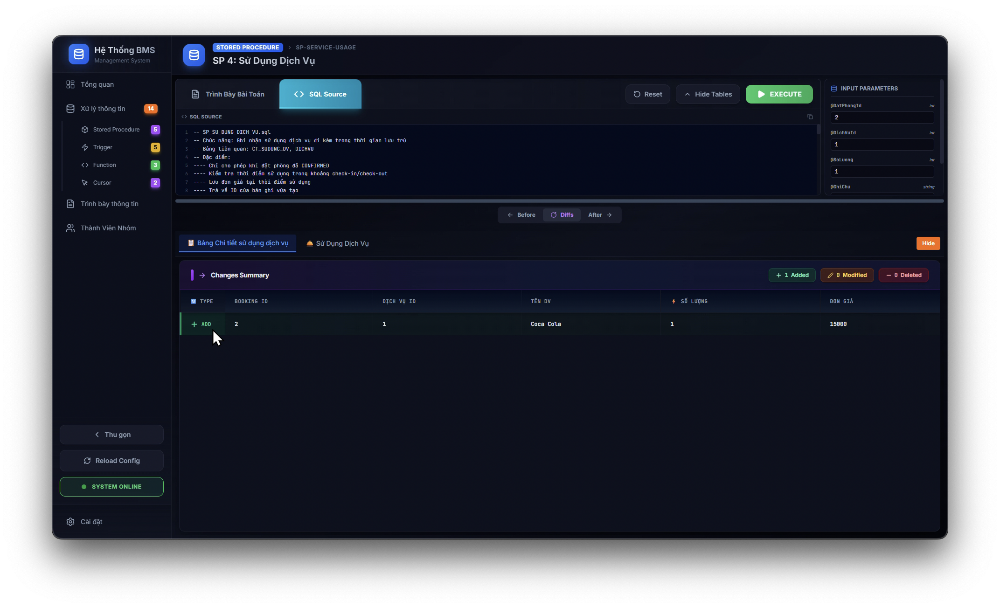

- Đặt Phòng ID số 2 hiện đã có dịch vụ sử dụng.

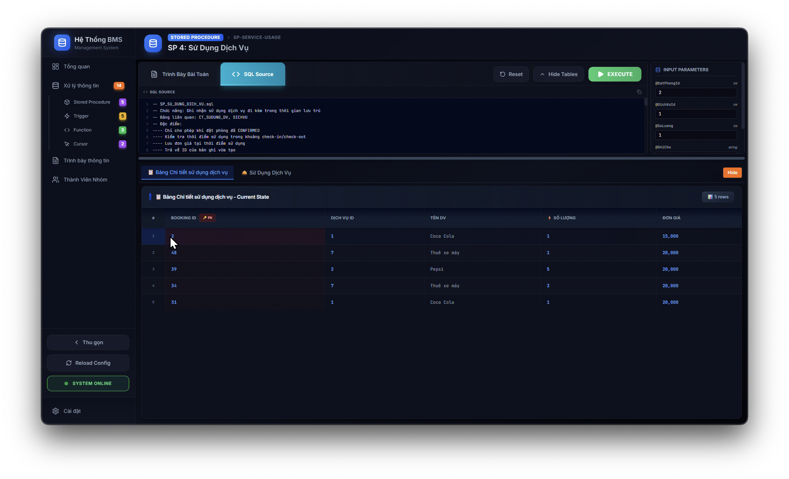

### Triggers (5)

Sử dụng Trigger để đảm bảo toàn vẹn dữ liệu và tự động cập nhật trạng thái.

#### TG1: CheckTime

- Xây dựng **Trigger** để đảm bảo tính hợp lệ của dữ liệu thời gian khi đặt phòng trong hệ thống quản lý khách sạn.

Trong hệ thống đặt phòng khách sạn, cần đảm bảo rằng:

- Thời gian trả phòng (`check_out`) phải **lớn hơn hoặc bằng** thời gian nhận phòng (`check_in`).
- Ngăn chặn dữ liệu không hợp lệ được lưu vào cơ sở dữ liệu.
- Báo lỗi rõ ràng cho người dùng khi nhập sai.

Sử dụng **AFTER Trigger** trên bảng `DATPHONG` để:

1. Kiểm tra điều kiện thời gian sau khi INSERT hoặc UPDATE
2. Sử dụng bảng ảo `inserted` để truy cập dữ liệu mới
3. ROLLBACK transaction nếu phát hiện lỗi
4. Hiển thị thông báo lỗi chi tiết

**Ví dụ thực hiện**:

- Thời gian check-out lớn hơn check-in, nên thực hiện thành công.


#### TG2: AutoPrice

- Xây dựng **Trigger** để tự động hóa quy trình đặt phòng và đảm bảo tính chính xác của đơn giá.

Khi thêm chi tiết đặt phòng vào bảng `CT_DATPHONG`, cần:

1. **Kiểm tra trạng thái phòng**: Chỉ cho phép đặt phòng có trạng thái `AVAILABLE`.
2. **Tự động lấy đơn giá**: Lấy giá từ bảng `LOAIPHONG` thay vì nhập thủ công (tránh sai sót).

Sử dụng `INSTEAD OF` Trigger để:

- Chặn `INSERT` không hợp lệ (phòng không `AVAILABLE`).
- Tự động điền `don_gia` từ `LOAIPHONG.gia_co_ban`.
- Đảm bảo tính nhất quán của dữ liệu.

**Ví dụ thực hiện**:

- Tự động tính đơn giá khi thêm chi tiết đặt phòng vào bảng `CT_DATPHONG`.
    - Đặt Phòng ID = 71.
    - Phòng ID = 8.

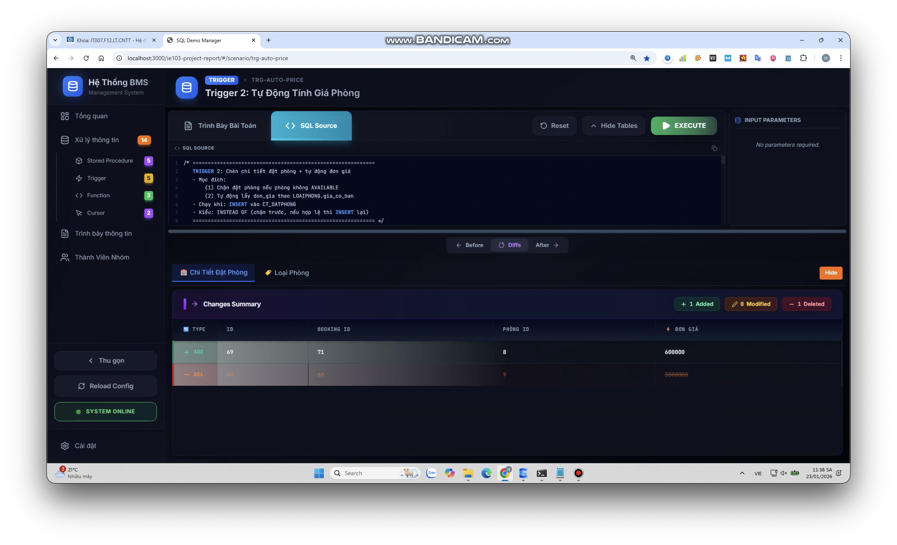

#### TG3: Payment

```{=typst}
#todo[(Xử Lý Thông Tin) TRÌNH BÀY DEMO.]
```

#### TG4: Refund

```{=typst}
#todo[(Xử Lý Thông Tin) TRÌNH BÀY DEMO.]
```

#### TG5: SyncStatus

```{=typst}
#todo[(Xử Lý Thông Tin) TRÌNH BÀY DEMO.]
```

### Functions (3)

Các hàm hỗ trợ tính toán và kiểm tra nhanh.

#### F1: CheckRoomAvailable

```{=typst}
#todo[(Xử Lý Thông Tin) TRÌNH BÀY DEMO.]
```

#### F2: RevertCreateError

```{=typst}
#todo[(Xử Lý Thông Tin) TRÌNH BÀY DEMO.]
```

#### F3 (WIP)

```{=typst}
#todo[(Xử Lý Thông Tin) TRÌNH BÀY DEMO.]
```

### Cursors (2)

Sử dụng Cursor cho các tác vụ xử lý theo lô (Batch Processing) định kỳ.

#### Cursor - Tự Động Hoàn Tất Đơn Đặt Phòng Khi Quá Hạn

- Tên gọi: `cursor_checkout`.
- **Mục Đích:**
    - Tự động hóa việc kết thúc quy trình đặt phòng.
    - Hệ thống quét các đơn đặt phòng đã quá hạn trả phòng (`Check-out`) nhưng trạng thái vẫn là `CONFIRMED` để chuyển sang `COMPLETED` và giải phóng phòng.
- **Logic Xử Lý:**
    - Khai báo Cursor quét bảng `DATPHONG`.
    - Điều kiện lọc: `trang_thai = 'CONFIRMED'` VÀ `check_out < GETDATE()` (Thời gian hiện tại đã vượt qua giờ check-out).
    - **Xử Lý Ngoại Lệ:** Vòng lặp xử lý từng đơn:
        + Cập nhật trạng thái đơn (`DATPHONG`) thành `COMPLETED`.
        + Tìm các phòng liên quan trong bảng `CT_DATPHONG` và cập nhật trạng thái phòng (`PHONG`) về `AVAILABLE` (Sẵn sàng đón khách mới).
        + Đếm số lượng đơn đã xử lý và in log thông báo.

**Kiểm Thử: Trước khi thực hiện.**

- Các phòng có trạng thái `CONFIRMED`.

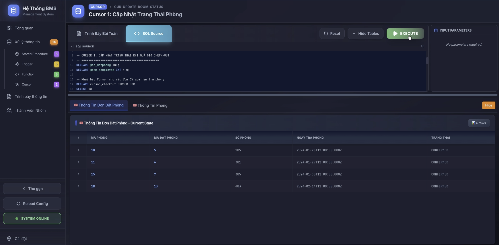

**Kiểm Thử: Kết quả.**

- Các phòng có trạng thái `AVAILABLE`.

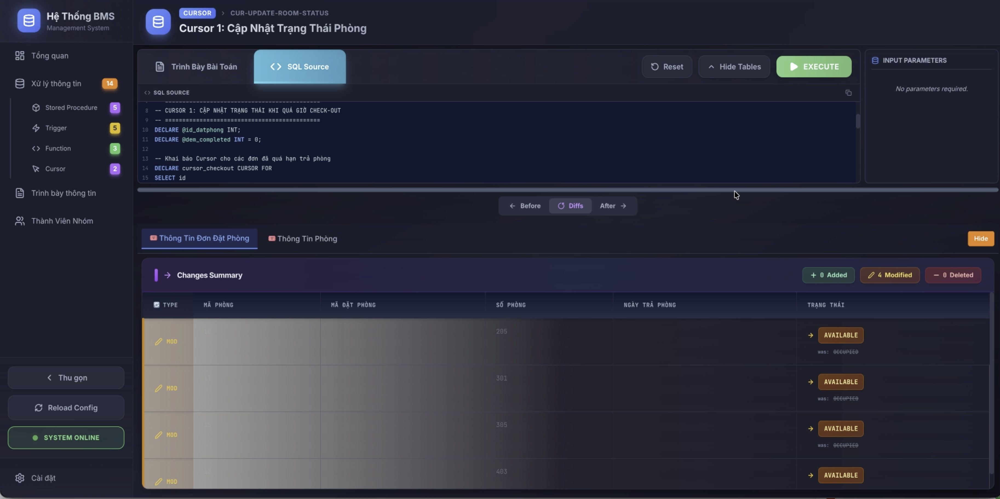

#### Cursor - Đồng Bộ Trạng Thái Phòng Thực Tế

- Tên gọi: `cur_phong_status`.
- **Mục đích:**
    - Cursor này đảm bảo trạng thái hiển thị của phòng (`AVAILABLE`, `OCCUPIED`, `MAINTENANCE`, `RESERVED`) trên giao diện luôn khớp với dữ liệu đặt phòng thực tế trong cơ sở dữ liệu.
- **Logic xử lý:**
    - Duyệt qua tất cả các phòng trong bảng `PHONG`, lấy thông tin `id`, `so_phong` và `trang_thai` hiện tại.
    - Với mỗi phòng, thực hiện truy vấn kiểm tra xem có đơn đặt phòng nào đang hoạt động (Trạng thái `CONFIRMED` và thời gian hiện tại nằm trong khoảng lưu trú).
    - Cập nhật:
        + Trường hợp 1 (Có khách đang ở):
            - Nếu trạng thái hiện tại chưa phải `OCCUPIED` $\to$ Cập nhật thành `OCCUPIED`.
        + Trường hợp 2 (Không có khách):
            - Nếu trạng thái hiện tại là `OCCUPIED` (tức là dữ liệu cũ bị sai/treo) $\to$ Trả về `AVAILABLE`.
            - Nếu trạng thái hiện tại là `MAINTENANCE` (Bảo trì) hoặc `RESERVED` (Đã đặt trước) $\to$ Giữ nguyên, không can thiệp.

**Kiểm Thử: Trước khi thực hiện.**

- Phòng 101: Đang trống thực tế và dữ liệu lỗi hiển thị là `AVAILABLE` (đúng).
- Phòng 102: Đang có khách ở thực tế nhưng hiển thị là `AVAILABLE` (sai).
- Phòng 503: Đang bảo trì (`MAINTENANCE`), không có khách (đúng).

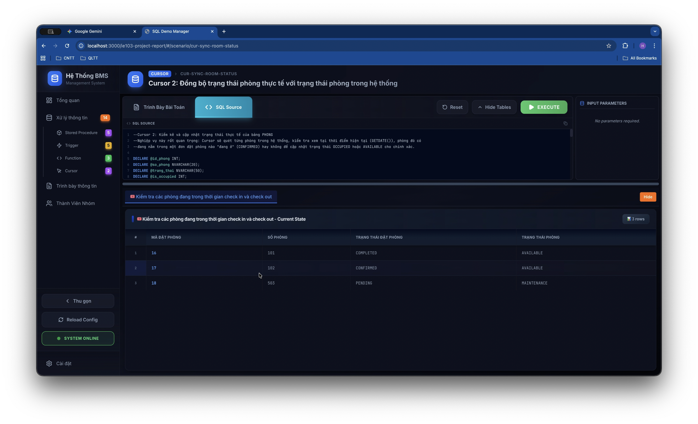

**Kiểm Thử: Kết quả.**

- Phòng 101: Giữ nguyên trạng thái (`AVAILABLE`).
- Phòng 102: Cập nhật sang Đang có khách (`OCCUPIED`).
- Phòng 503: Giữ nguyên trạng thái (`MAINTENANCE`).


## An Toàn Thông Tin

### Xác Thực Và Phân Quyền

```{=typst}
#todo[(Xác Thực Và Phân Quyền) THỰC HIỆN PHÂN QUYỀN.]
```

Hệ thống áp dụng mô hình bảo mật dựa trên vai trò (RBAC - Role Based Access Control).

- Xác thực:
    - Mật khẩu người dùng được mã hóa (Hashing) trước khi lưu vào cơ sở dữ liệu (giả lập logic ứng dụng).
- Bảng phân quyền:

<!-- | STT | **Vai Trò** | **Quyền Hạn** |
|----:|----|----|
| 1 | Admin | Quản lý tất cả |
| 2 | Staff | Quản lý đặt phòng |
| 3 | End User | Đặt phòng | -->

```{=typst}
#figure(
    table(
    columns: (10%, 20%, 70%),
    align: (right, left, left),
    [STT], [#strong[Vai Trò]], [#strong[Quyền Hạn]], [1], [Admin], [Quản lý tất cả], [2], [Staff], [Quản lý đặt phòng], [3], [End User], [Đặt phòng]
    ),
    caption: [An Toàn Thông Tin - Bảng Phân Quyền]
)
```

### Sao Lưu & Phục Hồi

```{=typst}
#todo[(Sao Lưu & Phục Hồi) TRÌNH BÀY BACKUP/RESTORE.]
```

Chiến lược sao lưu dữ liệu được đề xuất:

- Full Backup: Thực hiện định kỳ vào 00:00 Chủ Nhật hàng tuần.
- Differential Backup: Thực hiện vào 00:00 các ngày trong tuần.
- Transaction Log Backup: Mỗi 4 giờ/lần để giảm thiểu rủi ro mất dữ liệu giao dịch.

#### Import - Export Dữ Liệu

#### Backup – Restore Dữ Liệu

## Trình Bày Thông Tin

Hệ thống được thiết kế hướng tới trải nghiệm người dùng tối ưu hóa cho từng đối tượng.

<!-- Menu: Không sử dụng -->
<!-- ### Menu

- Module Khách Hàng (Front-Office):
    - Trang chủ / Tìm kiếm phòng.
    - Chi tiết phòng & Đặt phòng.
    - Lịch sử đặt phòng / Đánh giá.
- Module Quản Trị (Back-Office):
    - Dashboard: Thống kê doanh thu, tỷ lệ lấp đầy.
    - Quản lý phòng: Sơ đồ phòng, cập nhật trạng thái.
    - Nghiệp vụ: Check-in, Check-out, Dịch vụ đi kèm.
    - Cấu hình: Quản lý Voucher, Tài khoản nhân viên. -->

<!-- Form: Không sử dụng -->
<!-- ### Form -->

### Report

Các báo cáo đầu ra chính của hệ thống:

- Báo Cáo Doanh Thu Tháng: Tổng hợp doanh thu theo loại phòng và theo dịch vụ, phục vụ bộ phận kế toán.
- Phiếu Xác Nhận Đặt Phòng (Booking Confirmation): Gửi cho khách hàng sau khi đặt thành công.
- Hóa Đơn Thanh Toán (Invoice): Chi tiết tiền phòng, dịch vụ, giảm giá voucher và số tiền thực thu.

#### Thống Kê Doanh Thu

Tóm tắt:

- Thống kê doanh thu từng tháng trong năm 2024, và doanh thu của từng phòng trong tháng.

Miêu tả:

- Giúp thống kê được doanh thu của từng phòng để đánh giá xem phòng nào ít khách đặt để tìm ra lý do, hoặc thay đổi loại phòng theo xu hướng của khách.
- Chúng ta sẽ có phần chart thể hiển tổng doanh thu của từng tháng, và phần hiển thị chi tiết tổng số lượt đặt và tổng số tiền đem về của từng phòng trong năm 2024.

Các bước thực hiện:

1. Tạo View tính tổng doanh thu và số lần đặt phòng của từng phòng trong từng tháng của năm 2024: `V_RPT_DOANHTHU_THEO_PHONG_2024`.
2. Kết nối Tableau vào CSDL.
3. Kéo view `V_RPT_DOANHTHU_THEO_PHONG_2024` vào Canvas.
4. Sheet tạo chart bar, mapping dữ liệu từ View `V_RPT_DOANHTHU_THEO_PHONG_2024` để tạo report:
    - `Thang` $\to$ Columns, edit chọn *Discrete* $\Rightarrow$ để hiển thị từng tháng theo cột.
    - `Doanh Thu Phong` $\to$ Rows $\Rightarrow$ để Tableau tự tính `SUM` doanh thu theo từng tháng tương ứng.
    - Kéo thả vào mục Marks các trường trong view:
        - `Doanh Thu Phong` $\to$ Color $\Rightarrow$ để hiển thị màu phân biệt giá trị doanh thu.
        - `Doanh Thu Phong` và `So Luot Dat`  $\to$ Label $\Rightarrow$ để hiển thị doanh thu, số lần đặt trên bar.
        - Kéo `So Luot Dat` vào tooltip và edit thông tin để hiển thị khi rê chuột.
        - Tạo calculated fields để hiển thị mã phòng - tên loại phòng.
5. Màn hình design và preview chart bar.

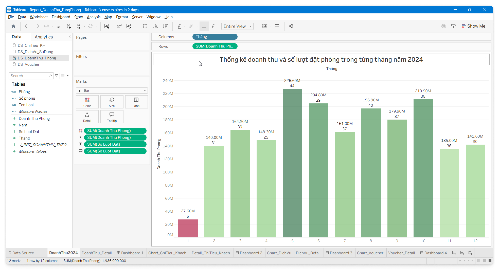

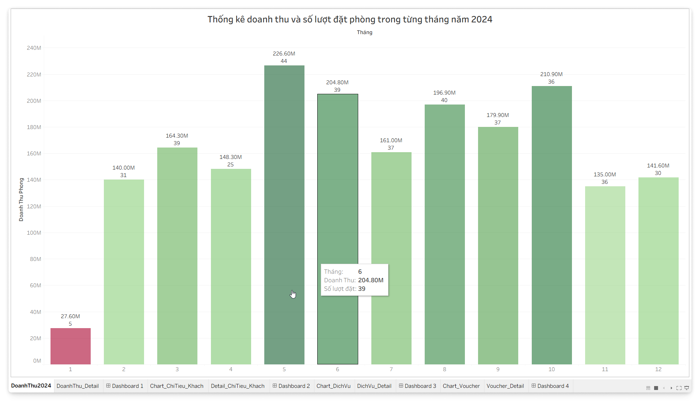

6. Màn hình Design và Preview sheet hiển thị bảng chi tiết.

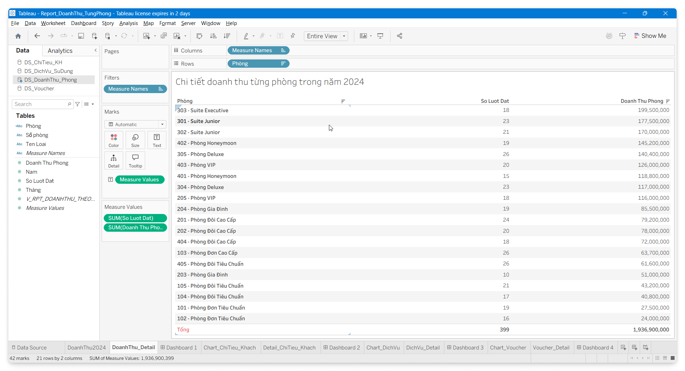

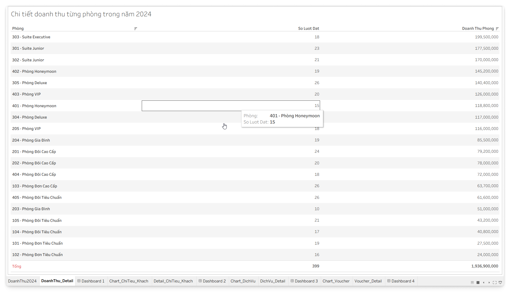

7. Tạo dashboard để hiển thị report.
    - Hiển thị 2 sheet charts ở trên.
        - Dạng cột.
        - Dạng bảng.

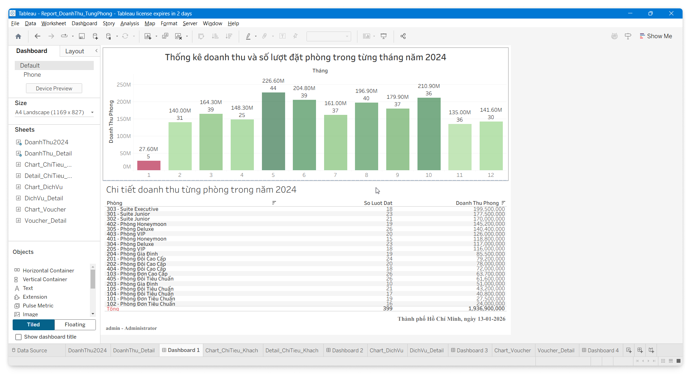

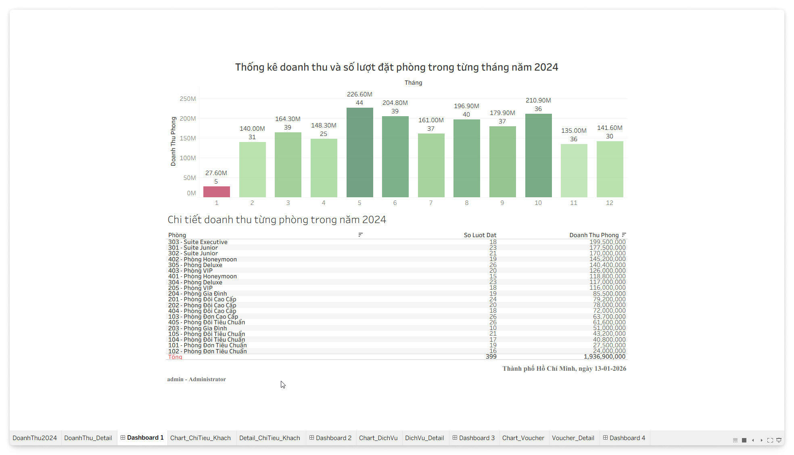

## Các Chức Năng Của Hệ Thống

(Hướng dẫn: Chỉ miêu tả)

### Quản Lý Thông Tin Nền Tảng

### Quản Lý Dữ Liệu Đặt Phòng

### Thống Kê Và Báo Cáo

### Quản Trị Hệ Thống
