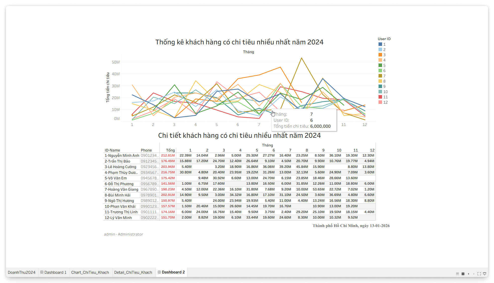
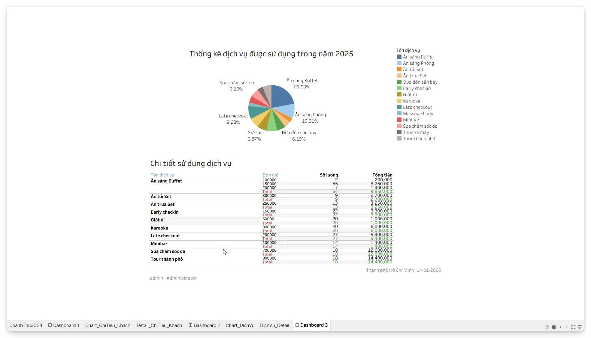
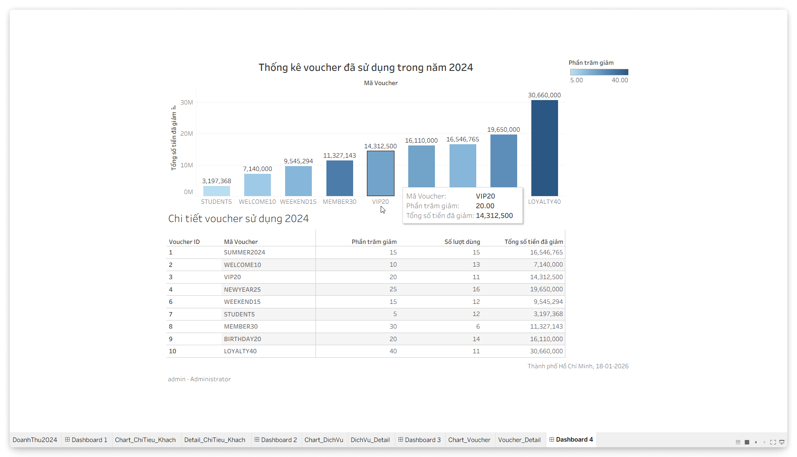
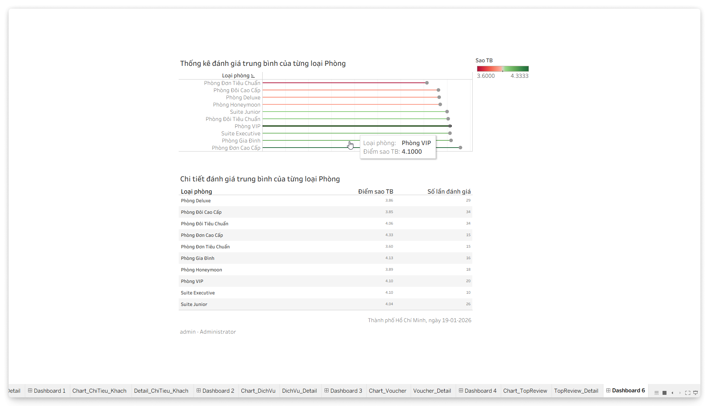

# GIỚI THIỆU

## Lời Cảm Ơn

### Giảng Viên

```{=typst}
#show table.cell: set text(weight: "light", font: body-font)
#table(
columns: (100%),
inset: (top: 0.6em, bottom: 0.6em),
align: (left),
stroke: (
    bottom: 0.5pt + gradient.linear(red, blue, green),
    top: none,
    left: none,
    right: none,
),
[- Thạc Sĩ Nguyễn Thành Luân.],
[- IE103 - Quản Lý Thông Tin.]
)
```

### Nhà Trường

```{=typst}
#table(
columns: (100%),
inset: (top: 0.6em, bottom: 0.6em),
align: (left),
stroke: (
    bottom: 0.5pt + gradient.linear(red, blue, green),
    top: none,
    left: none,
    right: none,
),
[- Trung Tâm Phát Triển Công Nghệ Thông Tin.],
[- Trường Đại Học Công Nghệ Thông Tin.]
)
```

### Nhóm 02

```{=typst}
#table(
columns: (100%),
inset: (top: 0.6em, bottom: 0.6em),
align: (left),
stroke: (
    bottom: 0.5pt + gradient.linear(red, blue, green),
    top: none,
    left: none,
    right: none,
),
[- Các thành viên của Nhóm 02.],
)
```

## Nhóm 02

```{=typst}
#align(center)[
  #show table.cell: current_cell => {
    if current_cell.x in (0, 1, 3, 4) {
      text(
        //font: code-font,
        weight: "light",
        //size: 0.9em,
        fill: gray,
      )[#current_cell]
    } else {
      current_cell
    }
  }
  #table(
    columns: (5%, 15%, 25%, 5%, 15%, 35%),
    inset: (top: 1.2em, bottom: 1.2em),
    align: (right + bottom, right + bottom, left + bottom, right + bottom, right + bottom, left + bottom),
    stroke: (
      bottom: 0.5pt + gradient.linear(red, blue, green),
      top: none,
      left: none,
      right: none,
    ),
      [1], [25410247], [Lê Kim Long],
      [2], [25410291], [Đinh Xuân Sâm],
      [3], [25410319], [Đặng Hữu Toàn],
      [4], [25410321], [Nguyễn Điền Triết],
      [5], [25410204], [Trương Xuân Hậu],
      [6], [25410338], [Lê Anh Vũ],
      [7], [25410176], [Trần Sơn Bình],
      [8], [25410337], [La Anh Vũ],
      [9], [25410209], [Lê Ngọc Hiệp],
      [10], [25410271], [Nguyễn Thị Ngọc Nhung],
  )
]
```

## Giới Thiệu Đề Tài

<!-- ### Đặt Vấn Đề -->

```{=typst}
#align(center)[
    #table(
        columns: (100%),
        inset: (top: 0.6em, bottom: 0.6em),
        align: (left),
        stroke: (
            bottom: 0.5pt + gradient.linear(red, blue, green),
            top: none,
            left: none,
            right: none,
        ),
        [Các Doanh Nghiệp vừa và nhỏ trong ngành Khách Sạn, Du Lịch:]
    )
]
```

```{=typst}
#table(
columns: (45%, 55%),
inset: (top: 0.6em, bottom: 0.6em),
align: (left, left),
stroke: (
    bottom: 0.5pt + gradient.linear(red, blue, green),
    top: none,
    left: none,
    right: none,
),
[- Quản lý *thủ công*.],
[- *Khó khăn* trong thống kê/báo cáo.],
[- Số hóa *hạn chế*.],
[- Không có *điểm chạm* với khách hàng.]
)
```

<!-- ### Giới Thiệu Đề Tài -->

```{=typst}
#align(center)[
    #table(
        columns: (100%),
        inset: (top: 0.6em, bottom: 0.6em),
        align: (left),
        stroke: (
            bottom: 0.5pt + gradient.linear(red, blue, green),
            top: none,
            left: none,
            right: none,
        ),
        [Hệ Thống Quản Lý Đặt Phòng #emph[(Booking Management System)]:]
    )
]
```
```{=typst}
#table(
columns: (45%, 55%),
inset: (top: 0.6em, bottom: 0.6em),
align: (left, left),
stroke: (
    bottom: 0.5pt + gradient.linear(red, blue, green),
    top: none,
    left: none,
    right: none,
),
[- *Số hóa* quy trình quản lý.],
[- *Chuyển đổi số* cách làm dịch vụ.],
[- Xây dựng *điểm chạm* số.],
[- Tìm kiếm, sử dụng, đánh giá.]
)
```

# PHÂN TÍCH VÀ THIẾT KẾ

## Chức Năng Nghiệp Vụ

```{=typst}
#show table.cell: set text(size: 0.9em, weight: "light", font: body-font)
#table(
  columns: (10%, 90%),
    inset: (top: 0.4em, bottom: 0.4em),
    align: (right, left),
    stroke: (
        bottom: 0.5pt + gradient.linear(red, blue, green),
        top: none,
        left: none,
        right: none,
    ),
    [], [- Quản lý phòng và loại phòng (BMS).],
    [], [- Quản lý khách hàng (BMS).],
    [], [- Quản lý đặt phòng (BMS).],
    [], [- Kiểm tra phòng trống (BMS & Khách Hàng).],
    [], [- Đặt phòng và hủy đặt phòng (Khách Hàng).],
    [], [- Hoàn tiền và hủy giao dịch theo chính sách.],
    [], [- Quản lý và phân quyền người dùng (Admin / Staff / End User).],
    [], [- Hiển thị trạng thái đặt phòng và thanh toán (Khách Hàng).],
    [], [- Hệ thống khuyến mãi & mã giảm giá (Vouchers).],
    [], [- Quản lý dịch vụ đi kèm như ăn sáng, giặt ủi, đưa đón sân bay.],
    [], [- Hệ thống đánh giá & phản hồi sau khi hoàn tất thanh toán.],
    [], [- Thanh toán trực tuyến (mô phỏng).],
)
```

## Mô Hình ER (Quan Niệm)

```{=typst}
#align(center)[
    #image("diagrams/ch02-concept-erd.svg")
]
```

## Mô Hình Logic - Bảng và Khóa

```{=typst}
#show table.cell: set text(size: 0.6em, weight: "light", font: body-font)
#table(
  columns: (5%, 95%),
    inset: (top: 0.5em, bottom: 0.5em),
    align: (right, left),
    stroke: (
        bottom: 0.5pt + gradient.linear(red, blue, green),
        top: none,
        left: none,
        right: none,
    ),
    [1], [ADMINS(#underline[id], email, password_hash, full_name, status, created_at, updated_at)],
    [2], [DATPHONG(#underline[id], #emph[user_id], #emph[voucher_id], check_in, check_out, trang_thai, created_at)],
    [3], [DICHVU(#underline[id], ten_dich_vu, don_gia, don_vi_tinh, trang_thai, created_at, updated_at)],
    [4], [LOAIPHONG(#underline[id], ten_loai, gia_co_ban, mo_ta, suc_chua)],
    [5], [PAYMENTS(#underline[id], #emph[booking_id], #emph[user_id], so_tien, phuong_thuc, trang_thai, created_at)],
    [6], [PERMISSIONS(#underline[id], code, description)],
    [7], [PHONG(#underline[id], so_phong, #emph[loai_phong_id], trang_thai)],
    [8], [REFUNDS(#underline[id], #emph[payment_id], #emph[requested_by], #emph[approved_by], so_tien_hoan, ly_do, trang_thai, created_at, updated_at)],
    [9], [REVIEWS(#underline[id], #emph[user_id], #emph[phong_id], #emph[datphong_id], so_sao, binh_luan, ngay_danh_gia, trang_thai, created_at, updated_at)],
    [10], [ROLES(#underline[id], code, name, description)],
    [11], [USERS(#underline[id], email, phone, password_hash, full_name, status, created_at, updated_at)],
    [12], [VOUCHERS(#underline[id], ma_code, phan_tram_giam, ngay_het_han, so_tien_toi_thieu, so_lan_toi_da, so_lan_da_dung, trang_thai, created_at, updated_at)],
    [13], [ADMIN_ROLES(#underline[admin_id], #underline[role_id])],
    [14], [ROLE_PERMISSIONS(#underline[role_id], #underline[permission_id])],
    [15], [CT_DATPHONG(#underline[id], #emph[datphong_id], #emph[phong_id], don_gia)],
    [16], [CT_SUDUNG_DV(#underline[id], #emph[datphong_id], #emph[dichvu_id], so_luong, don_gia, thoi_diem_su_dung, ghi_chu, created_at)]
)
```

# CÀI ĐẶT VÀ TRIỂN KHAI

## Mô Hình Vật Lý

```{=typst}
#show table.cell: set text(size: 1.5em, weight: "light", font: body-font)
#table(
columns: (100%),
inset: (bottom: 0.6em),
align: (left),
stroke: (
    bottom: 0.5pt + gradient.linear(red, blue, green),
    top: none,
    left: none,
    right: none,
),
[- Hiện thực hóa mô hình logic.],
[- Sẵn sàng triển khai trên Hệ Quản Trị CSDL cụ thể.]
)
```

```{=typst}
#align(center)[
    #table(
        columns: (100%),
        inset: (bottom: 0.6em),
        align: (center),
        stroke: (
            bottom: 0.5pt + gradient.linear(red, blue, green),
            top: none,
            left: none,
            right: none,
        ),
        [Ví dụ về *Mô Hình Vật Lý* của một bảng trong CSDL: ADMINS]
    )
]
```

```{=typst}
#align(center + bottom)[
#show table.cell: set text(size: 0.9em, weight: "light", font: body-font)
#table(
    columns: (20%, 20%, 30%, 30%),
    align: (left, left, left, left),
    stroke: (
        bottom: 0.5pt + gradient.linear(red, blue, green),
        top: none,
        left: none,
        right: none,
    ),
    [#strong[Thuộc Tính]], [#strong[Kiểu]], [#strong[Ràng Buộc]], [#strong[Mô Tả]], [`id`], [`INT`], [`PK`, `IDENTITY`], [Khóa chính tự tăng.], [`email`], [`NVARCHAR(255)`], [`NOT NULL`, `UNIQUE`], [Email đăng nhập.], [`password_hash`], [`NVARCHAR(255)`], [`NOT NULL`], [Mật khẩu (Hash).], [`full_name`], [`NVARCHAR(255)`], [`NULL`], [Họ tên đầy đủ.], [`status`], [`NVARCHAR(50)`], [`DEFAULT 'ACTIVE'`], [Trạng thái tài khoản.], [`created_at`], [`DATETIME`], [`DEFAULT GETDATE()`], [Ngày tạo.], [`updated_at`], [`DATETIME`], [`DEFAULT GETDATE()`], [Ngày cập nhật.], [#emph[CONSTRAINT]], [], [`status IN ('ACTIVE', 'INACTIVE')`], [Chỉ nhận giá trị quy định.]
  )
]
```

## Triển Khai

```{=typst}
#align(center)[
    #table(
        columns: (100%),
        inset: (bottom: 0.6em),
        align: (left),
        stroke: (
            bottom: 0.5pt + gradient.linear(red, blue, green),
            top: none,
            left: none,
            right: none,
        ),
        [- Hệ Quản Trị CSDL: Microsoft SQL Server 2019.]
    )
]
```

### Khởi Tạo Database

```{=typst}
#align(center)[
    #table(
        columns: (100%),
        inset: (bottom: 0.6em),
        align: (left),
        stroke: (
            bottom: 0.5pt + gradient.linear(red, blue, green),
            top: none,
            left: none,
            right: none,
        ),
        [- Khởi tạo: Database, tên `ROOM_BOOKING_SYSTEM`.]
    )
]
```

```{=typst}
#v(2em)
#align(center)[
#show raw: set text(size: 1em, weight: "light", font: "Iosevka")
#raw(read("code/slide-create-database.sql"), lang: "sql", block: true)
]
```

### Khởi Tạo Các Bảng

```{=typst}
#align(center)[
    #table(
        columns: (100%),
        inset: (bottom: 0.6em),
        align: (left),
        stroke: (
            bottom: 0.5pt + gradient.linear(red, blue, green),
            top: none,
            left: none,
            right: none,
        ),
        [- Khai báo và khởi tạo bảng: tổng 16.]
    )
]
```

```{=typst}
#align(center)[
    #table(
        columns: (100%),
        inset: (bottom: 0.6em),
        align: (center),
        stroke: (
            bottom: 0.5pt + gradient.linear(red, blue, green),
            top: none,
            left: none,
            right: none,
        ),
        [Ví dụ về *Khởi Tạo Bảng*: ADMINS.]
    )
]
```

```{=typst}
#align(center + bottom)[
#show raw: set text(size: 0.9em, weight: "light", font: "Iosevka")
#raw(read("code/slide-create-table-admins.sql"), lang: "sql", block: true)
]
```

# QUẢN LÝ THÔNG TIN

## Xử Lý Thông Tin - (SP) Đặt Phòng


## Xử Lý Thông Tin - (SP) Thanh Toán


## Xử Lý Thông Tin - (SP) Đánh Giá


## Xử Lý Thông Tin - (SP) Áp Dụng Voucher


## Xử Lý Thông Tin - (SP) Sử Dụng Dịch Vụ


## Xử Lý Thông Tin - (TRG) Kiểm Tra Thời Gian


## Xử Lý Thông Tin - (TRG) Tính Đơn Giá


## Xử Lý Thông Tin - (TRG) Đồng Bộ Trạng Thái


## Xử Lý Thông Tin - (TRG) Kiểm Tra Thanh Toán


## Xử Lý Thông Tin - (TRG) Kiểm Tra Hoàn Tiền


## Xử Lý Thông Tin - (FN) Tính Hạng Thành Viên


## Xử Lý Thông Tin - (FN) Tìm Phòng Trống


## Xử Lý Thông Tin - (FN) Phí Hủy Đặt Phòng


## Xử Lý Thông Tin - (CR) Hoàn Tất Đặt Phòng


## Xử Lý Thông Tin - (CR) Đồng Bộ Trạng Thái


## Trình Bày Thông Tin - Thống Kê Doanh Thu


## Trình Bày Thông Tin - Top Khách Hàng



## Trình Bày Thông Tin - Doanh Thu Dịch Vụ



## Trình Bày Thông Tin - Top Voucher



## Trình Bày Thông Tin - Top Loại Phòng



# KẾT LUẬN

## Phần Đã Đạt Được

- Chuẩn hóa quy trình nghiệp vụ.
- Thiết kế bộ khung CSDL.
- Xử lý thông tin tự động.
- Cơ chế bảo mật đa lớp.
- Khả năng sẵn sàng, sao lưu/dự phòng.

## Phần Chưa Đạt Được

- Giao diện cho người dùng cuối.
- Các kênh thanh toán thực thế.
- Quản lý vòng đời tài khoản/người dùng.

## Mở Rộng & Nâng Cấp

- **Web App**:
    - *Nhân Viên* (*Bộ Phận Quản Lý/Lễ Tân*)
    - Thao tác nghiệp vụ nhanh chóng và chính xác.
- **Mobile App**:
    - *Khách Hàng* (End User)
    - *"điểm chạm số"*.
    - Tìm phòng, đặt phòng và theo dõi lịch sử tích điểm ngay trên điện thoại.
