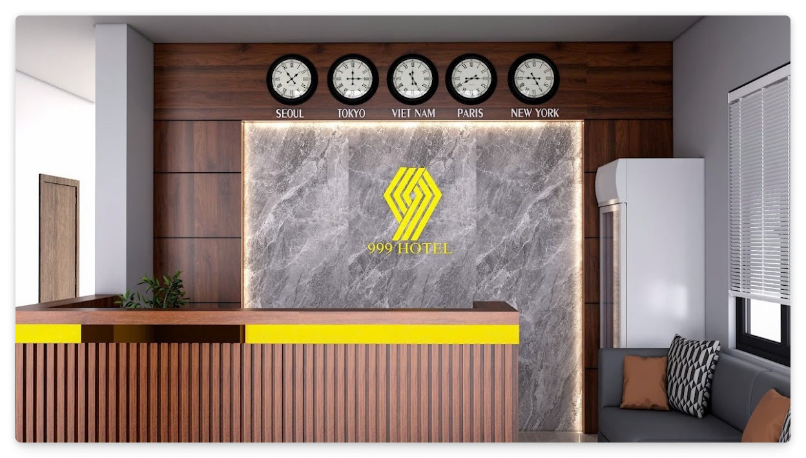

# Lời Nói Đầu

```{=typst}
#co-info(title: [#link("https://maps.app.goo.gl/HkeHUT6AEJRQPRjG8")[Wifong Alex] #text(fill: gray)[posted (2 months ago)] #text(fill: orange)[#sym.star #sym.star #sym.star #sym.star #sym.star]:])[
#emph[I am quite satisfied with this hotel.

Although it is not available on the "Booking" app, this is a reasonable accommodation when you travel to Vietnam.

The motel always has food available from 20-40 thousand, drinks will be 10-15 thousand and you can also call to order rice, the hotel owner will cook you delicious Vietnamese dishes, a meal will cost from 40-60 thousand.

There are also taxi and motorbike taxi services here, prices are transparent, you can call and someone will take you if you want to go to the airport or any location within a 100km radius.

This will be the place to stay that I recommend to you when coming to Vietnam.
]]
```

*NHÀ NGHỈ 999* -- tại Cừa -- Tân Kỳ -- Nghệ An, được hình thành từ tâm huyết của một người yêu xây dựng, mọi công đoạn từ ý tưởng, thiết kế đến xây dựng và hoàn thiện đều được chủ nhân thực hiện trực tiếp, với hình thức thẩm mỹ cao, và công năng sử dụng nhiều mục đích. Công trình đã đi vào hoạt động một thời gian, và nhận được đánh giá tích cực từ nhiều đợt khách hàng.

Tuy nhiên, với đặc thù thuộc một khu vực trung du miền núi, mật độ khách vãng lai hoặc du lịch không cao, kèm theo đó là mô hình quản lý còn thủ công, dựa trên sổ sách truyền thống, tạo nên một bất lợi để khách hàng có thể tiếp cận được dịch vụ của Nhà Nghỉ 999.

Phần *"số hóa"* thấy rõ nhất của quy trình quản lý và vận hành là một phần sổ sách được lưu trữ trong các bảng Excel rời rạc, và phần *"chuyển đổi số"* lớn nhất có lẽ là thực hiện nhận kiểm tra phòng trống, đặt phòng, báo giá thông qua các ứng dụng chat phổ biến như Zalo, Messenger.

Với các nhân sự quản lý là Vợ và Con Gái thay phiên nhau trực, điều này nhiều lúc tạo nên các vấn đề trong việc quản lý, nhất là khi có các giao dịch phức tạp, hoặc các yêu cầu được gửi tới một trong 2 người quản lý nhưng chưa được thống nhất hoặc *cập nhật* kịp thời.

Ngoài ra, với hình thức quản lý gần như thủ công hoàn toàn, việc *thống kê* hoặc *báo cáo* là rất vất vả, thậm chí không thể thực hiện được. Chưa kể không có một hình thức và điểm chạm *tương tác số* nào với khách hàng qua Internet, vô tình tạo nên một khoảng cách rõ ràng giữa khách hàng và dịch vụ của Nhà Nghỉ 999.

Đây là một góc nhỏ động lực để Nhóm 02 chọn đề tài *"Hệ Thống Quản Lý Đặt Phòng"* để thực hiện nghiên cứu, và tìm ra các giải pháp để cải thiện quy trình quản lý, và tạo ra một hình thức và điểm chạm *tương tác số* với khách hàng qua Internet, đặc biệt cho các doanh nghiệp vừa và nhỏ, ít hoặc thậm chí không có nền tảng *số hóa* hoặc *chuyển đổi số* như Nhà Nghỉ 999.

Vì vậy, trong báo cáo môn học *IE103 - Quản Lý Dữ Liệu* này, Nhóm 02 xin trình bày các nội dung liên quan đến Nghiên Cứu, Thiết Kế, và Xây Dựng *Hệ Thống Quản Lý Đặt Phòng* cho Nhà Nghỉ 999 và các doanh nghiệp tương tự.


