# Report Quản lý đặt phòng

## 1. Thống kê doanh thu từng tháng trong năm 2024, và doanh thu của từng phòng trong tháng
    Giúp thống kê được doanh thu của từng phòng để đánh giá xem phòng nào ít khách đặt để tìm ra lý do, hoặc thay đổi loại phòng theo xu hướng của khách.
    Chúng ta sẽ có phần chart thể hiển tổng doanh thu của từng tháng, và phần hiển thị chi tiết tổng số lượt đặt và tổng số tiền đem về của từng phòng trong năm 2024

#### 1.1 Tạo View tính tổng doanh thu  và số lần đặt của từng phòng trong từng tháng của năm 2024    
```sql

CREATE OR ALTER VIEW V_RPT_DOANHTHU_THEO_PHONG_2024 AS
WITH 

TargetMonths AS (
    SELECT DISTINCT MONTH(Check_In) AS Thang, YEAR(Check_In) AS Nam
    FROM DATPHONG
    WHERE Trang_Thai = 'COMPLETED' 
      AND YEAR(Check_In) = 2024 
    -- AND YEAR(Check_In) = YEAR(GETDATE())
),

AllRooms AS (
    SELECT P.ID AS Phong_ID, P.So_Phong, LP.Ten_Loai
    FROM PHONG P
    JOIN LOAIPHONG LP ON P.loai_phong_id = LP.ID
),

ReportSkeleton AS (
    SELECT 
        M.Nam,
        M.Thang, 
        R.Phong_ID, 
        R.So_Phong, 
        R.Ten_Loai
    FROM TargetMonths M
    CROSS JOIN AllRooms R
),

ActualData AS (
    SELECT 
        MONTH(DP.Check_In) AS Thang,
        CT.Phong_ID,
        COUNT(DP.ID) AS SoLuotDat,
        SUM(CT.Don_Gia * DATEDIFF(day, DP.Check_In, DP.Check_Out)) AS DoanhThu
    FROM DATPHONG DP
    JOIN CT_DATPHONG CT ON DP.ID = CT.DatPhong_ID
    WHERE DP.Trang_Thai = 'COMPLETED'
      AND YEAR(DP.Check_In) = 2024
    GROUP BY MONTH(DP.Check_In), CT.Phong_ID
)

SELECT 
    S.Nam,
    S.Thang,
    S.So_Phong,
    S.Ten_Loai,
    ISNULL(D.SoLuotDat, 0) AS SoLuotDat,
    ISNULL(D.DoanhThu, 0) AS DoanhThuPhong
FROM 
    ReportSkeleton S
LEFT JOIN 
    ActualData D ON S.Thang = D.Thang 
                 AND S.Phong_ID = D.Phong_ID;
GO
```

#### 1.2 Kiểm tra kết quả của view vừa tạo

```sql
   SELECT * FROM V_RPT_DOANHTHU_THEO_PHONG_2024;
```

#### 1.3 Kéo view V_RPT_DOANHTHU_THEO_PHONG_2024 vào canva


#### 1.4 Sheet tạo chart bar, mapping dữ liệu từ View V_RPT_DOANHTHU_THEO_PHONG_2024 để tạo report
  
    ▪ Thang -> Columns, edit chọn Discrete => để hiển thị từng tháng theo cột
    ▪ Doanh Thu Phong -> Rows => để tableau tự tính SUM doanh thu theo từng tháng tương ứng
    Kéo thả vào mục Marks các trường trong view:
    ▪ Doanh Thu Phong -> Color => để hiển thị màu phân biệt giá trị doanh thu
    ▪ Doanh Thu Phong và So Luot Dat  -> Label => để hiển thị doanh thu, số lần đặt trên bar
    ▪ Kéo So Luot Dat vào tooltip và edit thông tin để hiển thị khi rê chuột
    ▪ Tạo calculated fields để hiển thị mã phòng - tên loại phòng

#### 1.5 Màn hình design và preview chart bar

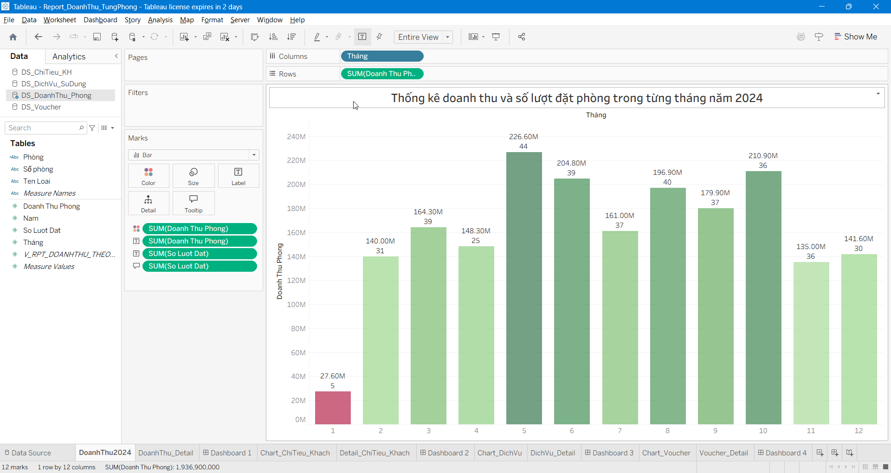

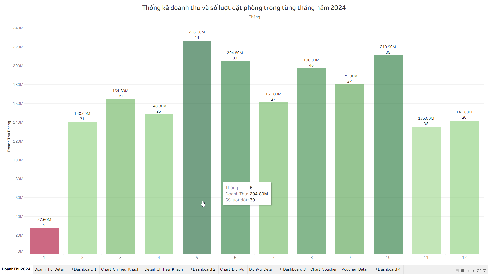

#### 1.6 Màn hình design và preview sheet hiển thị table chi tiết
    Kéo vào column sử dụng Measure Values cho: các chỉ số (số lượt đặt, doanh thu phòng) để hiển thị các thông tin này ra thành từng cột riêng biệt. 
    Kéo field "Phòng" vào Rows để hiển thị thông tin phòng theo dòng.


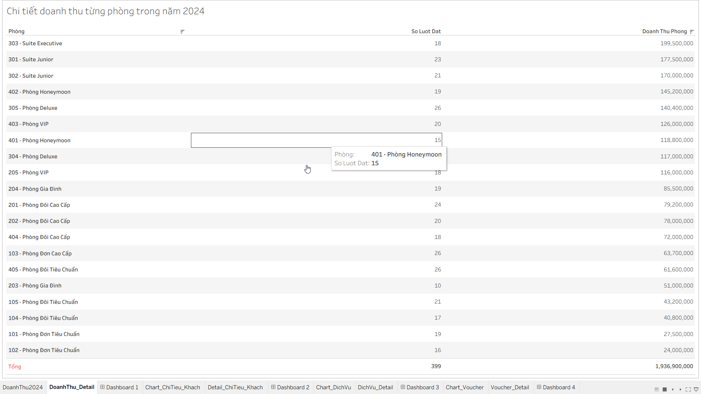

#### 1.7 Sử dụng dashboard để hiển thị 2 sheet chart, chi tiết và in ra pdf

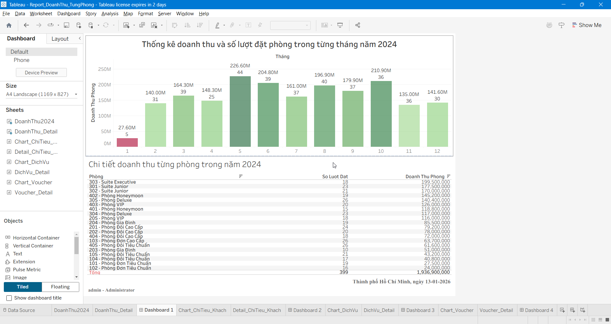

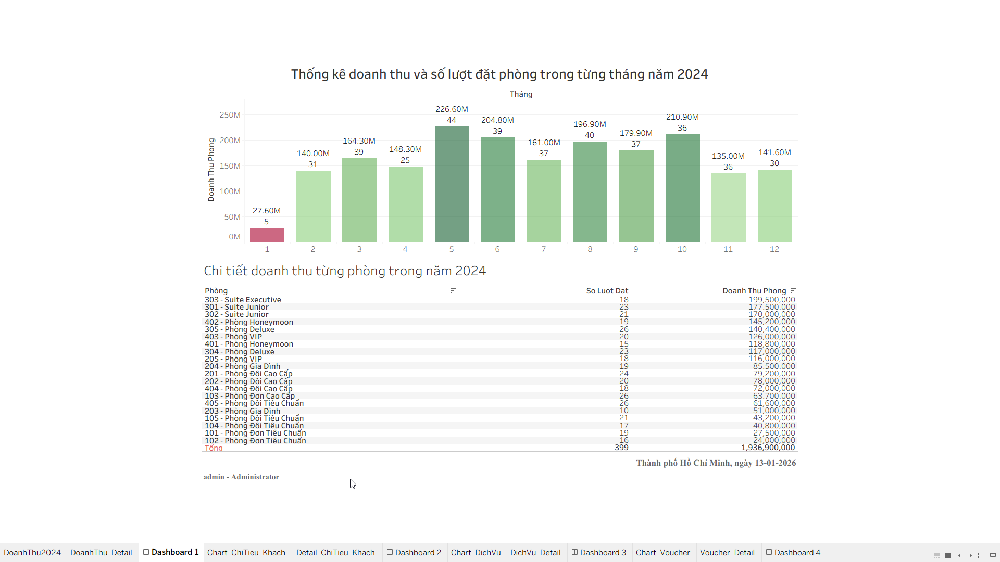


## 2. Thống kê top khách hàng chi tiêu nhiều nhất năm 2024
    Giúp đánh giá xem khách hàng thân thiết để tặng voucher hay là nâng hạng khách hàng lên Premium,VIP phục vụ cho CSKH, CRM

#### 2.1 Tạo View lấy danh sách     
```sql
CREATE OR ALTER VIEW V_REPORT_USER_VIP_2024 AS
SELECT 
    U.ID AS UserID,
    U.Full_Name AS TenKhachHang,
    U.Email,
    U.Phone, 
    P.so_tien AS TienChiTieu,
    P.created_at AS NgayThanhToan,
    MONTH(P.created_at) AS Thang 
FROM 
    USERS U
JOIN DATPHONG DP ON U.ID = DP.User_ID
JOIN PAYMENTS P ON DP.ID = P.Booking_ID
WHERE 
    (P.trang_thai = 'SUCCESS' OR P.trang_thai = 'PAID') 
    AND YEAR(P.created_at) = 2024 
GO
```

#### 2.2 Kiểm tra kết quả của view vừa tạo

```sql
   SELECT * FROM V_REPORT_USER_VIP_2024;
```

#### 2.3 Kéo view V_REPORT_USER_VIP_2024 vào canva


#### 2.4 Tạo Line chart để hiển thị tổng quan

#### 2.5 Mapping dữ liệu từ View V_REPORT_USER_VIP_2024 để tạo chart line

    ▪ Kéo "Tổng tiền chi tiêu" -> Row => Tableau sẽ tự động tính tổng và làm trục đứng(Y).
    ▪ Kéo "Tháng" -> Columns, chọn demension để làm trục ngang(X)
    ▪ Kéo UserID vào Color chỗ Mark để hiển thị màu phân biệt
    ▪ Filter top 10 hoặc gì đó tùy mục đích


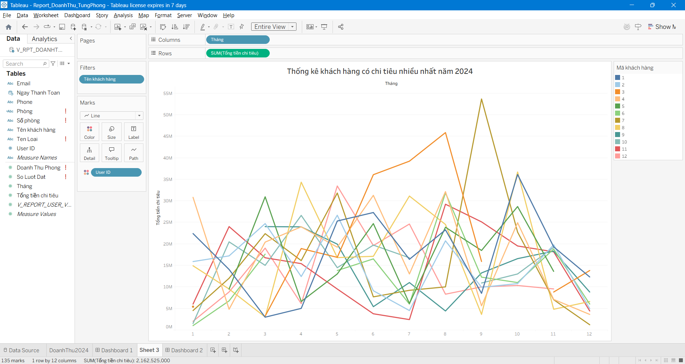

#### 2.6 Tạo Sheet hiển thị table chi tiết
    ▪ Kéo "Tháng" -> Columns, chọn demension và discrete 
    ▪ Tạo calculated fields để hiển thị UserID - Tên
    ▪ Kéo calculated fields và phone vào để hiển thị
    ▪ Kéo "Tổng chi tiêu" và Text chỗ Marks để show tiền vào table
    ▪ Format màu, kiểu chữ kích thước
    ▪ Chọn Analysis -> Total -> show grands total và kéo về trái để hiển thị cột tổng


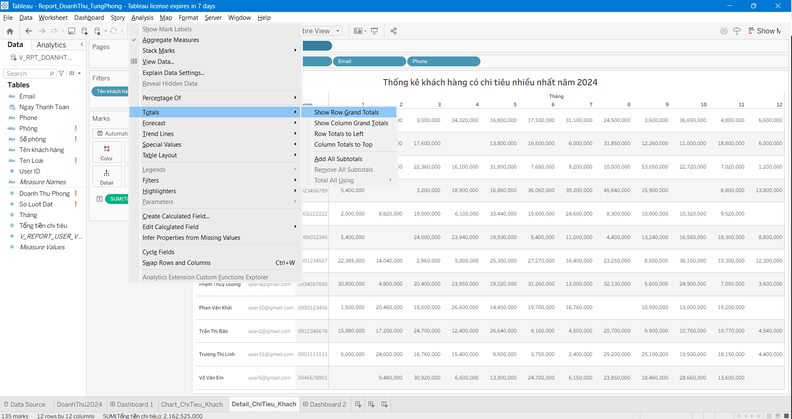


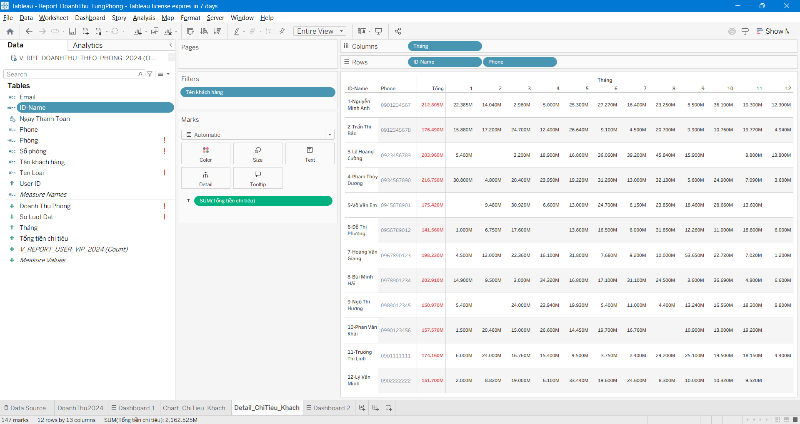


#### 2.7 Màn hình design và preview dashboard
    Ta chọn kích cỡ A4 lanscape để in cho đẹp và đây đủ, chọn fit -> entrie view để hiển thị hết width height.

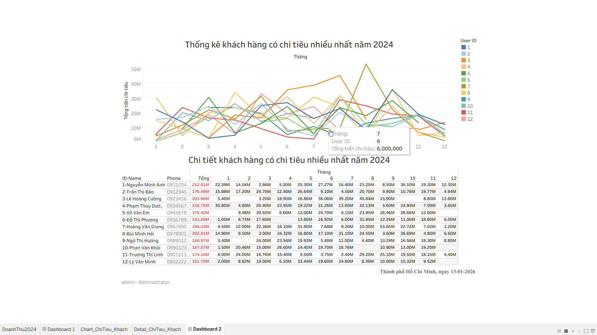

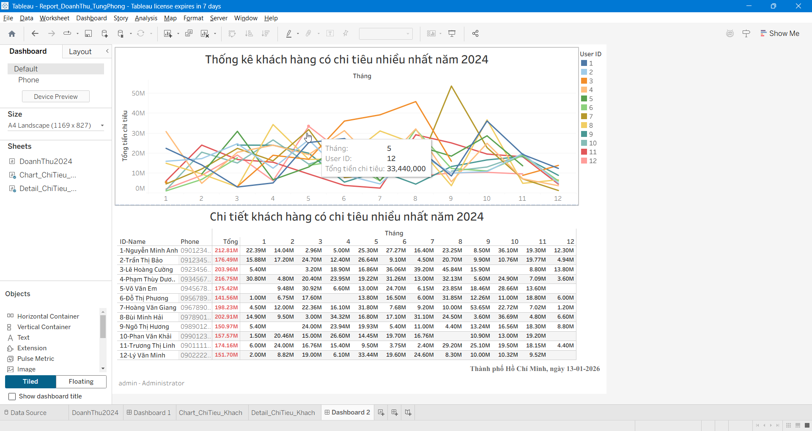

## 3. Thống kê xem dịch vụ nào được khách sử dụng nhiều, và nó mang lại bao nhiêu tiền trong năm 2024
    Để xác định "services nào được ưa chuộng nhất" (Best Seller) sẽ giúp quản lý biết đường nhập hàng và đẩy mạnh khuyến mãi.
    Vì mỗi dịch vụ thời giá sẽ khác nhau nên ở table chi tiết ta sẽ thống kê từng đơn giá của dịch vụ.

#### 3.1 Tạo View   
```sql
CREATE OR ALTER VIEW V_REPORT_TOP_SERVICE_2024 AS
SELECT 
    DV.Ten_Dich_Vu,
    DP.ID AS Booking_ID, 
    CT.created_at AS Thoi_Gian_Su_Dung, 
    CT.So_Luong,
    ISNULL(CT.Don_Gia, 0) AS Don_Gia,
    (ISNULL(CT.So_Luong, 0) * ISNULL(CT.Don_Gia, 0)) AS Thanh_Tien

FROM 
    CT_SUDUNG_DV CT
JOIN 
    DICHVU DV ON CT.DichVu_ID = DV.ID
JOIN 
    DATPHONG DP ON CT.DatPhong_ID = DP.ID
WHERE 
    YEAR(DP.Check_In) = 2024 
    AND DP.Trang_Thai NOT IN ('CANCELLED')
GO
```

#### 3.2 Kiểm tra kết quả của view vừa tạo

```sql
   SELECT * FROM V_REPORT_TOP_SERVICE_2024;
```
#### 3.3 Tạo chart Pie và mapping các dữ liệu vào
    


#### 3.4 Màn hình preview của chart pie

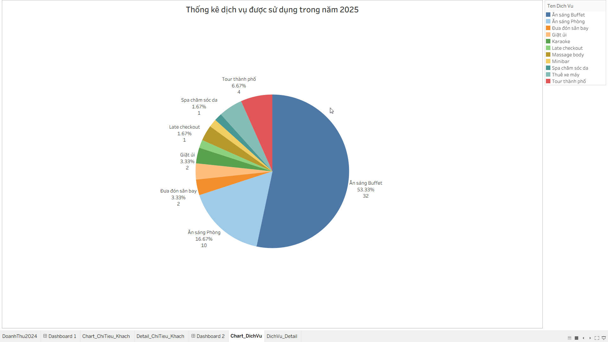

#### 3.5 Tạo sheet để hiển thị table chi tiết

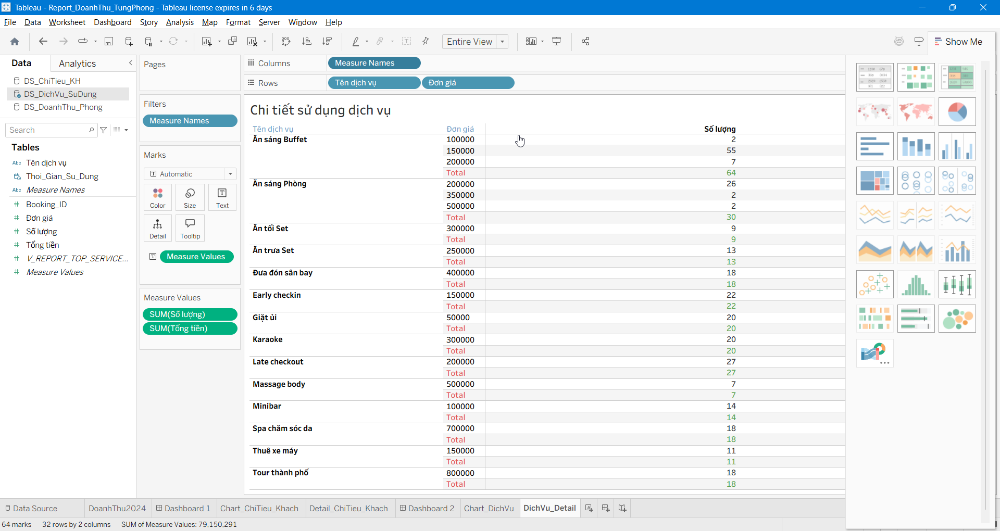


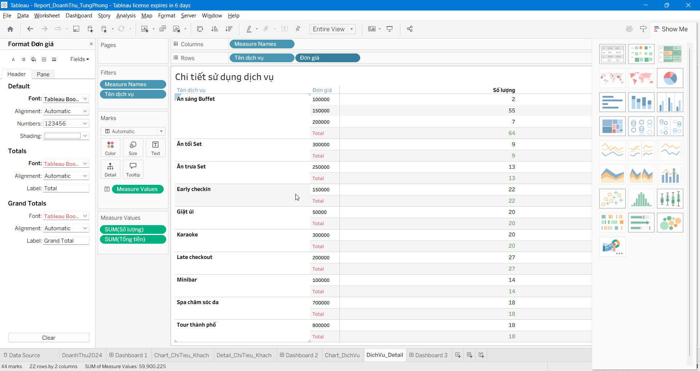

#### 3.6 Màn hình preview  sheet table chi tiết

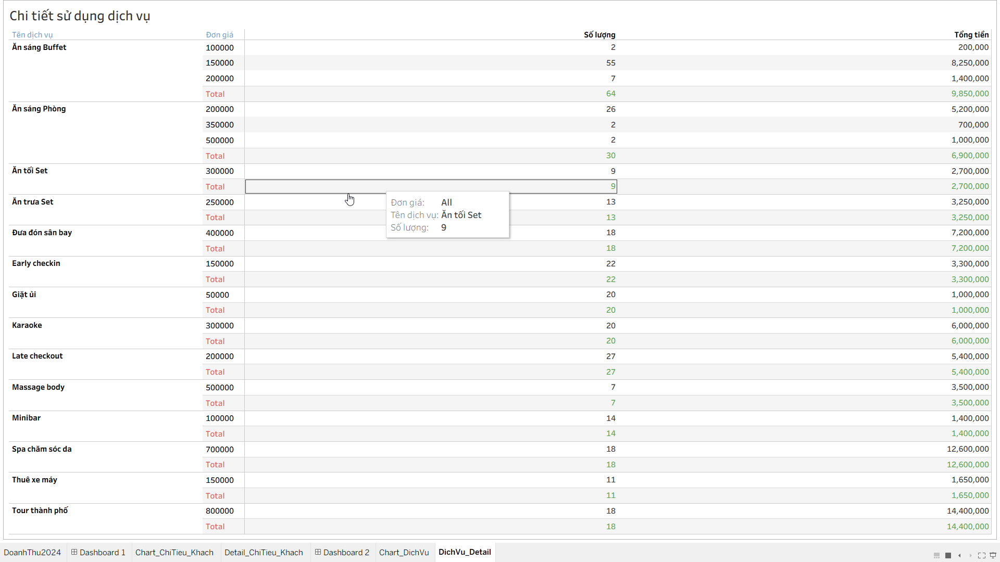

#### 3.7 Màn hình design và preview của dashboard để hiển thị chart pie và table chi tiết

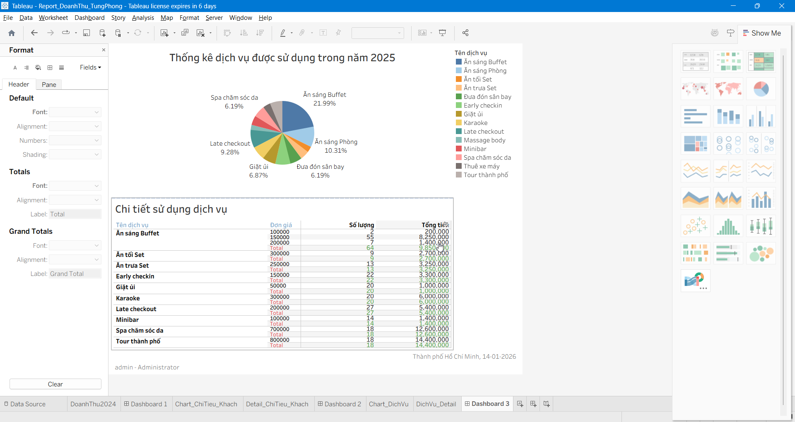


## 4. Thống kê Top Voucher được săn đón nhất & Số tiền đã giảm giá năm 2024
    Để thống kê xem mình đưa ra bao nhiêu mã giảm giá, và cái nào khách xài nhiều nhất. Tổng số tiền của voucher nào sử dụng nhiều nhất.
    Chỉ tính dòng trong bảng PAYMENTS có trạng thái 'SUCCESS', hiểu là thanh toán thành công.
    Công thức tính số tiền giảm: (tiền thực / (100% - %giảm)) - tiền thực .
#### 4.1 Tạo View   
```sql
CREATE OR ALTER VIEW V_REPORT_TOP_VOUCHER_2024 AS
SELECT 
    V.id AS Voucher_ID,
    V.ma_code AS Ma_Voucher,
    COUNT(DISTINCT DP.id) AS So_Luot_Dung,
    CAST(SUM(
        CASE 
            WHEN V.phan_tram_giam > 0 AND V.phan_tram_giam < 100 THEN
                (P.so_tien / (1.0 - (V.phan_tram_giam / 100.0))) - P.so_tien
            ELSE 0 
        END
    ) AS DECIMAL(18, 0)) AS Tong_Tien_Da_Giam

FROM 
    VOUCHERS V
JOIN 
    DATPHONG DP ON V.id = DP.voucher_id 
JOIN 
    PAYMENTS P ON DP.id = P.booking_id
WHERE 
    P.trang_thai = 'SUCCESS' 
    AND YEAR(DP.Check_In) = 2024 
GROUP BY 
    V.id, V.ma_code, V.phan_tram_giam
GO
```

#### 4.2 Kiểm tra kết quả của view vừa tạo

```sql
   SELECT * FROM V_REPORT_TOP_VOUCHER_2024;
```
#### 4.3 Tạo sheet sử dụng Chart Bar và mapping các fields của View đã tạo
    Sử dụng chart bar để hiển thị số tiền rõ ràng hơn, có thể sort được theo tổng số tiền giảm của các voucher cho dễ nhìn. 
    Kéo field "Phan_tram_giam" vào color để hiển thị màu -> màu càng đậm thì hiểu là phần trăm giảm càng nhiều

#### 4.4 Màn hình design và preview của chart bar

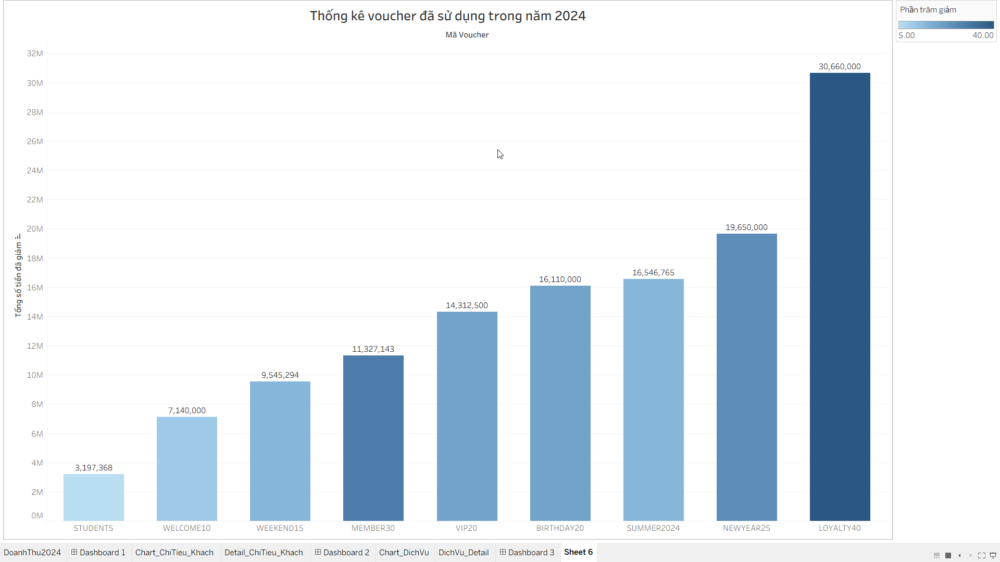

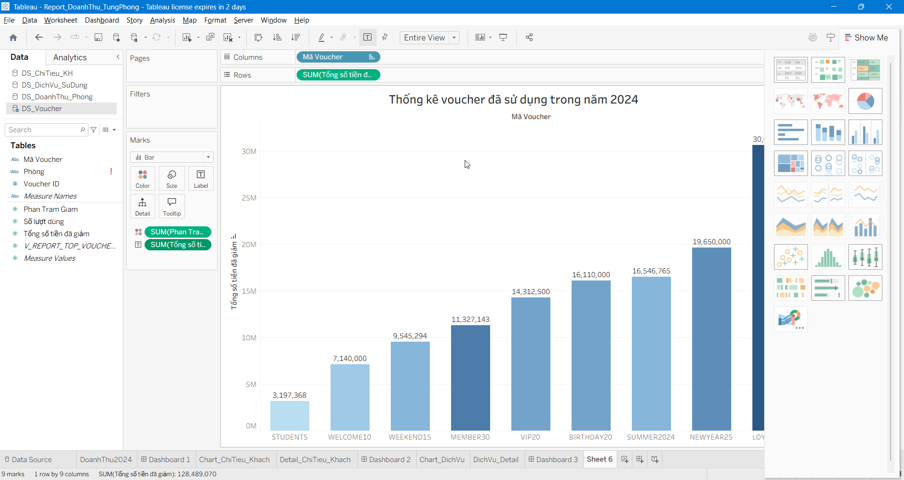

#### 4.5 Tạo sheet để hiển thị table chi tiết
    Kéo và sử dụng Measure Values cho: các chỉ số (phần trăm giảm, số lần sử dụng, tổng tiền giảm) để hiển thị các thông tin này ra thành từng cột riêng biệt. 
    Kéo VoucherID và Voucher vào Rows để hiển thị thông tin voucher theo dòng

#### 4.6 Màn hình preview & design sheet table chi tiết


#### 4.7 Sử dụng dashboard để hiển thị 2 sheet chart, chi tiết và in ra pdf


## 5. Thống kê top loại phòng được yêu thích nhất
    Dựa trên số sao được khách hàng đánh giá, ta sẽ thống kê xem xem là loại phòng nào làm khách hàng thích nhất, để điều chỉnh phòng theo xu hướng của khách hàng, giúp đánh giá tăng doanh thu, thu hút khách.
    Chúng ta chỉ lấy những reviews nào đã được admin duyệt(trang_thai = 'APPROVED'), vì có thể có những review spam hoặc rác.
#### 5.1 Tạo View   
```sql
CREATE OR ALTER VIEW V_REPORT_ROOM_RATING AS
SELECT 
    R.id AS Review_ID,
    LP.Ten_Loai,
    P.so_phong ,  
    CAST(R.so_sao AS DECIMAL(10,2)) AS Diem_Danh_Gia,
    
    R.binh_luan,
    R.ngay_danh_gia

FROM 
    REVIEWS R
JOIN 
    PHONG P ON R.phong_id = P.id
JOIN 
    LOAIPHONG LP ON P.loai_phong_id = LP.id
WHERE 
    R.trang_thai = 'APPROVED' 
GO
```

#### 5.2 Kiểm tra kết quả của view vừa tạo

```sql
   SELECT * FROM V_REPORT_ROOM_RATING;
```
#### 5.3 Tạo sheet để hiển thị table chart dạng Bar và mapping các fields của View đã tạo
    Sử dụng AVG để tính điểm sao TB được đánh giá

#### 5.4 Màn hình design và preview của chart bar


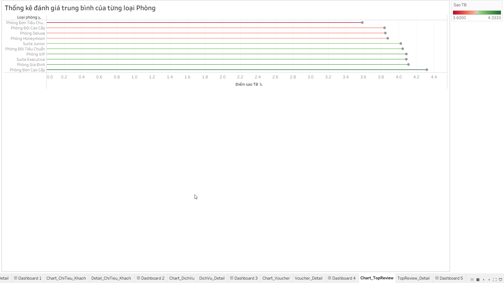

#### 5.5 Tạo sheet để hiển thị table chi tiết
    Kéo và sử dụng Measure Values cho: các chỉ số (avg(diem_danh_gia), count của tableau) để hiển thị các thông tin "điểm sao tb", "số lần được đánh giá" ra thành từng cột riêng biệt. 
    Kéo "loại phòng" vào Rows để hiển thị thông tin loại phòng theo dòng

#### 5.6 Màn hình preview & design sheet table chi tiết


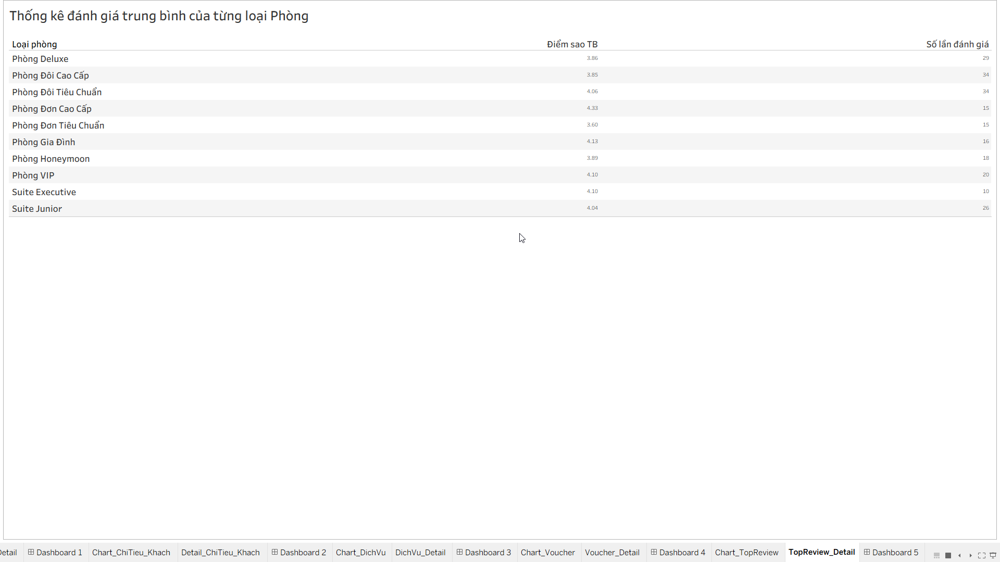

#### 5.7 Sử dụng dashboard để hiển thị 2 sheet chart, chi tiết và in ra pdf


--------------